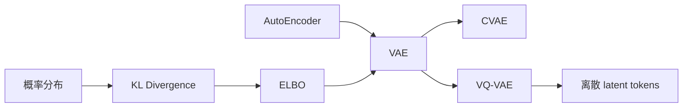
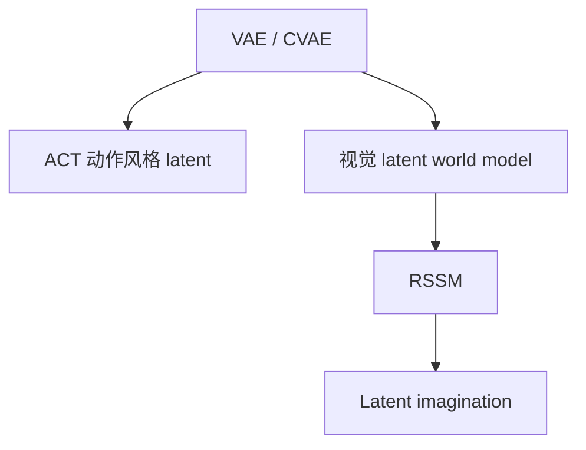
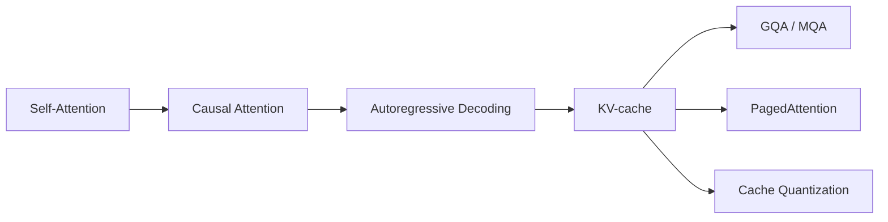

# 知识依赖图

## VAE 主线

文字说明：AutoEncoder 提供编码—解码结构；概率分布和 KL Divergence 支撑 ELBO；VAE 进一步通向 CVAE，也可通过 VQ-VAE 转向离散 latent tokens。

## 具身智能应用路线

文字说明：VAE/CVAE 的概率潜变量思想分别进入动作序列生成和世界模型；RSSM 则进一步处理时序状态与想象 rollout。
## Transformer 推理路线

文字说明：causal attention 支撑逐 token 解码；KV-cache 复用历史 K/V，随后通过 GQA/MQA、分页管理和量化缓解显存与带宽瓶颈。
