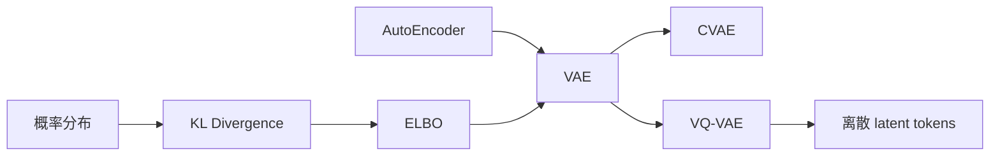
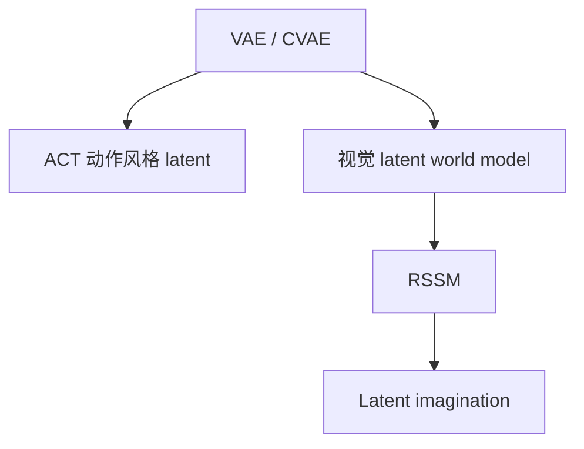
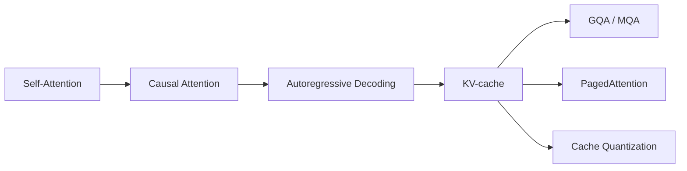
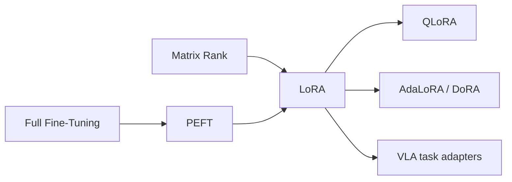
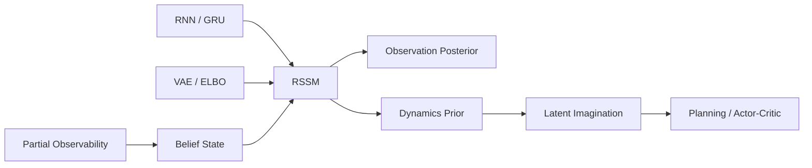
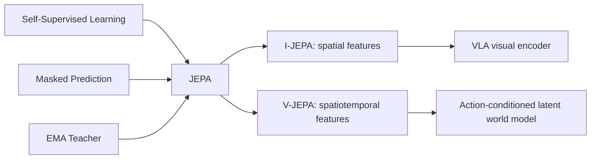

# 知识依赖图

## VAE 主线

文字说明：AutoEncoder 提供编码—解码结构；概率分布和 KL Divergence 支撑 ELBO；VAE 进一步通向 CVAE，也可通过 VQ-VAE 转向离散 latent tokens。

## 具身智能应用路线

文字说明：VAE/CVAE 的概率潜变量思想分别进入动作序列生成和世界模型；RSSM 则进一步处理时序状态与想象 rollout。
## Transformer 推理路线

文字说明：causal attention 支撑逐 token 解码；KV-cache 复用历史 K/V，随后通过 GQA/MQA、分页管理和量化缓解显存与带宽瓶颈。

## 参数高效适配路线

文字说明：LoRA 用低秩增量替代完整权重更新，是 PEFT 的一种；它进一步通向量化训练、rank 自适应变体与具身任务 adapter。
## RSSM 世界模型路线

文字说明：RSSM 结合 RNN 的确定性记忆与 VAE/ELBO 的随机 latent；观测 posterior 用传感器校正 belief，dynamics prior 支撑无未来观测的 imagination。

## JEPA 表征预测路线

文字说明：JEPA 将掩码预测移到表征空间；I-JEPA 学空间视觉语义，V-JEPA 扩展到时空特征，而具身规划仍需进一步加入动作条件的 dynamics 与任务目标。
