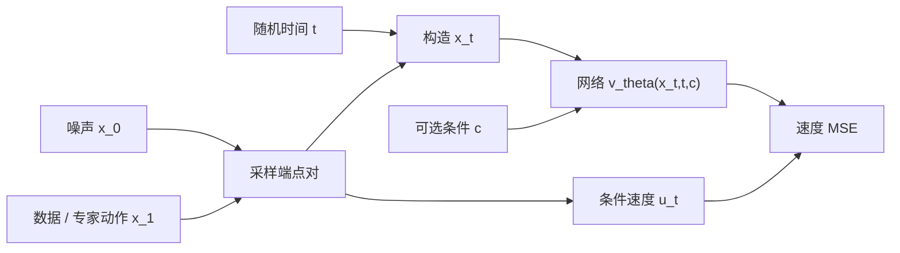
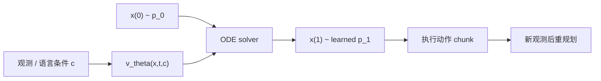
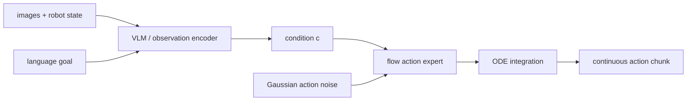

# Flow Matching（流匹配）

> 主卡。本卡先解释连续欧氏空间中的 Flow Matching，再说明如何把数据 $x$ 换成机器人动作 chunk。为避免符号混乱，统一规定：$t=0$ 是简单噪声分布，$t=1$ 是数据或专家动作分布。

## L0：一分钟理解

### 一句话定义

Flow Matching 学习一个随时间变化的速度场 $v_\theta(x,t)$，让样本从简单噪声出发，沿 ODE 连续流动到数据分布；训练时直接回归一条已知概率路径的速度，生成时再积分该 ODE。

### 它解决什么问题

连续归一化流（CNF）可以用 ODE 将简单分布变成复杂分布，但传统最大似然训练需要沿当前模型轨迹积分状态与密度，成本较高。Diffusion 避开了一部分困难，却通常以固定加噪过程、score/noise 目标和多步反向采样来组织训练。

Flow Matching 的核心转折是：先人为选择一条从噪声分布到数据分布的概率路径，再构造这条路径的局部条件速度作为监督标签。训练不必先运行当前模型的 ODE，就能用普通监督回归学习生成向量场。

### 在 VLA/WAM 中有什么用

- 根据视觉、语言与本体状态生成连续动作 chunk；
- 表达同一观测下多种合理操作策略，而不是输出平均动作；
- 用 ODE solver 在噪声动作与专家动作分布之间变换；
- 作为 VLA 的连续 action expert，例如 $\pi_0$ 采用 flow-matching 风格的动作生成。

Flow Matching 只定义生成目标与采样动力学；它本身不负责视觉语言理解、碰撞约束或闭环控制。

### 记住这三点

1. 训练目标是速度回归：给模型中间状态 $x_t$ 和时间 $t$，让它预测“此刻往哪里走”。
2. 直线路径下，条件速度标签就是 $x_1-x_0$，但网络学到的是给定当前位置后的平均边际速度场。
3. “simulation-free”只指训练标签不需要先积分当前模型；生成时仍需用 Euler、Heun 等方法求解 ODE。

## L1：直觉与结构

### 1. 背景：连续归一化流已经解决了什么

给定时间相关向量场 $v_t(x)$，常微分方程

```math
\frac{d x_t}{dt}=v_t(x_t)
```

定义了从初始样本 $x_0$ 到终点样本 $x_1$ 的连续变换。若初始分布简单，例如 $p_0=\mathcal N(0,I)$，并且流在 $t=1$ 将它推到数据分布 $p_1$，就可以通过从噪声积分 ODE 来生成数据。

CNF 还可利用瞬时变量替换公式跟踪密度，因此它不仅能采样，也能做 likelihood 建模。

### 2. 剩余矛盾与设计目标

问题在于：为了用最大似然训练 CNF，通常需要反复求解模型定义的 ODE，并计算向量场散度。也就是说，在模型还没学会之前，就要昂贵地模拟它的整条轨迹来获得训练信号。

设计目标是：**在不运行当前生成 ODE 的情况下，为任意中间时间 $t$ 构造局部监督，直接训练正确的速度场。**

### 3. 设计因果链

#### 全局分布速度难以直接得到

我们真正需要的是驱动边际概率路径 $p_t(x)$ 的速度 $u_t(x)$，但它通常不可解析。于是先采样条件变量：一个噪声端点 $x_0$ 和一个数据端点 $x_1$，为每对端点定义容易计算的条件路径 $x_t$ 与条件速度 $u_t(x_t\mid x_0,x_1)$。

这让每个训练样本都有精确标签，却带来一个疑问：同一中间位置可能来自许多不同端点对，它们的速度甚至互相冲突。

#### 用回归平均条件速度

模型只看 $x_t,t$，不知道具体端点对。平方误差的最优预测是条件均值：

```math
v^*(x,t)=\mathbb E[u_t\mid x_t=x]
```

这个平均速度正是驱动边际路径的速度场。于是可以用容易采样的 conditional Flow Matching 目标替代难以直接计算的 marginal Flow Matching 目标。新代价是：端点 coupling 和路径选择会决定回归冲突程度与生成轨迹曲率。

#### 选择直线路径降低几何复杂度

最简单的条件路径是线性插值：$x_t=(1-t)x_0+t x_1$，速度恒为 $x_1-x_0$。每对样本的路径是直线，标签很简单；但若 $x_0,x_1$ 独立配对，不同直线可能大量交叉，边际速度仍可能复杂。

使用 minibatch optimal-transport coupling 可让端点配对更合理、路径更短，但需要额外求解 batch 内匹配，并不保证得到全局最优 transport。

#### ODE 将局部速度组合成生成过程

训练只在随机时间点做局部回归。生成时必须从 $x_0\sim p_0$ 出发，连续查询模型并数值积分到 $t=1$。步数少延迟低但离散误差大；步数多更准确但对在线机器人控制更昂贵。

### 4. 完整训练与部署数据流



文字等价描述：训练时采样噪声、真实数据和随机时间，直接构造中间点与速度标签，再用条件网络回归该速度，全程无需先运行模型 ODE。



文字等价描述：部署时从噪声动作开始，solver 多次查询条件速度场并积分到动作分布，再执行部分动作并根据新观测重规划。

### 5. 输入、输出与张量形状

以动作 chunk 为例，batch 为 $B$，horizon 为 $H$，单步动作维度为 $A$：

- 噪声与专家动作：$x_0,x_1\in\mathbb R^{B\times H\times A}$；
- 时间：$t\in[0,1]^B$，广播为 `[B,1,1]`；
- 中间动作：$x_t\in\mathbb R^{B\times H\times A}$；
- 条件 $c$：视觉、语言和本体 token 或 pooled feature；
- 目标速度与预测：$u_t,v_\theta\in\mathbb R^{B\times H\times A}$。

最小代码将动作 chunk 展平为 $[B,D]$，其中 $D=HA$。真实 VLA 常用 Transformer 保留时间 token 结构并与视觉语言 tokens 交互。

### 6. 在具身智能系统中的位置



文字等价描述：VLM 或观测编码器产生条件，flow action expert 将 Gaussian 动作噪声沿条件 ODE 变成连续动作 chunk。

### 7. 与相近方法的区别

| 方法 | 训练监督 | 生成动力学 | 常见特征 |
|---|---|---|---|
| CVAE | reconstruction + KL | 一次 prior sample + decoder | 采样快，可能 posterior collapse |
| Diffusion | noise/score/velocity | 反向 SDE 或 ODE | 通常基于预设噪声过程 |
| Flow Matching | probability path 的速度 | forward ODE | 可选灵活路径，训练无需模拟模型 ODE |
| Autoregressive | next token/action likelihood | 逐 token 生成 | 因果分解，串行误差累积 |

Flow Matching 与 diffusion 并非互斥：某些 diffusion probability paths 也可用 Flow Matching 目标学习；区别更多在所选概率路径、参数化和训练解释，而不是简单的“一个有噪声、一个没噪声”。

## L2：数学与实现

### 1. 符号表

| 符号 | 含义 |
|---|---|
| $p_0$ | 简单源分布，通常为 Gaussian |
| $p_1$ | 数据或专家动作分布 |
| $p_t$ | 连接 $p_0$ 与 $p_1$ 的边际概率路径 |
| $x_0,x_1$ | 从源端和数据端采样的端点 |
| $x_t$ | 时间 $t$ 的中间状态 |
| $u_t$ | 目标速度场；带条件时可依赖端点 |
| $v_\theta$ | 神经网络学习的速度场 |
| $c$ | 观测、语言或任务条件 |
| $\pi(x_0,x_1)$ | 端点 coupling，规定如何配对 |

### 2. 核心公式

一个概率路径被速度场 transport 时满足 continuity equation：

```math
\partial_t p_t(x)+\nabla_x\cdot\left(p_t(x)u_t(x)\right)=0
```

理想 marginal Flow Matching 目标是：

```math
\mathcal L_{\mathrm{FM}}(\theta)
=\mathbb E_{t\sim\mathcal U[0,1],\,x\sim p_t}
\left[
\left\|v_\theta(x,t)-u_t(x)\right\|_2^2
\right]
```

但 $u_t(x)$ 往往未知。对线性条件路径：

```math
x_t=(1-t)x_0+t x_1
```

其时间导数是已知速度：

```math
u_t(x_t\mid x_0,x_1)
=\frac{d x_t}{dt}
=x_1-x_0
```

因此训练可用 conditional Flow Matching：

```math
\mathcal L_{\mathrm{CFM}}(\theta)
=\mathbb E_{\substack{
t\sim\mathcal U[0,1]\\
(x_0,x_1)\sim\pi
}}
\left[
\left\|
v_\theta((1-t)x_0+t x_1,t,c)
-(x_1-x_0)
\right\|_2^2
\right]
```

生成时求解：

```math
\frac{d x(t)}{dt}=v_\theta(x(t),t,c),
\qquad x(0)\sim p_0
```

### 3. 公式的逐步解释或推导

#### 第一步：continuity equation 在说什么

$p_t(x)$ 像一团随时间流动的“概率流体”，$u_t(x)$ 是每个位置的速度。continuity equation 表示概率质量不会凭空产生或消失：某区域密度下降，是因为概率从边界流出；密度上升，是因为概率流入。

若 ODE 的向量场与该方程一致，从 $p_0$ 采样并积分到时间 $t$，样本分布就会成为 $p_t$。

#### 第二步：为什么直接的 FM target 难获得

我们可以描述想要的分布路径 $p_t$，却不一定知道每个位置对应的边际速度 $u_t(x)$。更糟的是，要先模拟当前模型再估计速度，就又回到昂贵的 ODE-in-the-loop 训练。

条件路径把难题拆开：先固定容易采样的端点对 $(x_0,x_1)$，再定义一条解析曲线。对于线性插值，位置与速度都可以直接算出，因此每次训练只需普通 tensor 运算。

#### 第三步：为什么回归许多条件速度能得到边际速度

同一个 $(x,t)$ 可能由不同端点对产生。平方误差下，给定输入后的 Bayes 最优回归量是标签的条件期望：

```math
v^*(x,t)
=\mathbb E_{(x_0,x_1)\mid x_t=x}
\left[x_1-x_0\right]
```

可以把每个条件路径的 continuity equation 按端点后验加权并边缘化；所得平均速度驱动边际 $p_t$。在标准正则条件下，CFM 与不可直接计算的 FM 对参数 $\theta$ 有相同梯度，两个损失至多相差与 $\theta$ 无关的项。

这解释了一个看似矛盾的现象：训练标签是“这一对端点的速度”，网络却没有端点信息；通过大量样本回归，它学到当前位置应采用的边际平均速度。

#### 第四步：MSE 为什么出现在代码里

这里的 MSE 是有监督向量回归：目标 $x_1-x_0$ 是所选条件路径的解析导数。它的依据是平方损失的条件均值性质，而不是把速度假设成某个 Gaussian likelihood 后省略常数。

代码 `F.mse_loss(v_pred, target, reduction="none")` 先得到每个动作元素的平方误差；若对动作维度求和再对 batch 求平均，就对应公式中的每样本欧氏范数平方。若直接对所有元素取 mean，会额外除以动作维度 $D$，最优解相同，但损失和梯度整体缩小 $D$ 倍。

#### 第五步：coupling 为什么影响难度

边际要求只规定两端分布，没有规定哪个 $x_0$ 与哪个 $x_1$ 配对。独立 coupling $\pi=p_0p_1$ 最简单，但直线可能交叉，某个 $x_t$ 附近出现方向相反的标签，网络只能平均。

更合适的 coupling 可缩短路径并减少交叉，让向量场更容易拟合、ODE 更容易数值积分。所谓 OT-CFM 通常近似最优 transport coupling；“每对端点走直线”本身不等于边际 transport 已经全局最优。

#### 第六步：训练与生成为什么一个不积分、一个要积分

训练可以任取 $t$，通过解析插值立即得到 $x_t$ 和 target velocity，所以不需要模型先走到 $x_t$。生成时只有 $x(0)$，不知道对应终点，只能依靠模型给出的局部方向一步步前进。

最简单 Euler 更新为：

```math
x_{k+1}=x_k+\Delta t\,v_\theta(x_k,t_k,c)
```

它是一阶近似。Heun、Runge–Kutta 或自适应 solver 可降低误差，但每一步可能需要更多模型评估。

### 4. 最小数值例子

设一维噪声端点 $x_0=-1$，数据端点 $x_1=3$，采样 $t=0.25$。线性路径的中间点为：

```math
x_t=(1-0.25)(-1)+0.25\times3=0
```

条件速度在整条路径上恒定：

```math
u_t=x_1-x_0=3-(-1)=4
```

若网络在 $(x_t,t)=(0,0.25)$ 预测 $3.5$，该维平方误差为：

```math
(3.5-4)^2=0.25
```

若生成时当前位置为 $x_k=0$、步长 $\Delta t=0.25$，模型速度为 $3.5$，Euler 更新得到：

```math
x_{k+1}=0+0.25\times3.5=0.875
```

真实条件直线在下一个时间 $0.5$ 的位置是 $1$，因此这一步产生 $0.125$ 误差；误差同时来自速度预测和数值离散。

### 5. 训练与推理

#### 训练

1. 从示范数据取得 $x_1$ 与条件 $c$；
2. 从 $p_0$ 采样同形状噪声 $x_0$；
3. 采样 $t\sim\mathcal U[0,1]$；
4. 构造 $x_t=(1-t)x_0+t x_1$；
5. 构造 target velocity $x_1-x_0$；
6. 回归 $v_\theta(x_t,t,c)$，无需调用 ODE solver。

#### 条件生成

1. 从 Gaussian 动作噪声初始化 $x(0)$；
2. 固定当前观测/语言条件 $c$；
3. 从 $t=0$ 到 $1$ 积分 learned ODE；
4. reshape 得到动作 chunk；
5. 执行全部或部分动作，再获取新观测滚动生成。

本卡方向是 noise-to-data。有些实现定义 data-to-noise 或使用不同时间符号；迁移公式时必须同时核对插值、target velocity 和 solver 积分方向，不能只改一个负号。

### 6. 伪代码

```text
training:
    x1, condition = expert_action_chunk, observation_and_language
    x0 = sample_normal_like(x1)
    t = uniform(0, 1)
    xt = (1 - t) * x0 + t * x1
    target_velocity = x1 - x0
    predicted_velocity = model(xt, t, condition)
    loss = batch_mean(sum_action_dims((predicted_velocity - target_velocity)^2))
    update model

generation:
    x = sample_normal(action_shape)
    for t in increasing_time_grid(0, 1):
        x = ode_solver_step(model, x, t, condition)
    return x
```

### 7. 最小 PyTorch 实现

```python
import math
import torch
import torch.nn as nn
import torch.nn.functional as F


def time_features(t: torch.Tensor, dim: int = 32) -> torch.Tensor:
    # t: [B] in [0, 1] -> [B, dim]
    half = dim // 2
    freq = torch.exp(
        torch.linspace(0.0, math.log(1000.0), half, device=t.device)
    )
    phase = 2.0 * math.pi * t[:, None] * freq[None, :]
    features = torch.cat([torch.sin(phase), torch.cos(phase)], dim=-1)
    if dim % 2:
        features = F.pad(features, (0, 1))
    return features


class ConditionalVelocityMLP(nn.Module):
    def __init__(
        self,
        action_dim: int,
        condition_dim: int,
        time_dim: int = 32,
        hidden: int = 256,
    ):
        super().__init__()
        self.time_dim = time_dim
        self.net = nn.Sequential(
            nn.Linear(action_dim + condition_dim + time_dim, hidden),
            nn.SiLU(),
            nn.Linear(hidden, hidden),
            nn.SiLU(),
            nn.Linear(hidden, action_dim),
        )

    def forward(
        self,
        x_t: torch.Tensor,
        t: torch.Tensor,
        condition: torch.Tensor,
    ) -> torch.Tensor:
        # x_t: [B, D], t: [B], condition: [B, C] -> velocity: [B, D]
        t_feat = time_features(t, self.time_dim)
        return self.net(torch.cat([x_t, t_feat, condition], dim=-1))


def flow_matching_loss(
    model: nn.Module,
    x1: torch.Tensor,
    condition: torch.Tensor,
) -> torch.Tensor:
    # x1: expert action chunks flattened to [B, D].
    x0 = torch.randn_like(x1)
    t = torch.rand(x1.shape[0], device=x1.device)
    t_view = t[:, None]  # Broadcast the same time across all action dimensions.
    x_t = (1.0 - t_view) * x0 + t_view * x1
    target_velocity = x1 - x0  # Exact derivative of the chosen linear path.
    predicted_velocity = model(x_t, t, condition)

    # Per-sample squared Euclidean norm [B], then minibatch expectation.
    squared_error = F.mse_loss(
        predicted_velocity, target_velocity, reduction="none"
    )
    return squared_error.sum(dim=-1).mean()


@torch.no_grad()
def euler_sample(
    model: nn.Module,
    condition: torch.Tensor,
    action_dim: int,
    steps: int = 20,
) -> torch.Tensor:
    # Integrate noise -> data under dx/dt = v_theta(x,t,c).
    batch = condition.shape[0]
    x = torch.randn(batch, action_dim, device=condition.device)
    dt = 1.0 / steps
    for k in range(steps):
        t = torch.full(
            (batch,), k / steps, device=condition.device, dtype=x.dtype
        )
        x = x + dt * model(x, t, condition)
    return x
```

该示例使用独立 Gaussian coupling、直线路径与固定步长 Euler。它展示核心目标，不代表最佳机器人策略配置；真实模型通常使用时序 Transformer、动作归一化和更稳健的 solver。

### 8. 公式—代码对应

| 数学对象 | 代码 | 转换依据 | 形状与 reduction |
|---|---|---|---|
| $x_0\sim p_0$ | `torch.randn_like(x1)` | 选择标准 Gaussian 源分布 | `[B,D]` |
| $t\sim\mathcal U[0,1]$ | `torch.rand(B)` | Monte Carlo 采样时间期望 | `[B]` |
| $x_t=(1-t)x_0+t x_1$ | 线性 tensor 插值 | 解析条件概率路径样本 | `[B,D]`；$t$ 按维广播 |
| $u_t=x_1-x_0$ | `target_velocity = x1 - x0` | 对线性路径关于 $t$ 求导 | `[B,D]` |
| $v_\theta(x_t,t,c)$ | `model(x_t, t, condition)` | 条件速度场回归 | `[B,D]` |
| $\mathbb E\|v-u\|_2^2$ | `mse_loss(..., none).sum(-1).mean()` | 动作维求平方和，batch 做 Monte Carlo 均值 | 标量 |
| $x_{k+1}=x_k+\Delta t v$ | `x = x + dt * model(...)` | forward Euler 一阶 ODE 离散 | 每步 `[B,D]` |

注意：训练 MSE 的依据是解析速度监督和条件均值回归，不是 Gaussian reconstruction NLL。`sum(-1)` 明确实现欧氏范数平方；改为全元素 mean 只改变常数尺度，不改变无限容量下的最优速度场。

### 9. 常见超参数

- source distribution $p_0$ 与动作归一化；
- probability path 与 endpoint coupling；
- velocity network 宽度、深度及条件注入方式；
- 时间采样分布与 time embedding；
- ODE solver、步数、绝对/相对容差；
- 动作 chunk horizon、执行 horizon 与重规划频率；
- 是否使用 OT coupling、reflow、consistency/distillation；
- rotation 等非欧氏动作变量的表示或 manifold flow。

### 10. 失败模式与常见误解

#### 时间方向写反

若插值从 noise 到 data，target 是 $x_1-x_0$ 且 solver 从 0 积分到 1。若改成 data 到 noise，target 与积分方向都要同步改变。负号错误会让采样远离数据。

#### 把 simulation-free 理解成无需采样

训练无需模拟当前模型轨迹，但生成仍要积分 ODE。少步乃至一步生成通常需要额外蒸馏、consistency 或专门训练，不能从基础 CFM 自动得到。

#### 把每对直线等同于全局最优 transport

独立随机配对时，每条条件轨迹虽是直线，整体可能严重交叉。只有 coupling 合理时才接近短且简单的边际 transport。

#### 忽略速度多值冲突

相同 $x_t,t$ 附近若出现方向相反的标签，MSE 会取平均，可能形成弯曲或低速区域。应检查 coupling、条件信息是否充分，以及模型容量。

#### 误把 MSE 当 Gaussian likelihood

基础 CFM 的 MSE 是向量场回归，不要求定义 $p(u\mid x_t)$ 的显式 Gaussian likelihood。它和 VAE reconstruction MSE、diffusion noise MSE 的数学来源不同。

#### 训练 loss 低但 solver 结果差

局部速度误差会沿轨迹累积；模型还可能在训练路径低密度区之外被 solver 查询。应检查采样轨迹、solver 步数、数值稳定性与 endpoint 分布，而不只看随机 $t$ 的训练 loss。

#### 动作尺度主导损失

平移、旋转、夹爪等维度量纲不同。未归一化时，大尺度维度会主导欧氏速度损失；旋转还可能不适合直接在欧氏坐标线性插值。

#### 开环 chunk 累积误差

生成出平滑 chunk 不代表可长期开放环执行。接触、物体滑动和观测误差会改变状态，应选择合理执行 horizon 并闭环重规划。

## 自测

### 基础题

1. Flow Matching 网络预测的是噪声、终点，还是瞬时速度？
2. 基础线性路径下，条件速度标签是什么？

### 理解题

3. 为什么网络没看到端点对，却能用条件速度标签学到边际速度？
4. Flow Matching 训练中的 MSE 与 VAE reconstruction MSE 有什么根本差别？
5. “simulation-free training”为什么不意味着生成时无需 ODE solver？
6. coupling 会怎样影响速度场的学习难度？

### 迁移题

7. 将 $x_1$ 设为机器人动作 chunk 时，条件 $c$ 应包含什么，哪些信息不能在部署时泄漏？
8. 若末端姿态包含 SO(3) rotation，直接线性插值可能有什么问题？

<details>
<summary>参考答案</summary>

1. 预测给定位置、时间和条件下的瞬时速度。
2. $x_1-x_0$。
3. 平方回归的最优预测是给定 $x_t,t$ 后条件速度的期望；该平均场驱动边际概率路径。
4. FM MSE 回归解析路径导数；VAE MSE 通常来自固定方差 Gaussian observation likelihood，二者建模对象与推导不同。
5. 训练可解析构造任意 $x_t$；生成只有起点，必须沿 learned local velocity 积分才能到数据分布。
6. 配对越混乱，条件路径交叉越多，同一位置的速度标签冲突越强；更合理的 coupling 可缩短路径并简化场。
7. 可含当前视觉、语言目标、本体状态和历史；不能包含部署时未知的未来图像、未来真实动作或结果标签。
8. 矩阵/四元数的欧氏直线可能离开合法旋转流形或遇到双覆盖问题，需要合适的旋转表示、测地插值或 Riemannian Flow Matching。

</details>

## 学习导航

### 前置卡片

- Ordinary Differential Equation（待创建）
- Conditional Expectation（待创建）
- Probability Path / Continuity Equation（待创建）

### 原子子卡

- Conditional Flow Matching 推导（待创建）
- Endpoint Coupling 与 OT-CFM（待创建）
- ODE Solver（Euler / Heun / RK）（待创建）
- Rectified Flow 与 Reflow（待创建）

### 对比卡片

- Flow Matching vs Diffusion（待创建）
- Flow Matching vs [CVAE](../../representations/latent/CVAE.md)
- Flow Matching vs Autoregressive Policy（待创建）

### 下一张推荐卡

学习 Diffusion Policy，再对比 diffusion noise/score 目标与 Flow Matching velocity 目标在动作生成、采样步数和闭环控制上的差异。

## 参考资料

1. [Flow Matching for Generative Modeling](https://arxiv.org/abs/2210.02747) — Flow Matching 原论文。
2. [Conditional Flow Matching: Simulation-Free Dynamic Optimal Transport](https://arxiv.org/abs/2302.00482) — CFM 与 OT-CFM。
3. [Flow Matching Guide and Code](https://arxiv.org/abs/2412.06264) — 系统教程与统一符号。
4. [Official Flow Matching PyTorch library](https://github.com/facebookresearch/flow_matching) — probability path、loss 与 solver 实现。
5. [$\pi_0$: A Vision-Language-Action Flow Model for General Robot Control](https://arxiv.org/abs/2410.24164) — Flow Matching 在通用机器人动作生成中的实例。
6. [Learning Robotic Manipulation Policies from Point Clouds with Conditional Flow Matching](https://arxiv.org/abs/2409.07343) — 条件动作 flow 与机器人位姿建模。

## L3：论文与源码深入（待补充）

- CFM 与 marginal FM 梯度等价的完整证明；
- Gaussian conditional paths、diffusion paths 与 OT displacement interpolation；
- CNF instantaneous change-of-variables 与 likelihood 计算；
- minibatch OT、multisample Flow Matching、reflow 与 consistency；
- $\pi_0$ action expert 的时间约定、架构与 action chunk 推理实现；
- SO(3)/SE(3) 上的 Riemannian Flow Matching。
