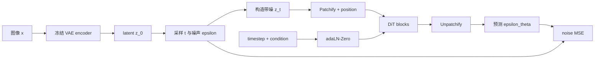
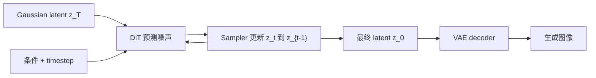
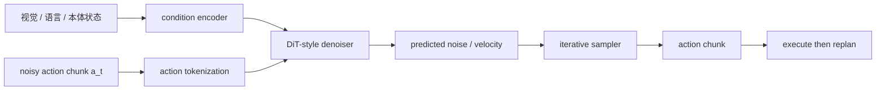

# Diffusion Transformer（DiT）

> 主卡。这里的 DiT 特指 Peebles 与 Xie 提出的 Diffusion Transformer：在 latent diffusion 中用 Transformer 替换常见 U-Net 去噪骨干。具身动作 diffusion 可以复用其原则，但不必与原始图像 DiT 完全同构。

## L0：一分钟理解

### 一句话定义

DiT 是把带噪图像 latent 切成 patch tokens，再用带 timestep 与条件调制的 Transformer 预测噪声，从而完成 diffusion 去噪的架构。

### 它解决什么问题

扩散模型需要一个网络反复回答：“当前噪声等级下，这个带噪样本中的噪声是什么？”经典图像 diffusion 常用卷积 U-Net，它具有强局部与多尺度归纳偏置；但当模型和数据继续扩大时，人们希望使用更统一、容易按深度、宽度和 token 数扩展的 Transformer 骨干。

DiT 保留 diffusion 的加噪目标与迭代采样，只替换承担噪声预测的网络结构：二维 latent 先 token 化，Transformer 建模全局关系，timestep 和类别条件通过自适应 LayerNorm 注入。

### 在 VLA/WAM 中有什么用

- 将动作 chunk 或轨迹切成时序 tokens，用 Transformer 同时建模跨时间、跨关节关系；
- 以视觉、语言、机器人状态作为条件，逐步去噪得到多模态动作；
- 在生成式世界模型中，对未来图像/视频 latent 或状态序列去噪。

原始 DiT 是类条件图像生成模型，不包含机器人观测编码、动作执行或闭环控制。把 DiT 用于具身任务还需重新定义 token、条件与输出。

### 记住这三点

1. DiT 改的是去噪网络 backbone，不是把 diffusion 过程改成自回归生成。
2. 输入是带噪 latent patches，输出通常是与 latent 同形状的噪声预测，而不是离散词 token。
3. timestep 与条件常通过 adaLN-Zero 调制每个 Transformer block；零初始化使深层网络从近似恒等映射开始。

## L1：直觉与结构

### 1. 背景：U-Net latent diffusion 已经解决了什么

Latent Diffusion 先用预训练 VAE 将图像 $x$ 压缩为连续 latent $z_0$，再在 latent 空间执行前向加噪和反向去噪。相比像素空间，它降低了空间尺寸和生成成本。U-Net 通过卷积、下采样、上采样与 skip connections 同时处理局部细节和多尺度结构。

因此，在 DiT 出现前，“低成本 latent 空间 + 强多尺度 U-Net 去噪器”已经是有效方案。

### 2. 剩余矛盾与设计目标

U-Net 的结构与分辨率层级紧密绑定；扩大模型时通常需要同时调整 channel、residual blocks 和 attention resolutions。Transformer 则提供更规则的 block 堆叠，并能直接让所有 tokens 交互。

设计目标是：**不改变 diffusion 学习问题，只把去噪器改造成可沿深度、宽度、注意力头数和 token 数系统扩展的 Transformer。**

这也产生新代价：全局 self-attention 对 token 数是二次复杂度，patch 越小、分辨率越高，计算和显存增长越快。

### 3. 设计因果链

#### latent 是二维网格，Transformer 接受序列

问题：VAE latent 为 $[C,H,W]$ 网格，Transformer 期待 token 序列。设计：用步长等于 patch size 的卷积完成 patchify 和线性投影，得到 $N=HW/p^2$ 个 $D$ 维 tokens，再加入二维位置编码。解决：可直接使用标准 Transformer。新代价：patch size $p$ 决定信息粒度和计算量。

#### 同一网络必须理解不同噪声等级

问题：$z_t$ 在早期接近数据、后期接近纯噪声，同一输入数值不能表明当前任务难度。设计：将 timestep $t$ 编码成向量。解决：网络可随噪声等级改变行为。新问题：还要把 timestep 和类别/文本等条件高效注入每层。

#### 条件 token 会增加序列与交互设计

原论文比较了 in-context conditioning、cross-attention 和 adaptive LayerNorm。最终 adaLN-Zero 用条件向量生成每层的 shift、scale 与 residual gate，无需增加条件 token 的注意力长度。它高效且让条件直接影响所有 block，但更偏向全局向量条件；长文本或密集空间条件常需要 cross-attention 等扩展。

#### 深层条件网络训练初期可能不稳定

设计：将 adaLN 的 residual gate 与最终输出层零初始化，使每个 block 初始近似恒等映射，整个模型初始预测接近零。解决：深网络从温和状态开始学习。代价：初始化是优化技巧，并不减少最终推理计算。

### 4. 完整训练与生成流程



文字等价描述：训练时图像先被 VAE 编成 latent，随机加噪后切成 tokens；DiT 在 timestep 和条件调制下预测所加噪声，并用噪声 MSE 训练。



文字等价描述：生成时从高斯 latent 开始，sampler 多次调用同一个 DiT 做反向更新，最后仅由 VAE decoder 把去噪 latent 还原为图像。

### 5. 输入、输出与张量形状

设 latent 为 $z_t\in\mathbb R^{B\times C\times H\times W}$，patch size 为 $p$，hidden width 为 $D$：

- patch 数 $N=(H/p)(W/p)$；
- patch embedding 后为 $h\in\mathbb R^{B\times N\times D}$；
- timestep embedding 与条件向量为 $c\in\mathbb R^{B\times D}$；
- Transformer 输出仍为 $[B,N,D]$；
- final layer 将每个 token 映射到 $p^2C_{out}$；
- unpatchify 后为 $[B,C_{out},H,W]$。

若只预测噪声，$C_{out}=C$；原始 DiT 的 learned-sigma 设置可输出 $2C$ channels，分别承载均值参数化相关输出和方差参数。

### 6. 在具身智能系统中的位置



文字等价描述：具身系统可让 DiT-style denoiser 在观测条件下迭代净化动作序列，但最终动作仍需执行、获取新观测并滚动重规划。

### 7. 与相近方法的区别

| 方法 | 去噪骨干 | 空间/序列归纳偏置 | 典型瓶颈 |
|---|---|---|---|
| U-Net diffusion | 多尺度卷积 U-Net | 强局部性、层级分辨率 | 结构扩展较专用 |
| 原始 DiT | 等分辨率 Transformer | 全局 token 交互 | attention 随 token 数二次增长 |
| Transformer diffusion policy | Transformer 或 DiT 变体 | 适合动作时序与多条件 | 多步采样影响控制频率 |
| Autoregressive Transformer | causal Transformer | 按顺序预测下一个 token | 暴露偏差、串行生成 |

DiT 的“Transformer”不意味着 causal mask。图像 latent tokens 在每个去噪步骤通常双向交互，因为整个 $z_t$ 同时可见。

## L2：数学与实现

### 1. 符号表

| 符号 | 含义 |
|---|---|
| $x$ | 原始图像或一般数据 |
| $z_0$ | VAE 编码后的干净 latent |
| $z_t$ | diffusion timestep $t$ 的带噪 latent |
| $\epsilon$ | 采样的标准高斯噪声 |
| $\beta_t$ | 第 $t$ 步噪声 schedule |
| $\alpha_t=1-\beta_t$ | 单步信号保留系数 |
| $\bar\alpha_t=\prod_{s=1}^{t}\alpha_s$ | 累积信号保留系数 |
| $y$ | 类别、文本或具身任务条件 |
| $\epsilon_\theta(z_t,t,y)$ | DiT 的噪声预测 |
| $p$ | latent patch size |

### 2. 核心公式

前向过程可一步采样任意 $t$：

```math
z_t=\sqrt{\bar\alpha_t}\,z_0
+\sqrt{1-\bar\alpha_t}\,\epsilon,
\qquad \epsilon\sim\mathcal N(0,I)
```

简化噪声预测目标为：

```math
\mathcal L_{\mathrm{simple}}
=\mathbb E_{z_0,t,\epsilon,y}
\left[
\left\|\epsilon-\epsilon_\theta(z_t,t,y)\right\|_2^2
\right]
```

一个 adaLN-Zero block 可抽象为：

```math
\begin{aligned}
u &= h+g_{\mathrm{msa}}\odot
\operatorname{MSA}\!\left(
s_{\mathrm{msa}}\odot\operatorname{LN}(h)+b_{\mathrm{msa}}
\right),\\
h' &= u+g_{\mathrm{mlp}}\odot
\operatorname{MLP}\!\left(
s_{\mathrm{mlp}}\odot\operatorname{LN}(u)+b_{\mathrm{mlp}}
\right)
\end{aligned}
```

其中六组调制参数都由 timestep/condition 向量产生；实现常令 $s=1+\Delta s$，并将 $g$ 的输出层零初始化。

### 3. 公式的逐步解释或推导

#### 第一步：为什么能直接构造任意 $z_t$

逐步前向转移定义为 Gaussian：

```math
q(z_t\mid z_{t-1})
=\mathcal N\!\left(
z_t;\sqrt{\alpha_t}z_{t-1},(1-\alpha_t)I
\right)
```

Gaussian 的线性组合仍是 Gaussian。将前 $t$ 步合并，可得 $q(z_t\mid z_0)=\mathcal N(\sqrt{\bar\alpha_t}z_0,(1-\bar\alpha_t)I)$，因此训练无需真的循环加噪 $t$ 次，只需一次采样公式。

#### 第二步：网络为什么预测噪声

给定 $z_t$ 和 $t$，若网络能恢复本次加入的 $\epsilon$，就能估计干净 latent：

```math
\hat z_0
=\frac{z_t-\sqrt{1-\bar\alpha_t}\,epsilon_\theta(z_t,t,y)}
{\sqrt{\bar\alpha_t}}
```

sampler 再根据所选 DDPM、DDIM 或其他求解规则把 $z_t$ 更新到更干净状态。DiT 给出模型预测，但具体反向步长由 sampler 定义，两者不是同一组件。

#### 第三步：MSE 与 diffusion 变分目标是什么关系

DDPM 的变分下界可以分解为各 timestep 的 Gaussian KL。采用固定方差反向过程并用噪声参数化均值后，每一项可化为带 timestep 权重的噪声平方误差。常见 `simple loss` 省略或重设这些理论权重，直接平均 $\|\epsilon-\epsilon_\theta\|^2$。

因此代码中的 MSE 不是任意替代：它来自 Gaussian reverse-process 参数化；但未加权 simple loss 是工程目标，与完整负 ELBO 不严格相等。

#### 第四步：patchify 改变的是表示，不改变 diffusion 随机变量

Patch embedding 把 $z_t$ 从 `[B,C,H,W]` 重排并线性投影成 `[B,N,D]`。Transformer 输出再映射并 unpatchify 回 latent 网格。噪声损失最终仍在与 $\epsilon$ 相同的 latent 网格元素上计算。tokenization 只是去噪函数 $\epsilon_\theta$ 的内部结构。

#### 第五步：adaLN-Zero 如何注入条件

先组合 timestep embedding 与类别 embedding：$c=e_t+e_y$。一个小网络将 $c$ 映射为六个 `[B,D]` 向量，并广播到所有 $N$ tokens。scale/shift 改变归一化后的通道，gate 控制注意力和 MLP residual 的强度。

当 gate 初始为零时，$h'=h$，所以每层初始为恒等映射。训练后不同 $t,y$ 产生不同调制参数，同一组 Transformer 权重即可适应各噪声等级与条件。

#### 第六步：classifier-free guidance 不属于 DiT block 本身

训练时以一定概率丢弃条件，令同一模型同时学习 conditional 与 unconditional 预测。采样时组合：

```math
\hat\epsilon_{\mathrm{cfg}}
=\epsilon_\theta(z_t,t,\varnothing)
+w\left[
\epsilon_\theta(z_t,t,y)-
\epsilon_\theta(z_t,t,\varnothing)
\right]
```

$w$ 增强条件一致性，但通常牺牲多样性，并使每一步需要两路预测或批量拼接。CFG 是条件采样策略，不是“Transformer 替换 U-Net”的必要定义。

### 4. 最小数值例子

设一维干净 latent $z_0=2$，某一步 $\bar\alpha_t=0.81$，采样噪声 $\epsilon=-0.5$：

```math
z_t=\sqrt{0.81}\times2+\sqrt{0.19}\times(-0.5)
\approx1.8-0.2179=1.5821
```

若 DiT 预测 $\hat\epsilon=-0.4$，该元素的 simple loss 为：

```math
(\epsilon-\hat\epsilon)^2=(-0.5+0.4)^2=0.01
```

由预测噪声反推：

```math
\hat z_0
=\frac{1.5821-\sqrt{0.19}\times(-0.4)}{0.9}
\approx1.9516
```

预测噪声存在 $0.1$ 误差，因此恢复的 $\hat z_0$ 也偏离真实值 $2$。

形状例子：若 latent 为 `[B,4,32,32]` 且 $p=2$，则有 $(32/2)^2=256$ tokens；若 $p=4$，仅有 64 tokens，但每个 token 必须覆盖更大的 latent 区域。

### 5. 训练与推理

#### 训练

1. 用冻结 VAE encoder 得到 $z_0$；
2. 为每个样本独立采样 timestep $t$ 和噪声 $\epsilon$；
3. 一步构造 $z_t$；
4. DiT 预测噪声（以及可选方差）；
5. 对非 batch 维取平方误差均值或和，再对 batch 求均值；
6. 若使用 CFG，以一定概率将条件替换为空条件。

#### 生成

1. 从 $z_T\sim\mathcal N(0,I)$ 开始；
2. sampler 在每个 timestep 调用 DiT；
3. 根据噪声/速度/数据预测参数化更新 latent；
4. 得到 $z_0$ 后用 VAE decoder 解码；
5. 具身动作生成还要执行部分动作并闭环重规划。

训练一次随机 $t$ 只需一次 DiT forward；生成却通常需要多次 forward，这是 diffusion 推理慢的根本来源之一。

### 6. 伪代码

```text
training:
    z0 = frozen_vae_encoder(x)
    t ~ Uniform({1, ..., T})
    epsilon ~ Normal(0, I)
    zt = sqrt(alpha_bar[t]) * z0 + sqrt(1 - alpha_bar[t]) * epsilon
    condition = maybe_drop_condition(y)
    epsilon_hat = dit(zt, t, condition)
    loss = mean((epsilon_hat - epsilon)^2)
    update dit

sampling:
    z = Normal(0, I)
    for t in reverse(schedule):
        epsilon_hat = dit(z, t, condition)
        z = sampler_step(z, epsilon_hat, t)
    x = frozen_vae_decoder(z)
```

### 7. 最小 PyTorch 实现

下面实现展示 patchify、timestep/condition 调制、adaLN-Zero 和噪声 MSE。为保持最小，它省略二维固定位置编码、learned variance、CFG 与完整 sampler。

```python
import math
import torch
import torch.nn as nn
import torch.nn.functional as F


def timestep_embedding(t: torch.Tensor, dim: int) -> torch.Tensor:
    # t: [B] -> sinusoidal embedding: [B, D]
    half = dim // 2
    freqs = torch.exp(
        -math.log(10000.0)
        * torch.arange(half, device=t.device, dtype=torch.float32)
        / max(half - 1, 1)
    )
    args = t.float()[:, None] * freqs[None]
    emb = torch.cat([torch.cos(args), torch.sin(args)], dim=-1)
    if dim % 2:
        emb = F.pad(emb, (0, 1))
    return emb


def modulate(x: torch.Tensor, shift: torch.Tensor, scale: torch.Tensor):
    # x: [B, N, D], shift/scale: [B, D]
    return x * (1.0 + scale[:, None, :]) + shift[:, None, :]


class AdaLNZeroBlock(nn.Module):
    def __init__(self, dim: int, heads: int, mlp_ratio: int = 4):
        super().__init__()
        self.norm1 = nn.LayerNorm(dim, elementwise_affine=False)
        self.attn = nn.MultiheadAttention(dim, heads, batch_first=True)
        self.norm2 = nn.LayerNorm(dim, elementwise_affine=False)
        self.mlp = nn.Sequential(
            nn.Linear(dim, mlp_ratio * dim),
            nn.GELU(),
            nn.Linear(mlp_ratio * dim, dim),
        )
        self.ada = nn.Sequential(nn.SiLU(), nn.Linear(dim, 6 * dim))
        nn.init.zeros_(self.ada[-1].weight)
        nn.init.zeros_(self.ada[-1].bias)

    def forward(self, x: torch.Tensor, cond: torch.Tensor) -> torch.Tensor:
        shift_a, scale_a, gate_a, shift_m, scale_m, gate_m = (
            self.ada(cond).chunk(6, dim=-1)
        )
        qkv = modulate(self.norm1(x), shift_a, scale_a)
        attn_out, _ = self.attn(qkv, qkv, qkv, need_weights=False)
        x = x + gate_a[:, None, :] * attn_out
        mlp_in = modulate(self.norm2(x), shift_m, scale_m)
        x = x + gate_m[:, None, :] * self.mlp(mlp_in)
        return x


class TinyDiT(nn.Module):
    def __init__(
        self,
        in_channels: int = 4,
        patch_size: int = 2,
        dim: int = 128,
        depth: int = 4,
        heads: int = 4,
        num_classes: int = 1000,
    ):
        super().__init__()
        self.in_channels = in_channels
        self.patch_size = patch_size
        self.patch_embed = nn.Conv2d(
            in_channels, dim, kernel_size=patch_size, stride=patch_size
        )
        self.time_mlp = nn.Sequential(nn.Linear(dim, dim), nn.SiLU(), nn.Linear(dim, dim))
        self.class_embed = nn.Embedding(num_classes, dim)
        self.blocks = nn.ModuleList(
            [AdaLNZeroBlock(dim, heads) for _ in range(depth)]
        )
        self.final_norm = nn.LayerNorm(dim, elementwise_affine=False)
        self.final_ada = nn.Sequential(nn.SiLU(), nn.Linear(dim, 2 * dim))
        self.final_linear = nn.Linear(dim, patch_size * patch_size * in_channels)
        nn.init.zeros_(self.final_ada[-1].weight)
        nn.init.zeros_(self.final_ada[-1].bias)
        nn.init.zeros_(self.final_linear.weight)
        nn.init.zeros_(self.final_linear.bias)

    def unpatchify(self, tokens: torch.Tensor, hp: int, wp: int) -> torch.Tensor:
        # [B, hp*wp, p*p*C] -> [B, C, hp*p, wp*p]
        b, _, _ = tokens.shape
        p, c = self.patch_size, self.in_channels
        x = tokens.view(b, hp, wp, p, p, c)
        return x.permute(0, 5, 1, 3, 2, 4).reshape(b, c, hp * p, wp * p)

    def forward(self, z_t: torch.Tensor, t: torch.Tensor, y: torch.Tensor):
        # z_t: [B, C, H, W], t/y: [B]
        h = self.patch_embed(z_t)  # [B, D, H/p, W/p]
        hp, wp = h.shape[-2:]
        h = h.flatten(2).transpose(1, 2)  # [B, N, D]
        cond = self.time_mlp(timestep_embedding(t, h.shape[-1])) + self.class_embed(y)
        for block in self.blocks:
            h = block(h, cond)
        shift, scale = self.final_ada(cond).chunk(2, dim=-1)
        h = modulate(self.final_norm(h), shift, scale)
        return self.unpatchify(self.final_linear(h), hp, wp)


def add_noise(
    z0: torch.Tensor,
    noise: torch.Tensor,
    alpha_bar_t: torch.Tensor,
) -> torch.Tensor:
    # alpha_bar_t: [B]; broadcast across [C, H, W].
    a = alpha_bar_t[:, None, None, None]
    return a.sqrt() * z0 + (1.0 - a).sqrt() * noise


def diffusion_loss(
    model: nn.Module,
    z0: torch.Tensor,
    t: torch.Tensor,
    y: torch.Tensor,
    alpha_bar_t: torch.Tensor,
) -> torch.Tensor:
    noise = torch.randn_like(z0)
    zt = add_noise(z0, noise, alpha_bar_t)
    noise_hat = model(zt, t, y)
    # Exact element mean of the finite-batch simple epsilon objective.
    return F.mse_loss(noise_hat, noise, reduction="mean")
```

真实 DiT 必须加入位置编码，否则 attention 无法区分 patch 空间位置；上面省略它是为了突出条件调制，不应直接作为高质量训练配置。

### 8. 公式—代码对应

| 数学对象 | 代码 | 转换依据 | 形状与 reduction |
|---|---|---|---|
| $z_t=\sqrt{\bar\alpha_t}z_0+\sqrt{1-\bar\alpha_t}\epsilon$ | `add_noise(...)` | forward Gaussian 的闭式采样 | `[B,C,H,W]`，系数按 batch broadcast |
| latent patch tokens | `Conv2d(..., kernel_size=p, stride=p)` | 不重叠 patchify 与线性投影合并 | `[B,C,H,W] -> [B,D,H/p,W/p]` |
| timestep embedding | `timestep_embedding` + `time_mlp` | 正弦特征后学习投影 | `[B] -> [B,D]` |
| $c=e_t+e_y$ | `time_mlp(...) + class_embed(y)` | 同维全局条件相加 | `[B,D]` |
| adaLN shift/scale/gate | `self.ada(cond).chunk(6,-1)` | 每层由条件生成六组通道参数 | 六个 `[B,D]`，广播到 $N$ |
| unpatchify | `view`、`permute`、`reshape` | patch 元素回到通道和二维位置 | `[B,N,p^2C] -> [B,C,H,W]` |
| $\mathbb E\|\epsilon-\epsilon_\theta\|^2$ | `F.mse_loss(..., reduction="mean")` | minibatch、channel 与空间元素的经验均值 | 标量；simple objective |

这里的 MSE 是对 batch 内全部 latent 元素取 mean。若实现先对每个样本求 sum 再 batch mean，损失会多出 $CHW$ 的尺度；必须同步调整学习率或权重，不能只比较数值大小。

### 9. 常见超参数

- model size：depth、hidden width、attention heads；
- patch size $p$：越小 token 越多、细粒度更强、attention 更贵；
- diffusion steps 与 noise schedule；
- prediction target：$\epsilon$、$x_0$ 或 velocity $v$；
- condition dropout 与 CFG scale；
- 是否学习 reverse-process variance；
- latent scaling、VAE 类型和 latent channel 数；
- 动作任务中的 horizon、action dimension 与重规划频率。

原论文名称如 DiT-XL/2 中，`XL` 表示模型规模，`/2` 表示 latent patch size 为 2，而不是图像被缩小两倍。

### 10. 失败模式与常见误解

#### 把 DiT 当作新的 diffusion 方程

DiT 主要替换 $\epsilon_\theta$ 的网络架构。forward noise、训练参数化和 sampler 可以与 U-Net diffusion 共用。

#### 忘记位置编码

没有位置编码时，self-attention 对 token 排列近似置换等变，难以理解二维位置。最小代码省略不代表真实模型可以省略。

#### token 数导致显存爆炸

减小 patch 或提高 latent 分辨率会增加 $N$，标准 attention 的矩阵为 $N\times N$。应估算 token 数，而不只看参数量。

#### timestep 或条件没有真正进入每层

只在输入端拼接弱条件可能被深层网络淡化。检查 adaLN 参数、cross-attention 或 conditioning path 是否有梯度，且训练/推理条件编码一致。

#### 零初始化写错位置

adaLN-Zero 不是把整个 Transformer 所有权重归零，而是将调制输出/gate 和最终输出层按设计零初始化；全网络归零会造成对称性与学习问题。

#### 误把 MSE 当作像素重建

原始 DiT 的 MSE 比较 VAE latent 空间中的真实噪声和预测噪声，不是比较生成图像与真实 RGB。VAE reconstruction 与 diffusion noise prediction 属于不同训练阶段。

#### 训练便宜等于采样便宜

训练每个样本随机一个 $t$，而采样要多次调用模型。大 DiT、CFG 双路预测和长 schedule 都会增加延迟，机器人在线控制尤其敏感。

#### 将图像 DiT 直接称为 diffusion policy

具身模型必须将条件改为观测/语言，把输出改为动作或轨迹，并处理闭环执行。共享 backbone 思想不代表任务定义相同。

## 自测

### 基础题

1. DiT 替换了 diffusion 系统中的哪个组件？
2. DiT-XL/2 中 `/2` 通常表示什么？

### 理解题

3. timestep 为什么不能只当作一个无关元数据？
4. adaLN-Zero 的 shift、scale 和 gate 各起什么作用？
5. 为什么 `F.mse_loss(noise_hat, noise)` 能对应 diffusion 训练目标，却不是像素 MSE？
6. patch size 从 4 改成 2 时，二维 latent 的 token 数和 attention 规模怎样变化？

### 迁移题

7. 将 DiT 用于 $T\times A$ 动作 chunk 时，你会如何定义 token、位置编码、条件和输出？
8. 若机器人控制频率不够，应该从模型、sampler 和闭环 horizon 哪些方向排查？

<details>
<summary>参考答案</summary>

1. 替换预测噪声/速度等 diffusion target 的去噪 backbone，通常由 U-Net 换成 Transformer。
2. latent patch size 为 2。
3. 不同 $t$ 对应完全不同的信噪比；网络必须据此选择从结构恢复到细节修正的行为。
4. shift/scale 调制归一化特征，gate 控制 attention/MLP residual 写回强度；零 gate 使初始 block 近似恒等。
5. 模型比较的是前向过程采样的 latent Gaussian noise；在特定 reverse Gaussian 参数化下，它来自变分目标的简化，而不是 RGB reconstruction。
6. 高宽 token 网格各扩大 2 倍，总 token 数扩大 4 倍；朴素 attention 矩阵元素数约扩大 16 倍。
7. 可将每个时间步或时间—动作分组作为 token，加入时间位置编码；以视觉、语言、本体状态为条件；输出与带噪动作同形状的噪声或 velocity。
8. 检查 DiT 大小/token 数、attention kernel、去噪步数、CFG 双路开销、蒸馏/一致性加速，以及动作 chunk 长度和滚动重规划频率。

</details>

## 学习导航

### 前置卡片

- Diffusion Model（待创建）
- Transformer（待创建）
- [VAE](../../representations/latent/VAE.md)

### 原子子卡

- Forward Diffusion 与 Noise Schedule（待创建）
- adaLN-Zero（待创建）
- Classifier-Free Guidance（待创建）
- Patchify / Unpatchify（待创建）

### 对比卡片

- DiT vs U-Net Diffusion（待创建）
- DiT vs Autoregressive Transformer（待创建）
- DiT vs Flow Transformer（待创建）

### 下一张推荐卡

先学习 Diffusion Model 的 forward/reverse process，再学习 Diffusion Policy，观察相同去噪目标如何从图像 latent 转为条件动作序列。

## 参考资料

1. [Scalable Diffusion Models with Transformers](https://arxiv.org/abs/2212.09748) — DiT 原论文。
2. [DiT official project page](https://www.wpeebles.com/DiT) — 结构与规模实验概览。
3. [Official PyTorch implementation](https://github.com/facebookresearch/DiT) — adaLN-Zero、patchify 与采样实现。
4. [Denoising Diffusion Probabilistic Models](https://arxiv.org/abs/2006.11239) — 噪声预测目标与 DDPM 基础。
5. [High-Resolution Image Synthesis with Latent Diffusion Models](https://arxiv.org/abs/2112.10752) — latent diffusion 与 VAE 压缩背景。

## L3：论文与源码深入（待补充）

- 原论文四种 conditioning mechanism 的控制变量比较；
- learned covariance 与完整 variational bound 的官方实现映射；
- DiT scaling、Gflops 与 token 数的实验解读；
- RoPE、cross-attention、MMDiT 与视频时空 patches；
- diffusion/flow Transformer 在 VLA 动作生成中的延迟与闭环权衡。
