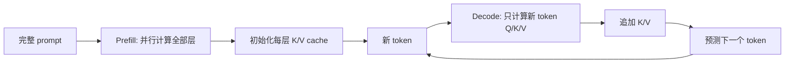
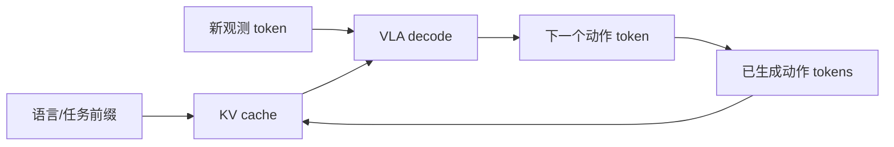

# Key-Value Cache（KV-cache，键值缓存）

> 主卡。KV-cache 是 Transformer 自回归推理的状态复用机制，不改变模型参数，也不是一种新的 attention 训练目标。

## L0：一分钟理解

### 一句话定义

KV-cache 保存每一层过去 tokens 已经计算好的 Key 和 Value，使生成下一个 token 时只计算新 token 的 Q/K/V，而不重复投影整个历史。

### 它解决什么问题

自回归模型一次只追加一个 token。若每一步都把完整前缀重新送入模型，过去 tokens 的 K/V 会被反复计算；KV-cache 用显存保存这些中间结果，换取更低的逐 token 延迟。

它不消除新 query 对全部历史 keys/values 的注意力计算，因此上下文越长，单步 attention 仍越慢，cache 显存也线性增长。

### 在 VLA/WAM 中有什么用

- VLA 自回归生成动作 token 时复用视觉、语言和已有动作历史；
- 机器人闭环每次追加新观测或动作时，减少对未变化前缀的重复编码；
- 多模态 agent 长对话或轨迹推理中降低首 token 之后的解码延迟。

能否安全复用取决于前缀是否真的未变；若历史被编辑、重排或重新编码，对应 cache 必须失效或重建。

### 记住这三点

1. Cache 按层保存过去的 K/V，不是保存 attention 权重，也通常不缓存过去的 Q。
2. Prefill 处理完整 prompt，decode 每步追加新 K/V；KV-cache 主要加速 decode。
3. 它以显存换计算：时间收益越大，长上下文、batch 和 beam 带来的 cache 压力也越大。

## L1：直觉与结构

### 1. 背景：普通 causal attention 已经解决了历史依赖

第 $t$ 个位置的 self-attention 使用 query $q_t$ 查询截至当前位置的 keys 和 values：

```math
\operatorname{Attn}(q_t,K_{\le t},V_{\le t})
=
\operatorname{softmax}
\left(
\frac{q_tK_{\le t}^{\top}}{\sqrt{d_h}}
\right)V_{\le t}
```

causal mask 保证 token 不能读取未来。训练时整段序列可以并行计算；但生成时，$x_t$ 出现后才能生成 $x_{t+1}$，所以 decode 天生是逐步的。

### 2. 剩余矛盾与设计目标

生成到第 $t$ 步时，前 $t-1$ 个 tokens 没变。若仍把完整前缀重新前向：

- 过去 hidden states 再次做 K/V projection；
- 过去位置之间的中间计算再次发生；
- 下一步又重复同一批工作。

我们希望复用不随未来 token 改变的中间结果，同时保持当前 token 能读取全部历史。

关键观察是：在 causal Transformer 的某一层中，一旦过去 token 的该层表示已经确定，它产生的 $k_i$ 和 $v_i$ 不会因为未来 token 到来而改变。于是它们可以缓存。

### 3. 设计因果链

| 当前问题 | 设计选择 | 解决了什么 | 新问题或代价 |
|---|---|---|---|
| 每步重复计算历史 K/V | 按层缓存 $K_{\text{past}},V_{\text{past}}$ | 过去投影只算一次 | cache 随序列增长 |
| 当前 token 仍要访问历史 | 新 K/V 与 cache 拼接 | 保留完整 causal 上下文 | 单步 attention 仍随长度线性增长 |
| 动态拼接会分配/复制内存 | 预分配或分页管理 | 降低碎片与复制 | 管理逻辑更复杂 |
| MHA cache 太大 | MQA/GQA 减少 KV heads | 降低 cache 显存和带宽 | 改变注意力结构 |
| 超长上下文仍 OOM | sliding/offload/quantized cache | 控制设备显存 | 可能损失上下文、精度或速度 |
| prefix 被修改 | cache 失效/重建 | 保证 K/V 与输入一致 | 丢失复用收益 |

### 4. 为什么缓存 K/V，而通常不缓存过去的 Q

过去的 $q_i$ 只用于计算过去位置自己的输出；生成新 token 时，我们不需要重新查询“过去 token 应该关注什么”。新一步只需要：

- 当前 token 的 $q_t$；
- 所有历史及当前的 $K_{\le t}$；
- 所有历史及当前的 $V_{\le t}$。

因此缓存 K/V 正好覆盖会被新 query 重用的数据。缓存过去 Q 通常不会帮助标准单步 causal decode。

### 5. Prefill 与 decode：完整推理流程



文字说明：prefill 一次处理已有上下文并建立 cache；decode 每步只输入尚未处理的新 token，同时读取并扩展 cache。

这也解释了两个常见延迟指标：

- **TTFT（time to first token）** 更受 prefill 和 prompt 长度影响；
- **TPOT（time per output token）** 更受 decode、cache 读取和逐步 attention 影响。

### 6. 输入、输出与张量形状

设 batch 为 $B$、query heads 为 $H_q$、KV heads 为 $H_{kv}$、历史长度为 $T$、head dim 为 $d_h$：

| 张量 | 单 token decode 形状 | 含义 |
|---|---|---|
| $q_t$ | `[B,H_q,1,d_h]` | 当前 token query |
| $k_t,v_t$ | `[B,H_{kv},1,d_h]` | 当前 token 新 K/V |
| $K_{\text{cache}},V_{\text{cache}}$ | `[B,H_{kv},T,d_h]` | 某一层已有历史 |
| attention scores | `[B,H_q,1,T+1]` | 当前 query 对全部历史的分数 |

MHA 通常有 $H_{kv}=H_q$；GQA/MQA 使用更少 KV heads，从而直接减少 cache 大小。

### 7. 在具身智能系统中的位置



文字说明：固定语言和较早历史可被复用，新观测与动作 token 逐步追加；若模型重新编码了被修改的视觉前缀，则旧 cache 不再有效。

对实时机器人而言，KV-cache 降低的是模型推理中的重复计算，并不能替代传感器更新、控制频率设计或安全闭环。长轨迹 cache 还可能挤占用于视觉 Encoder、world model 或 batch 的显存。

### 8. 与相近机制的区别

| 机制 | 保存什么 | 主要目标 |
|---|---|---|
| KV-cache | 每层过去 token 的 K/V | 加速自回归 decode |
| Prefix cache | 多请求共享的相同前缀对应 cache blocks | 跨请求复用 prefill |
| PagedAttention | 分页组织 KV-cache | 降低碎片、支持动态请求 |
| Sliding-window cache | 最近窗口的 K/V | 用有限显存处理长流 |
| Activation checkpointing | 训练激活的重计算策略 | 用计算换训练显存 |

## L2：数学与实现

### 1. 符号表

| 符号 | 含义 |
|---|---|
| $L$ | Transformer 层数 |
| $T$ | 已缓存序列长度 |
| $H_q$ | query head 数 |
| $H_{kv}$ | key/value head 数 |
| $d_h$ | 每个 head 的维度 |
| $s$ | 每个元素的字节数 |
| $K^{(\ell)},V^{(\ell)}$ | 第 $\ell$ 层 cache |

### 2. 核心公式：前缀没有变，为什么还要重算

无 cache 时，第 $t$ 步重新从完整前缀计算：

```math
Q_{\le t}=X_{\le t}W_Q,\quad
K_{\le t}=X_{\le t}W_K,\quad
V_{\le t}=X_{\le t}W_V
```

有 cache 时只投影新 token：

```math
q_t=x_tW_Q,\quad k_t=x_tW_K,\quad v_t=x_tW_V
```

再更新：

```math
K_{\text{cache}}\leftarrow
\operatorname{concat}(K_{\text{cache}},k_t),\qquad
V_{\text{cache}}\leftarrow
\operatorname{concat}(V_{\text{cache}},v_t)
```

当前输出仍严格使用完整历史：

```math
o_t=
\operatorname{softmax}
\left(
\frac{q_tK_{\text{cache}}^\top}{\sqrt{d_h}}
\right)V_{\text{cache}}
```

因此，在确定性模型、相同位置编码和正确 mask 下，cache 改变的是计算复用方式，不应改变生成结果。

### 3. 公式的逐步解释或推导

#### 3.1 为什么速度提升不是“attention 变成常数时间”

无 cache 时，每一步把长度 $t$ 的前缀重新送入 causal self-attention，单层 attention 对该前缀的计算规模约为 $O(t^2d_h)$。有 cache 时，当前只有一个新 query 与 $t$ 个 keys 计算，decode 单步约为 $O(td_h)$。

累计生成 $T$ 个新 tokens 时，仅从这一直观 attention 计数看：

```math
\sum_{t=1}^{T}O(t^2)=O(T^3),\qquad
\sum_{t=1}^{T}O(t)=O(T^2)
```

实际内核、prefill、MLP、memory bandwidth 和 batching 会影响墙钟时间，因此不能把复杂度降阶直接当成固定倍数加速。尤其在长上下文 decode 中，读取大量 K/V 往往成为带宽瓶颈。

#### 3.2 Cache 显存为什么线性增长

每层同时保存 K 和 V，因此近似字节数为：

```math
M_{\mathrm{KV}}
=
2LBH_{kv}Td_hs
```

其中最前面的 2 代表 K 与 V。它对层数、batch、KV heads、上下文长度和元素字节数都线性增长。

例如 $L=32$、$B=1$、$H_{kv}=8$、$T=4096$、$d_h=128$、FP16 的 $s=2$：

```math
M_{\mathrm{KV}}
=
2\times32\times1\times8\times4096\times128\times2
=
536{,}870{,}912\ \text{bytes}
```

约为 512 MiB。若其余条件相同但 MHA 使用 $H_{kv}=32$，则约为 2 GiB。这说明 GQA/MQA 为什么能显著降低 KV-cache 压力。

#### 3.3 为什么训练通常不用 decode cache

教师强制训练时，整段序列已知，可以一次并行计算全部 Q/K/V。逐 token cache 会破坏并行性，还要保留反向传播图，通常得不偿失。

此外，训练中的 dropout、梯度图和序列打包使“过去状态永远固定”的推理假设不再适合作为通用缓存接口。KV-cache 的主要使用场景是参数固定的自回归推理。

### 4. 最小数值例子

假设已有 3 个 tokens 的单头 cache：

```math
K_{\text{past}}\in\mathbb{R}^{1\times1\times3\times4}
```

新 token 产生 $q_4,k_4,v_4\in\mathbb{R}^{1\times1\times1\times4}$。追加后：

```math
K_{\le4},V_{\le4}\in\mathbb{R}^{1\times1\times4\times4}
```

attention scores 形状为 `[1,1,1,4]`：只有一个新 query，但它读取 4 个 key。下一步 cache 长度变成 5；旧的 4 组 K/V 不再投影。

### 5. Prefill、decode 与 cache 失效

| 情况 | 是否可直接复用 | 原因 |
|---|---|---|
| 在相同前缀末尾追加 token | 可以 | 过去位置与位置编码不变 |
| 修改中间某个 token | 修改点之后需重算 | 后续 hidden states 已改变 |
| 改变 position ids/RoPE 偏移 | 通常不可直接复用 | 缓存 K 已包含位置信息 |
| beam 扩展/重排 | 需同步复制或重排 cache | cache 必须与 beam 对齐 |
| sliding window 移出旧 token | 按模型规则更新 | attention 可见范围改变 |
| 新传感器帧替换旧视觉 tokens | 通常需重算相关前缀 | 输入内容并非简单追加 |

### 6. 伪代码

1. Prefill 完整 prompt，保存每层 K/V；
2. 只把新 token 输入下一次 forward；
3. 每层计算当前 $q_t,k_t,v_t$；
4. 将 $k_t,v_t$ 写入该层 cache；
5. 用 $q_t$ 查询完整 cached K/V；
6. 产生 logits 并选择下一 token；
7. 若 prefix、beam 或位置发生变化，同步更新或重建 cache。

### 7. 最小 PyTorch 实现

```python
import math
import torch


def decode_attention(x_t, w_q, w_k, w_v, cache=None):
    # x_t: [B, 1, D]。这里只演示单头、单层、单 token decode。
    q_t = x_t @ w_q
    k_t = x_t @ w_k
    v_t = x_t @ w_v

    if cache is None:
        k_all, v_all = k_t, v_t
    else:
        k_past, v_past = cache
        # 沿 sequence 维追加；生产实现通常避免每步 torch.cat 的复制。
        k_all = torch.cat([k_past, k_t], dim=1)
        v_all = torch.cat([v_past, v_t], dim=1)

    # q_t: [B,1,D]，k_all: [B,T,D]，scores: [B,1,T]。
    scores = q_t @ k_all.transpose(-2, -1)
    scores = scores / math.sqrt(q_t.shape[-1])
    weights = torch.softmax(scores, dim=-1)
    output = weights @ v_all
    return output, (k_all, v_all)
```

这个最小实现展示语义，不代表高性能写法。逐步 `torch.cat` 会反复分配和复制；真实系统常用预分配、分页 blocks 或框架 Cache 类管理写入位置。

### 8. 公式—代码对应

| 数学对象 | 代码 | 转换依据 | 形状与成本 |
|---|---|---|---|
| $q_t=x_tW_Q$ | `x_t @ w_q` | 只计算当前 query | `[B,1,D]` |
| $k_t,v_t$ | `x_t @ w_k/w_v` | 只投影新 token | 各 `[B,1,D]` |
| $[K_{\text{past}};k_t]$ | `torch.cat(...)` | 沿序列维追加 | `[B,T,D]`；示例会复制 |
| $q_tK^\top$ | `q_t @ k_all.transpose(...)` | 当前 query 读取全部历史 | `[B,1,T]` |
| cache state | `(k_all,v_all)` | 传给下一 decode step | 每层两张量 |

### 9. 常见配置与优化

- Dynamic cache：长度按需增长，简单但动态形状不利于部分编译优化；
- Static cache：预分配最大长度，利于固定形状但可能浪费显存和计算；
- GQA/MQA：减少 $H_{kv}$；
- quantized cache：降低元素字节数 $s$，但增加量化开销并可能影响精度；
- offloaded cache：用 CPU 内存换 GPU 显存，增加传输；
- sliding-window cache：限制 $T$，但丢弃窗口外上下文；
- PagedAttention：分页管理动态请求的 cache blocks，减少碎片和冗余复制。

### 10. 失败模式与常见误解

1. **把 cache 当作模型记忆**：它只是当前请求的中间状态，不会更新模型知识。
2. **认为缓存后单步是 $O(1)$**：新 query 仍要读取历史 K/V。
3. **忽略每层 cache**：不是只在模型顶部保存一份 K/V。
4. **前缀变化仍复用**：会造成位置、mask 或内容错位。
5. **只看容量不看带宽**：长上下文 decode 常受 K/V 读取限制。
6. **训练也强行开启 cache**：会破坏常见并行训练流程。
7. **把 KV-cache 与 prompt 文本缓存混淆**：前者保存张量，后者可能只是 tokenized 输入或业务缓存。

## 自测

### 基础题

1. KV-cache 为什么缓存 K/V 而不是过去所有 Q？
2. Prefill 与 decode 分别做什么？
3. 单层 cache 的典型形状是什么？

### 理解题

1. 为什么 KV-cache 降低重复计算，却增加显存？
2. 为什么单步 decode 仍随上下文长度增长？
3. GQA 为什么能减少 cache？

### 迁移题

1. VLA 替换了历史中的一帧图像，旧 cache 哪部分还能用？
2. 长轨迹导致 OOM 时，可在速度、精度和上下文范围之间做哪些交换？
3. 多个请求拥有相同系统提示时，普通请求内 KV-cache 与 prefix cache 有何区别？

<details>
<summary>参考答案</summary>

1. 新 token 只需要新的 query 查询全部历史 K/V；过去 Q 不再参与新位置输出。
2. Prefill 并行处理已有前缀并建立 cache；decode 每步追加一个或少量新 tokens。
3. 每层 K/V 各为 `[B,H_kv,T,d_h]`。
4. 它保存过去中间结果，用存储换掉重复投影和前缀前向。
5. 当前 query 仍需与 $T$ 个 keys 计算并读取 $T$ 个 values。
6. 它让多个 query heads 共享较少的 KV heads，公式中的 $H_{kv}$ 变小。
7. 修改点之后的 hidden states 通常需重算；是否保留之前部分取决于模型和 cache API。
8. 可选 GQA/MQA、量化、offload、sliding window、分页管理或降低 batch/beam。
9. 请求内 cache 复用同一序列的过去 K/V；prefix cache 让多个请求共享相同前缀的 cache blocks。

</details>

## 学习导航

### 前置卡片

- Self-Attention（待创建）
- Causal Mask（待创建）
- Autoregressive Decoding（待创建）
- Multi-Head Attention（待创建）

### 原子子卡

- RoPE 与 cache position（待创建）
- Grouped-Query Attention（待创建）
- PagedAttention（待创建）
- KV-cache Quantization（待创建）

### 对比卡片

- KV-cache vs Prefix Cache（待创建）
- Dynamic vs Static Cache（待创建）

### 下一张推荐卡

先学习 Self-Attention 与 Causal Mask，再学习 GQA 和 PagedAttention 如何缓解 KV-cache 的显存与管理瓶颈。

## 参考资料

1. [Attention Is All You Need](https://arxiv.org/abs/1706.03762).
2. [Hugging Face Transformers：Caching](https://huggingface.co/docs/transformers/cache_explanation).
3. [Hugging Face Transformers：Cache strategies](https://huggingface.co/docs/transformers/kv_cache).
4. [Efficient Memory Management for Large Language Model Serving with PagedAttention](https://arxiv.org/abs/2309.06180).
5. [PyTorch scaled dot product attention](https://docs.pytorch.org/docs/stable/generated/torch.nn.functional.scaled_dot_product_attention).

## L3：论文与源码深入（待补充）

- RoPE、relative position 与 cache reuse 的约束；
- continuous batching、prefix sharing 与 beam cache 重排；
- FlashAttention decode kernels 与 memory bandwidth；
- KV quantization、eviction 和 long-context serving；
- VLA 中视觉前缀缓存与闭环观测刷新策略。
