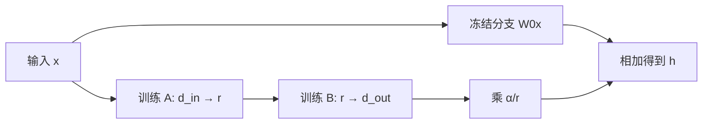
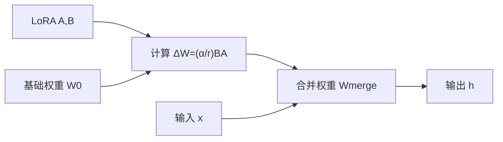
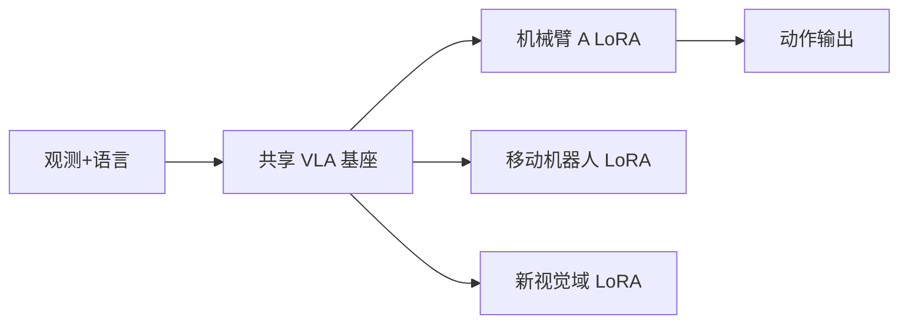

# Low-Rank Adaptation（LoRA，低秩适配）

> 主卡。LoRA 是参数高效微调方法：冻结预训练权重，只学习低秩形式的权重增量。

## L0：一分钟理解

### 一句话定义

LoRA 不直接更新大矩阵 $W_0$，而是用两个小矩阵的乘积 $BA$ 表示任务适配增量，使前向变成 $W_0x+BAx$。

### 它解决什么问题

完整微调允许每个权重变化，表达能力强，但需要为每个任务训练、保存并优化一整套大模型参数。LoRA 假设任务适配所需的权重变化具有较低的有效秩，只训练一对小矩阵。

它减少的是可训练参数、梯度和优化器状态；基础模型权重仍需加载，前向激活也不会自动按同样比例减少。

### 在 VLA/WAM 中有什么用

- 用同一个 VLA 基座为不同机器人、末端执行器或任务保存轻量 adapter；
- 在有限显存下适配新的相机域、语言指令或动作数据；
- 部署时按任务切换 LoRA，而不复制完整基础模型。

这是通用低秩适配在具身模型中的应用推论；实际效果取决于目标模块、数据覆盖、rank 和基座能力。

### 记住这三点

1. LoRA 学的是低秩权重增量 $\Delta W=BA$，不是对原权重做低秩分解。
2. 参数量从 $d_{out}d_{in}$ 降为 $r(d_{in}+d_{out})$，前提是 $r$ 足够小。
3. 固定 adapter 可合并进 $W_0$；但训练、动态切换或组合多个 adapters 时通常保留分支。

## L1：直觉与结构

### 1. 背景：完整微调已经解决了任务适配

给定预训练线性层：

```math
h=W_0x
```

完整微调直接更新 $W_0$，所以理论上可以学习任意形状相同的增量 $\Delta W$：

```math
h=(W_0+\Delta W)x
```

这已经解决了“让模型适应新任务”，但代价随着模型规模和任务数量增长：每个任务都需要大量可训练参数、梯度、优化器状态和 checkpoint 存储。

### 2. 剩余矛盾与设计目标

我们希望同时满足：

1. 保留预训练基座的通用能力；
2. 每个下游任务只训练和保存少量参数；
3. 适配作用仍发生在模型内部权重上，而非只在输入端追加提示；
4. 对固定 adapter，部署时尽量不增加额外层和推理延迟。

LoRA 的关键假设是：虽然 $W_0$ 很大，但某个具体下游任务需要的更新 $\Delta W$ 可能集中在低维子空间，因而可用低秩矩阵近似。

### 3. 设计因果链

| 当前问题 | 设计选择 | 解决了什么 | 新问题或代价 |
|---|---|---|---|
| 完整 $\Delta W$ 参数太多 | 令 $\Delta W=BA$ 且 $r\ll\min(d_{in},d_{out})$ | 大幅减少可训练参数 | 更新被限制在 rank 至多 $r$ 的空间 |
| 希望保留基座 | 冻结 $W_0$ | 不保存每任务完整模型 | 基座仍占模型内存 |
| 初始 adapter 不应扰动模型 | 将 $B$ 初始化为 0 | 初始 $\Delta W=0$ | 初始时 $A$ 暂时收不到梯度 |
| rank 改变更新尺度 | 使用 $\alpha/r$ 缩放 | 调节 adapter 强度 | $\alpha$ 与 $r$ 需共同理解 |
| 部署不想多一次分支 | 合并 $W_0+\frac{\alpha}{r}BA$ | 固定 adapter 无额外线性分支 | 动态切换前需保留或恢复基座 |
| 不同任务需要不同适配 | 每任务保存独立 $A,B$ | checkpoint 轻量、可切换 | adapter 管理和兼容性变复杂 |

### 4. 结构或数据流

训练时：



文字说明：基础分支参与前向但不更新；梯度只优化低秩分支和明确允许训练的其他参数。

固定 adapter 部署时可合并：



文字说明：合并后前向仍是一层普通线性变换；若需要频繁切换 adapters，则可能保留未合并形式。

### 5. 输入、输出与张量形状

设 $W_0\in\mathbb{R}^{d_{out}\times d_{in}}$：

| 对象 | 形状 | 是否训练 |
|---|---|---|
| $W_0$ | `[d_out,d_in]` | 否 |
| $A$ | `[r,d_in]` | 是 |
| $B$ | `[d_out,r]` | 是 |
| $x$ | `[...,d_in]` | 输入 |
| $Ax$ | `[...,r]` | 低维适配特征 |
| $BAx$ | `[...,d_out]` | 权重增量对输出的贡献 |

### 6. 在具身智能系统中的位置



文字说明：多个任务共享冻结基座，仅保存各自适配参数；这降低多任务存储成本，但不保证不同机器人可以仅靠小 adapter 弥补全部形态差异。

LoRA 可放在语言 backbone、视觉投影层、cross-attention 或动作 head 的线性层上。目标模块的选择决定“允许模型在哪里改变”，因此比单独调 rank 更具结构意义。

### 7. 与相近方法的区别

| 方法 | 训练什么 | 每任务存储 | 推理结构 |
|---|---|---|---|
| Full fine-tuning | 全部或大部分权重 | 完整模型增量/副本 | 原模型结构 |
| LoRA | 低秩 $\Delta W$ | 小型 $A,B$ | 可保留分支或合并 |
| Adapter layer | 插入瓶颈网络 | 小型额外层 | 通常保留额外层 |
| Prefix/Prompt tuning | 可学习前缀向量 | 前缀参数 | 增加有效序列/状态 |
| QLoRA | 量化冻结基座 + LoRA | LoRA 参数及量化基座依赖 | 通常不等同于简单 merge |

## L2：数学与实现

### 1. 符号表

| 符号 | 含义 |
|---|---|
| $W_0$ | 冻结预训练权重 |
| $\Delta W$ | 下游任务所需权重更新 |
| $A$ | down projection |
| $B$ | up projection |
| $r$ | LoRA rank |
| $\alpha$ | adapter 缩放超参数 |
| $s=\alpha/r$ | 原始 LoRA 常用缩放 |

### 2. 核心公式：怎样把大更新限制到低维子空间

完整微调写成：

```math
h=(W_0+\Delta W)x
```

LoRA 参数化：

```math
\Delta W=\frac{\alpha}{r}BA
```

所以：

```math
h=W_0x+\frac{\alpha}{r}B(Ax)
```

由于 $A\in\mathbb{R}^{r\times d_{in}}$、$B\in\mathbb{R}^{d_{out}\times r}$：

```math
\operatorname{rank}(BA)\le r
```

LoRA 并未声称 $W_0$ 是低秩；它限制的是任务更新 $\Delta W$。

### 3. 公式的逐步解释或推导

#### 3.1 参数量为什么减少

完整训练该矩阵需要：

```math
N_{\mathrm{full}}=d_{out}d_{in}
```

LoRA 需要：

```math
N_{\mathrm{LoRA}}=r(d_{in}+d_{out})
```

比例为：

```math
\frac{N_{\mathrm{LoRA}}}{N_{\mathrm{full}}}
=
\frac{r(d_{in}+d_{out})}{d_{out}d_{in}}
```

只有当 $r$ 远小于输入输出维度时才显著节省。模型中最终节省多少，还取决于有多少层被设为 target modules，以及是否训练 bias、embedding 或 head。

#### 3.2 为什么常把 B 初始化为零

若 $A$ 随机初始化、$B=0$：

```math
\Delta W=\frac{\alpha}{r}BA=0
```

所以训练开始时，LoRA 层与原模型输出完全一致。这避免随机 adapter 在第一步前破坏基座行为。

对损失 $\mathcal{J}$ 而言：

```math
\frac{\partial\mathcal{J}}{\partial A}
=
\frac{\alpha}{r}
B^\top
\frac{\partial\mathcal{J}}{\partial \Delta W},
\qquad
\frac{\partial\mathcal{J}}{\partial B}
=
\frac{\alpha}{r}
\frac{\partial\mathcal{J}}{\partial \Delta W}A^\top
```

初始 $B=0$ 时，$A$ 的梯度为 0，但随机 $A$ 通常使 $B$ 获得非零梯度；$B$ 更新后，$A$ 随后也能收到梯度。这是有意的 no-op 初始化，不是训练失效。

#### 3.3 为什么 merge 后可以没有额外分支延迟

训练完成后定义：

```math
W_{\mathrm{merged}}
=
W_0+\frac{\alpha}{r}BA
```

则：

```math
W_{\mathrm{merged}}x
=
W_0x+\frac{\alpha}{r}BAx
```

这是严格代数等式。因此固定 LoRA 可以预先合并为一张普通权重矩阵，不再运行两条线性分支。

但“无额外推理延迟”有适用条件：adapter 已合并、权重精度允许合并，并且部署不需要逐请求动态切换或组合 adapters。未合并 LoRA 仍有额外小矩阵乘法。

#### 3.4 LoRA 节省显存的边界

冻结 $W_0$ 后，不再需要它的梯度和优化器状态；LoRA 只为 $A,B$ 保存这些训练状态。这通常是主要节省来源。

但是：

- 基础权重仍需加载；
- 前向/反向激活仍与序列长度、batch 和网络深度有关；
- rank 增大时 LoRA 激活和优化状态也会增长；
- LoRA 与基础模型量化是两个不同维度，QLoRA 才组合二者。

### 4. 最小数值例子

对一个 $4096\times4096$ 线性层，完整权重参数量为：

```math
4096\times4096=16{,}777{,}216
```

若 $r=8$：

```math
N_{\mathrm{LoRA}}
=
8(4096+4096)
=
65{,}536
```

只相当于该矩阵参数量的：

```math
\frac{65{,}536}{16{,}777{,}216}
=
0.00390625
\approx0.39\%
```

若 $\alpha=16$，缩放 $s=\alpha/r=2$。这并不表示 adapter 输出一定放大 2 倍；实际幅度还由训练得到的 $A,B$ 决定。

### 5. 训练与推理

| 阶段 | 基础权重 | LoRA 参数 | 前向 |
|---|---|---|---|
| 初始化 | 冻结 | $A$ 随机、$B=0$ | 与基座一致 |
| 训练 | 只参与前向 | 更新 $A,B$ | 基座分支 + LoRA 分支 |
| 保存 | 不重复保存或只引用基座 | 保存 adapter checkpoint | 需记录 target/rank/scaling |
| 未合并推理 | 冻结 | 加载并可切换 | 两分支相加 |
| 合并推理 | 写入合并结果 | 可卸载 adapter 结构 | 单一线性层 |

### 6. 伪代码

1. 选择 target linear modules；
2. 冻结基础参数 $W_0$；
3. 为每个目标矩阵创建 $A,B$；
4. 初始化 $A$，将 $B$ 置零；
5. 前向计算 $W_0x+(\alpha/r)B(Ax)$；
6. 只优化 LoRA 和明确允许的其他参数；
7. 保存 adapter 配置与 $A,B$；
8. 部署时选择动态加载或合并权重。

### 7. 最小 PyTorch 实现

```python
import math
import torch
from torch import nn
from torch.nn import functional as F


class LoRALinear(nn.Module):
    def __init__(self, base, rank=8, alpha=16.0):
        super().__init__()
        if rank <= 0:
            raise ValueError("rank must be positive")

        self.base = base
        self.rank = rank
        self.scaling = alpha / rank

        # base.weight: [d_out, d_in]
        d_out, d_in = base.weight.shape
        self.lora_a = nn.Parameter(torch.empty(rank, d_in))
        self.lora_b = nn.Parameter(torch.zeros(d_out, rank))
        nn.init.kaiming_uniform_(self.lora_a, a=math.sqrt(5))

        # 冻结预训练线性层；只训练 LoRA 参数。
        for parameter in self.base.parameters():
            parameter.requires_grad = False

    def forward(self, x):
        base_output = self.base(x)

        # F.linear(x, A) 实现 x A^T，再经过 B 得到 (..., d_out)。
        low_rank = F.linear(F.linear(x, self.lora_a), self.lora_b)
        return base_output + self.scaling * low_rank

    @torch.no_grad()
    def merged_weight(self):
        # base.weight 与 B @ A 都是 [d_out, d_in]。
        delta_weight = self.scaling * (self.lora_b @ self.lora_a)
        return self.base.weight + delta_weight
```

代码中的 `F.linear(x,A)` 使用 $xA^\top$ 约定；连续两次后对应 $xA^\top B^\top$，等价于列向量记法中的 $BAx$。必须先确认框架的权重存储方向，不能只按矩阵名字机械照抄。

### 8. 公式—代码对应

| 数学对象 | PyTorch | 转换依据 | 形状 |
|---|---|---|---|
| $W_0$ | `base.weight` | 冻结预训练权重 | `[d_out,d_in]` |
| $A$ | `lora_a` | down projection | `[r,d_in]` |
| $B$ | `lora_b` | up projection，零初始化 | `[d_out,r]` |
| $B(Ax)$ | 两次 `F.linear` | PyTorch 使用行向量 batch 约定 | `[...,d_out]` |
| $\alpha/r$ | `self.scaling` | 原始 LoRA 常用缩放 | scalar |
| $W_0+sBA$ | `merged_weight()` | 固定 adapter 的严格代数合并 | `[d_out,d_in]` |

### 9. 常见超参数

- `rank/r`：容量与参数量；
- `lora_alpha`：缩放强度，需与 rank 联合解释；
- `target_modules`：允许哪些权重更新；
- `lora_dropout`：只作用于 LoRA 分支的常见正则选择；
- bias 策略：`none`、`all` 或 LoRA 相关 bias；
- 初始化：默认 no-op、Gaussian、PiSSA 等变体；
- 是否训练 embedding、norm、action head 等额外模块。

### 10. 失败模式与常见误解

1. **LoRA 等于模型压缩**：错误；基础模型仍存在。
2. **rank 越大一定越好**：容量增加，也增加参数、激活和过拟合风险。
3. **只看可训练参数比例**：实际显存还受激活、序列长度和量化影响。
4. **所有 linear 都应适配**：target modules 是结构性选择。
5. **合并后还能免费动态切换**：切换通常需要保存基座或重新 merge。
6. **LoRA 必然保持基座能力**：冻结权重不代表适配输出不会破坏旧任务行为。
7. **LoRA checkpoint 可独立使用**：它依赖匹配的基座版本、模块命名和配置。
8. **低秩假设总成立**：某些任务可能需要更高 rank 或更新其他模块。

## 自测

### 基础题

1. LoRA 分解的是 $W_0$ 还是 $\Delta W$？
2. $A,B$ 的形状是什么？
3. 为什么常将 $B$ 初始化为 0？

### 理解题

1. LoRA 为什么减少优化器状态，却不自动消除基础模型内存？
2. merge 为什么是严格等价，而不是近似？
3. target modules 与 rank 分别控制什么？

### 迁移题

1. 一个 VLA 要适配三种机器人，LoRA checkpoint 应如何组织？
2. 若新任务需要改变视觉 Encoder 和动作 head，只给语言 attention 加 LoRA 可能发生什么？
3. 在需要逐请求切换 adapter 的服务中，是否应永久 merge？

<details>
<summary>参考答案</summary>

1. 分解任务更新 $\Delta W$。
2. $A:[r,d_{in}]$，$B:[d_{out},r]$。
3. 使初始 $\Delta W=0$，前向与基座一致。
4. 冻结权重不需梯度和优化器状态，但其数值仍参与前向并需存储。
5. $W_0x+sBAx=(W_0+sBA)x$ 是分配律。
6. target modules 决定允许哪里改变，rank 决定每处更新的低秩容量。
7. 共享同一基座，按机器人保存独立 adapter 与配置，并记录兼容版本。
8. 适配容量可能放错位置，无法充分处理视觉域和动作映射变化。
9. 通常不应永久 merge；保留未合并基座和可切换 adapters 更合适。

</details>

## 学习导航

### 前置卡片

- Linear Layer（待创建）
- Matrix Rank（待创建）
- Transformer Fine-Tuning（待创建）

### 原子子卡

- LoRA Initialization（待创建）
- Target Module Selection（待创建）
- Adapter Merge（待创建）

### 对比卡片

- LoRA vs Full Fine-Tuning（待创建）
- LoRA vs Adapter Layers（待创建）
- LoRA vs QLoRA（待创建）

### 下一张推荐卡

先学习矩阵秩和线性层权重约定，再学习 QLoRA 如何把量化基座与 LoRA 训练结合。

## 参考资料

1. [LoRA: Low-Rank Adaptation of Large Language Models](https://arxiv.org/abs/2106.09685).
2. [Microsoft LoRA / loralib official implementation](https://github.com/microsoft/LoRA).
3. [Hugging Face PEFT：LoRA conceptual guide](https://huggingface.co/docs/peft/main/conceptual_guides/lora).
4. [Hugging Face PEFT：LoRA API reference](https://huggingface.co/docs/peft/package_reference/lora).

## L3：论文与源码深入（待补充）

- intrinsic rank 与原论文实验；
- QLoRA、AdaLoRA、DoRA、rsLoRA 与 PiSSA；
- 多 adapter 组合、路由和冲突；
- VLA 中视觉、语言、cross-attention 与 action head 的 rank 分配；
- LoRA 与 continual learning、灾难性遗忘的关系。
