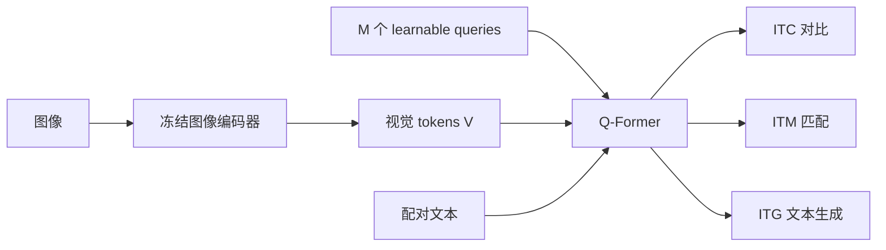
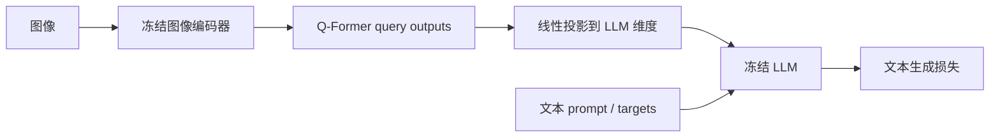
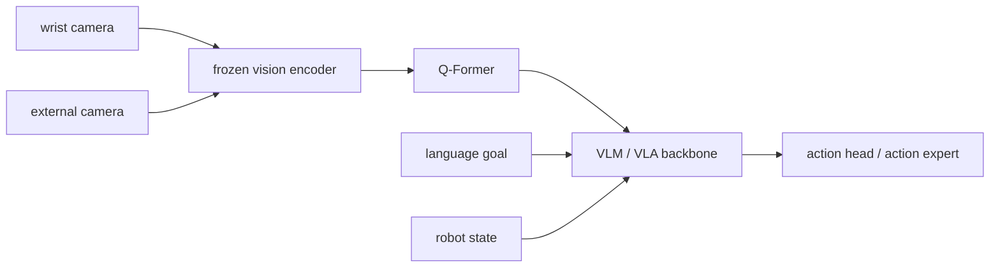

# Querying Transformer（Q-Former）

> 主卡。Q-Former 是 BLIP-2 中连接冻结图像编码器与冻结大语言模型的可训练桥接模块；后续多模态模型可以借鉴其 query bottleneck，但不等同于都使用原版 Q-Former。

## L0：一分钟理解

### 一句话定义

Q-Former 使用一组可学习 query，通过 cross-attention 主动查询图像编码器产生的大量视觉 tokens，把它们压缩并对齐为固定数量、适合送入语言模型的视觉表示。

### 它解决什么问题

预训练视觉编码器和 LLM 各自很强，但接口不兼容：视觉编码器输出许多连续 patch features，LLM 接收语言 embedding，并且直接端到端训练两个大模型代价很高。

简单线性投影能匹配维度，却不会主动挑选哪些视觉信息对语言最重要。Q-Former 在两个冻结模型之间增加一个轻量、可训练的查询瓶颈：少量 query 从视觉网格中提取信息，再将固定长度结果投影给 LLM。

### 在 VLA/WAM 中有什么用

- 压缩单帧、多摄像头或视频视觉 tokens，降低后续 VLA backbone 的上下文长度；
- 让视觉表征围绕语言任务或查询槽位重新组织；
- 作为冻结视觉 backbone 与冻结/大部分冻结 LLM 之间的参数高效适配器；
- 为动作模型提供紧凑的跨模态 condition tokens。

但 BLIP-2 的 Q-Former主要通过图文目标学习语义对齐，不天然保证保留毫米级几何、接触状态或时序动力学。将它用于机器人需要重新验证信息瓶颈是否损害控制。

### 记住这三点

1. Learnable queries 不是文字问题，也不预先对应固定物体；它们是通过训练形成分工的可学习槽位。
2. Q-Former 的核心是 query self-attention 加对视觉 tokens 的 cross-attention，从多视觉 tokens 得到固定数量 query outputs。
3. BLIP-2 分两阶段训练桥梁：先做视觉—语言表示学习，再把 query outputs 投影成冻结 LLM 可消费的软视觉提示。

## L1：直觉与结构

### 1. 背景：预训练单模态模型已经解决了什么

大规模视觉编码器已经能把图像变成丰富的 patch features；LLM 已经具备语言理解与生成能力。如果重新从头联合训练视觉—语言巨型模型，会重复支付大量预训练成本。

因此，一个自然方向是冻结两端模型，只学习它们之间的小型接口。线性 projector 可以解决 feature dimension 不同的问题，但仍把每个视觉 token 几乎原样交给 LLM，既增加序列长度，也缺乏任务相关的信息选择。

### 2. 剩余矛盾与设计目标

视觉端可能产生数百个 tokens，数量随分辨率、帧数和摄像头增加；语言端希望接收有限、语义密集的上下文。接口必须同时做到：

1. 从视觉 tokens 中选择与图文任务相关的信息；
2. 将可变或较长的视觉序列压缩为固定长度；
3. 对齐视觉与语言语义；
4. 保持两端大型预训练模型冻结。

这形成设计目标：**训练一个小型、可查询的跨模态瓶颈，而不是重新训练视觉编码器和 LLM。**

### 3. 设计因果链

#### 固定池化不知道该保留什么

平均池化把所有 patch 一视同仁，可能稀释小物体和关系信息。Q-Former引入 $M$ 个 learnable query tokens，它们通过 attention 学会从不同视觉位置和通道收集信息。解决了“主动选择”，却引入固定容量瓶颈：$M$ 太小会丢信息，太大则削弱压缩收益。

#### Queries 需要协作，也需要读取图像

仅有 cross-attention 时，各 query 独立读取视觉信息，容易重复。Q-Former让 queries 先/同时通过 self-attention 交换信息，再在部分层通过 cross-attention 读取冻结图像 features。这样不同槽位可协调覆盖内容，但 query 的语义分工来自数据与目标，不受硬约束保证。

#### 视觉查询结果不一定与语言空间对齐

只重建或只匹配图片容易得到视觉特征，却未必适合文本检索和生成。BLIP-2 第一阶段联合使用 image-text contrastive、image-text matching 和 image-grounded text generation 目标：分别训练全局对齐、细粒度配对判断与生成所需的信息。多目标更全面，但损失权重和 attention mask 设计更复杂。

#### 对齐后的 Q-Former输出仍不在 LLM embedding space

Q-Former hidden size 与 LLM token embedding size通常不同。第二阶段加一个全连接投影，把 query outputs 映射为 $M$ 个 LLM 维度的软视觉 tokens，作为视觉提示接入冻结 LLM。它避免改动 LLM 主体，但把视觉信息限制在短前缀中，并依赖 LLM 能利用这种非文本 embedding。

### 4. 完整训练与部署数据流

#### 第一阶段：视觉—语言表示学习



文字等价描述：第一阶段冻结图像编码器，Q-Former用 queries 读取视觉 tokens，并结合文本通过对比、匹配和生成目标学习视觉—语言对齐。

#### 第二阶段：视觉到冻结 LLM



文字等价描述：第二阶段把 Q-Former视觉查询结果投影为 LLM 软提示，在冻结 LLM 的语言建模损失下训练桥接模块。

#### 部署

图像经过冻结 encoder、Q-Former与 projection 得到固定 $M$ 个视觉 tokens，再与用户文本一起送入 LLM。若用于 VLA，LLM 或后续 action head 还要产生动作表示；Q-Former本身不解码机器人动作。

### 5. 输入、输出与张量形状

设 batch 为 $B$，视觉 token 数为 $N_v$，query 数为 $M$，Q-Former hidden width 为 $D_q$，LLM width 为 $D_l$：

- 图像特征 $V\in\mathbb R^{B\times N_v\times D_v}$；
- learnable queries $Q\in\mathbb R^{M\times D_q}$，按 batch 复制为 `[B,M,Dq]`；
- cross-attention 后 query outputs $H_q\in\mathbb R^{B\times M\times D_q}$；
- 投影后视觉提示 $H_l=H_qW_p\in\mathbb R^{B\times M\times D_l}$；
- 与文本长度无关，送给 LLM 的视觉 token 数固定为 $M$。

BLIP-2 原始设置使用 32 个 queries；这是该论文的设计选择，不是 Q-Former概念对所有任务的硬性规定。

### 6. 在具身智能系统中的位置



文字等价描述：Q-Former可把多摄像头视觉 features 压缩成固定 query tokens供 VLA 使用，但机器人状态和动作解码通常沿独立接口进入后续模型。

对于精细操作，可以让 queries 分别关注末端执行器、目标物体、接触区域或障碍物；这是可能的学习结果，不应仅凭 attention 可视化就宣称每个 query 固定代表某个实体。

### 7. 与相近方法的区别

| 接口 | 压缩机制 | 输出长度 | 主要特点 |
|---|---|---:|---|
| Linear projector | 每 token 独立映射 | 通常等于视觉 token 数 | 简单，但不主动选择信息 |
| Mean/attention pooling | 聚合视觉 tokens | 1 或少量 | 便宜，容量有限 |
| Q-Former | learnable queries + cross-attention | 固定 $M$ | 查询式压缩并做图文预训练 |
| Perceiver Resampler | latent array + cross/self-attention | 固定 $M$ | 相似的 latent bottleneck，训练目标/结构不同 |
| Cross-attention in LLM | LLM 层直接读取视觉 tokens | 视觉长度通常保留 | 融合更深，但需改造更多 LLM 层 |

Q-Former不是普通 query projection：其价值来自多层 Transformer、视觉 cross-attention、共享/受控的文本交互和两阶段预训练目标的组合。

## L2：数学与实现

### 1. 符号表

| 符号 | 含义 |
|---|---|
| $I$ | 输入图像 |
| $E_v$ | 冻结图像编码器 |
| $V=E_v(I)$ | 视觉 tokens |
| $Q$ | $M$ 个 learnable query embeddings |
| $H_q$ | Q-Former输出的 query representations |
| $W_p$ | 映射到 LLM width 的 projection |
| $H_l$ | 投影后的软视觉 tokens |
| $T$ | 配对文本 tokens |
| $M,N_v$ | query 数和视觉 token 数 |

### 2. 核心公式

单头 cross-attention 的抽象形式为：

```math
\operatorname{CrossAttn}(Q,V)
=\operatorname{softmax}\!\left(
\frac{(QW_Q)(VW_K)^\top}{\sqrt{d_h}}
\right)(VW_V)
```

其中 query 提供查询，冻结视觉 features 提供 key/value。多层 Q-Former可抽象为：

```math
H_q=F_\phi(Q,V,T;\mathcal M)
```

$\mathcal M$ 表示不同预训练目标使用的 attention mask；并非所有目标都允许 query 与文本双向互看。

第二阶段投影为：

```math
H_l=H_qW_p+b_p
```

若将 $H_l$ 作为视觉前缀，语言生成目标为：

```math
\mathcal L_{\mathrm{LM}}
=-\frac{1}{L}
\sum_{i=1}^{L}
\log p_\psi(w_i\mid H_l,w_{<i})
```

BLIP-2 第一阶段联合三个目标：

```math
\mathcal L_{\mathrm{stage1}}
=\lambda_{\mathrm{ITC}}\mathcal L_{\mathrm{ITC}}
+\lambda_{\mathrm{ITM}}\mathcal L_{\mathrm{ITM}}
+\lambda_{\mathrm{ITG}}\mathcal L_{\mathrm{ITG}}
```

### 3. 公式的逐步解释或推导

#### 第一步：Queries 为什么能压缩视觉 tokens

Cross-attention 权重矩阵形状为 `[B, heads, M, Nv]`。每个 query 对全部视觉位置形成一个归一化权重分布，并对视觉 values 加权求和。无论 $N_v$ 是多少，输出始终只有 $M$ 个 query states。

这是一种 learned compression，不是无损压缩。网络只会保留有助于训练目标的信息；若训练目标主要是图文语义，细小深度误差或接触变化可能被忽略。

#### 第二步：为什么 queries 还需要 self-attention

如果 $M$ 个 query 完全独立，它们可能同时关注最显眼区域。Self-attention 允许 query states 相互通信，后续层能基于其他 query 已提取的内容调整关注点。它提高协同能力，但没有显式多样性约束时仍可能出现冗余。

#### 第三步：三个第一阶段目标各自补什么短板

- ITC（image-text contrastive）拉近匹配图文、推远不匹配样本，建立全局语义对齐；图像—文本相似度可从多个 query—text 相似度中取最大值，使不同 query 竞争解释文本。
- ITM（image-text matching）二分类判断图文是否匹配，允许更充分的 query—text 交互以学习细粒度对应。
- ITG（image-grounded text generation）让文本 token 在视觉 query 条件下自回归生成，迫使 queries 保留语言生成所需信息。

三者不是同一公式的不同写法，而是使用不同监督问题和 attention masks 的互补工程目标。

#### 第四步：ITC 为什么使用 cross-entropy

设 batch 内图像到文本的相似度 logits 为 $S\in\mathbb R^{B\times B}$，正确配对标签为对角索引 $y_i=i$。InfoNCE 可写成：

```math
\mathcal L_{i\to t}
=-\frac{1}{B}\sum_{i=1}^{B}
\log\frac{\exp(S_{ii}/\tau)}
{\sum_{j=1}^{B}\exp(S_{ij}/\tau)}
```

`F.cross_entropy(S / tau, arange(B))` 对每行做 log-softmax并取对角类的负对数，正好实现该方向的 minibatch 对比损失；再对 $S^\top$ 做一次得到对称文本到图像项。

这里的 cross-entropy 来自“batch 内哪个文本与图像匹配”的分类式对比目标，不是语言词表预测。

#### 第五步：投影为何不等于语义对齐全部工作

$W_p$ 只解决 $D_q\to D_l$ 的维度和线性坐标变换。若 Q-Former输出没有先学会提取图文相关信息，仅靠线性层很难从杂乱视觉 features 中建立完整语言接口。两阶段训练先塑造 query bottleneck，再适配冻结 LLM。

#### 第六步：冻结两端模型时梯度流向哪里

第一阶段梯度更新 queries、Q-Former和任务 heads，不更新 image encoder。第二阶段通常更新 Q-Former与 projection，不更新 image encoder 和 LLM。`torch.no_grad()` 或 `requires_grad_(False)` 决定参数不更新，但 Q-Former仍能通过冻结 features 接收数值输入。

冻结节省训练参数和显存，但两端表征若存在根本错位，桥接器容量可能不足。

### 4. 最小数值例子

设一个 query 对两个视觉 tokens 的已缩放 attention logits 为 $[0,\log 3]$，softmax 权重为：

```math
\operatorname{softmax}([0,\log3])
=\left[\frac14,\frac34\right]
```

若两个 value vectors 为 $v_1=[2,0]$、$v_2=[0,4]$，cross-attention 输出为：

```math
\frac14[2,0]+\frac34[0,4]=[0.5,3]
```

该 query 把更多权重放在第二个视觉 token，因此第二维信息占主导。若有 $M=32$ 个 queries、视觉端 $N_v=257$ 个 tokens，Q-Former输出仍为 32 个 tokens，送入下游的视觉序列长度缩短约为 $257/32\approx8.03$ 倍；这只比较 token 数，不等于端到端计算一定减少同样倍数，因为 Q-Former自身也要做 cross-attention。

### 5. 训练与推理

#### BLIP-2 第一阶段

1. 冻结 image encoder并计算视觉 tokens；
2. 复制 learnable queries到 batch；
3. 按 ITC、ITM、ITG 所需 attention mask运行 Q-Former；
4. 联合优化三种目标；
5. 只更新桥接模块和相关 heads。

#### 第二阶段

1. 继续冻结 image encoder和 LLM；
2. Q-Former提取固定数量 query outputs；
3. 线性投影到 LLM embedding width；
4. 以视觉 tokens 和文本 prompt/target训练语言生成；
5. 更新 Q-Former与 projection。

#### 部署到 VLA

1. 编码当前相机图像；
2. Q-Former压缩视觉 features；
3. 将 query tokens 与语言和机器人状态送入 VLA；
4. action head生成动作；
5. 新观测到来后重新查询，形成闭环。

若缓存静态视觉 query tokens，可以节省计算；但机器人场景变化时沿用旧缓存会使状态过期。

### 6. 伪代码

```text
vision_tokens = frozen_image_encoder(image)
queries = learnable_queries repeated over batch

for block in qformer:
    queries = self_attention(queries)
    queries = cross_attention(queries, vision_tokens)
    queries = feed_forward(queries)

visual_prefix = projection(queries)
logits = frozen_llm(inputs_embeds = concat(visual_prefix, text_embeddings))
loss = token_cross_entropy(logits_on_target_positions, target_token_ids)
update queries, qformer, and projection only
```

### 7. 最小 PyTorch 实现

下面代码只展示 query compression 与 LLM projection。原版 Q-Former还包含文本分支、交替 cross-attention层和三种第一阶段 attention masks。

```python
import torch
import torch.nn as nn
import torch.nn.functional as F


class QueryBlock(nn.Module):
    def __init__(self, dim: int, vision_dim: int, heads: int = 8):
        super().__init__()
        self.self_norm = nn.LayerNorm(dim)
        self.self_attn = nn.MultiheadAttention(dim, heads, batch_first=True)
        self.cross_norm = nn.LayerNorm(dim)
        self.vision_norm = nn.LayerNorm(vision_dim)
        self.cross_attn = nn.MultiheadAttention(
            embed_dim=dim,
            num_heads=heads,
            kdim=vision_dim,
            vdim=vision_dim,
            batch_first=True,
        )
        self.ffn_norm = nn.LayerNorm(dim)
        self.ffn = nn.Sequential(
            nn.Linear(dim, 4 * dim),
            nn.GELU(),
            nn.Linear(4 * dim, dim),
        )

    def forward(self, queries: torch.Tensor, vision: torch.Tensor):
        q = self.self_norm(queries)
        self_out, _ = self.self_attn(q, q, q, need_weights=False)
        queries = queries + self_out

        q = self.cross_norm(queries)
        vision = self.vision_norm(vision)
        cross_out, weights = self.cross_attn(
            q, vision, vision, need_weights=True
        )
        queries = queries + cross_out
        queries = queries + self.ffn(self.ffn_norm(queries))
        return queries, weights


class TinyQFormer(nn.Module):
    def __init__(
        self,
        vision_dim: int,
        query_dim: int,
        llm_dim: int,
        num_queries: int = 32,
        depth: int = 4,
        heads: int = 8,
    ):
        super().__init__()
        self.queries = nn.Parameter(torch.randn(1, num_queries, query_dim) * 0.02)
        self.blocks = nn.ModuleList(
            [QueryBlock(query_dim, vision_dim, heads) for _ in range(depth)]
        )
        self.to_llm = nn.Linear(query_dim, llm_dim)

    def forward(self, vision_tokens: torch.Tensor):
        # vision_tokens: [B, Nv, Dv], normally from a frozen encoder.
        batch = vision_tokens.shape[0]
        queries = self.queries.expand(batch, -1, -1)  # [B, M, Dq]
        weights = None
        for block in self.blocks:
            queries, weights = block(queries, vision_tokens)
        llm_prefix = self.to_llm(queries)  # [B, M, Dl]
        return llm_prefix, weights


def image_text_contrastive_loss(
    image_features: torch.Tensor,
    text_features: torch.Tensor,
    temperature: float = 0.07,
) -> torch.Tensor:
    # image_features: [B, M, D], text_features: [B, D]
    image_features = F.normalize(image_features, dim=-1)
    text_features = F.normalize(text_features, dim=-1)
    # All query-to-text similarities: [B_images, M, B_texts].
    all_scores = torch.einsum("bmd,nd->bmn", image_features, text_features)
    scores_i2t = all_scores.max(dim=1).values / temperature  # [B, B]
    labels = torch.arange(scores_i2t.shape[0], device=scores_i2t.device)
    loss_i2t = F.cross_entropy(scores_i2t, labels)
    loss_t2i = F.cross_entropy(scores_i2t.transpose(0, 1), labels)
    return 0.5 * (loss_i2t + loss_t2i)
```

`TinyQFormer` 每层都做 cross-attention，是教学简化；BLIP-2 官方结构在特定层插入视觉 cross-attention，并支持文本 tokens 与不同 attention masks，不能把上面代码当作逐行复刻。

### 8. 公式—代码对应

| 数学对象 | 代码 | 转换依据 | 形状与 reduction |
|---|---|---|---|
| Learnable $Q$ | `nn.Parameter([1,M,Dq])` | 参数按 batch expand，不复制梯度参数 | `[B,M,Dq]` |
| Query self-attention | `self_attn(q,q,q)` | queries彼此交换信息 | 输入输出 `[B,M,Dq]` |
| $\operatorname{CrossAttn}(Q,V)$ | `cross_attn(q, vision, vision)` | query 作 Q，视觉 tokens 作 K/V | 输出 `[B,M,Dq]`；权重约 `[B,M,Nv]` |
| $H_l=H_qW_p+b$ | `self.to_llm(queries)` | learned linear width alignment | `[B,M,Dq] -> [B,M,Dl]` |
| 多 query 图文相似度 | `einsum` 后 `max(dim=1)` | 每个图像选择最匹配文本的 query 槽 | `[B,M,B] -> [B,B]` |
| ITC InfoNCE | `cross_entropy(scores/tau, labels)` | batch 内匹配索引分类；双向平均 | 两个标量均值 |

ITC 的 `max` 是 hard query selection：梯度主要流向当前最匹配 query。其他聚合方式会改变优化行为，不能视为完全等价。

### 9. 常见超参数

- query 数 $M$：控制视觉带宽与 LLM token 成本；
- Q-Former层数、hidden width 与 attention heads；
- 哪些层插入视觉 cross-attention；
- ITC temperature 与 ITC/ITM/ITG loss 权重；
- 图像分辨率、视觉 token 数及是否使用多帧；
- LLM projection width 和视觉前缀位置；
- VLA 中多摄像头融合方式、时间 query 和机器人状态注入方式。

### 10. 失败模式与常见误解

#### 把 query 当作固定对象槽

Query 可能形成关注偏好，但没有目标检测监督时不能保证“一号 query 永远是机械臂、二号永远是杯子”。Attention map 是诊断线索，不是语义证明。

#### 固定瓶颈丢失控制细节

图文任务强调物体类别和关系，机器人还需要位姿、深度、接触和遮挡边界。应通过控制任务 ablation、空间 probe 或保留额外高分辨率 tokens验证信息是否足够。

#### 多摄像头直接拼接导致来源混淆

不同相机 tokens需要 camera/view embedding 与空间标定信息；否则 queries可能难以区分视角和对应关系。

#### 只训练 projection 就期待完成查询

Linear projection只调维度。若 Q-Former未接受合适跨模态预训练，输出不一定与 LLM语义空间对齐。

#### 冻结等于没有计算成本

冻结参数不保存其梯度，但 image encoder和 LLM仍需前向计算并占用权重显存。Q-Former还会产生 $M\times N_v$ cross-attention成本。

#### Query 越多越好

更多 queries提高容量，也增加 Q-Former self-attention和 LLM上下文成本，并可能产生冗余。最佳 $M$ 取决于视觉复杂度和下游任务。

#### 把 Q-Former等同于完整 VLA

它只桥接/压缩视觉与语言表示。机器人动作 tokenization、生成目标、时序状态、闭环控制和安全机制仍由其他模块承担。

#### 忽略训练与部署视觉域差异

互联网图文预训练中的居中物体，与腕部相机中的遮挡、运动模糊和近距离接触差异很大。冻结视觉 encoder加小桥接器未必足以跨越域差距。

## 自测

### 基础题

1. Q-Former中的 learnable queries 与用户输入的文字 query 有什么区别？
2. 为什么 Q-Former输出 token 数不随视觉 token 数增长？

### 理解题

3. Query self-attention 与视觉 cross-attention分别解决什么问题？
4. ITC、ITM、ITG 三个目标为什么不是简单重复？
5. 线性 projection 能解决什么，不能解决什么？
6. ITC 代码中的 cross-entropy 对应哪一个分类问题？

### 迁移题

7. 将 Q-Former用于双摄像头机器人时，你会如何帮助模型区分视角？
8. 若语言问答很好但抓取精度下降，你会怎样判断是不是 query bottleneck丢失了几何信息？

<details>
<summary>参考答案</summary>

1. Learnable queries是模型参数化槽位，不是自然语言问题；它们通过训练学会从视觉 tokens提取信息。
2. Cross-attention每个 query输出一个 state，所以输出恒为预设的 $M$ 个 queries。
3. Self-attention让 queries协作和去冗余；cross-attention让它们读取图像 features。
4. ITC做全局图文对齐，ITM学习细粒度匹配判断，ITG要求视觉信息支持自回归文本生成；监督问题和 attention mask不同。
5. Projection匹配 hidden width和线性坐标；不能独自完成视觉信息选择、压缩和深层跨模态语义对齐。
6. 对每张图像，在当前 batch 的所有文本中识别正确配对文本；反向项则从图像中找正确配对。
7. 为 tokens加入 camera ID/view embedding，保留相机内位置编码，并在需要时提供标定或三维几何信息。
8. 比较不同 query 数、保留原始高分辨率视觉旁路、做关键点/深度/位姿 probe，并检查接触区域 attention与控制误差的相关性。

</details>

## 学习导航

### 前置卡片

- Transformer / Self-Attention（待创建）
- Cross-Attention（待创建）
- Vision Transformer（待创建）
- Contrastive Learning（待创建）

### 原子子卡

- Learnable Query Tokens（待创建）
- Image-Text Contrastive / Matching / Generation（待创建）
- Multimodal Attention Masks（待创建）
- Visual Token Bottleneck（待创建）

### 对比卡片

- Q-Former vs Linear Projector（待创建）
- Q-Former vs Perceiver Resampler（待创建）
- Q-Former vs LLM Cross-Attention（待创建）

### 下一张推荐卡

学习 BLIP-2，重点把 Q-Former放回完整两阶段系统，再对比 LLaVA 的简单 projector 和 Flamingo 的 gated cross-attention 路线。

## 参考资料

1. [BLIP-2: Bootstrapping Language-Image Pre-training with Frozen Image Encoders and Large Language Models](https://arxiv.org/abs/2301.12597) — Q-Former原论文与两阶段训练。
2. [BLIP-2 conference paper](https://proceedings.mlr.press/v202/li23q.html) — ICML 2023 正式版本。
3. [Salesforce LAVIS](https://github.com/salesforce/LAVIS) — BLIP-2 官方实现仓库。
4. [Official BLIP-2 Q-Former implementation](https://github.com/salesforce/LAVIS/blob/main/lavis/models/blip2_models/blip2_qformer.py) — queries与第一阶段目标的代码映射。

## L3：论文与源码深入（待补充）

- Q-Former中共享 self-attention、隔层 cross-attention的逐层源码映射；
- ITC、ITM、ITG attention masks和 hard-negative mining；
- decoder-only与 encoder-decoder LLM的第二阶段连接差异；
- query collapse、query diversity和可解释性分析；
- Q-Former、Perceiver Resampler、MLP projector在 VLA中的信息—计算权衡；
- 多相机、视频和三维 token的具身扩展。
