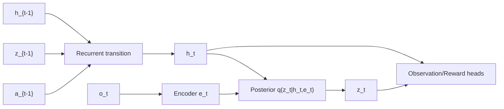
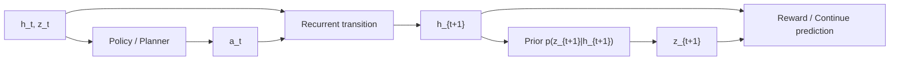
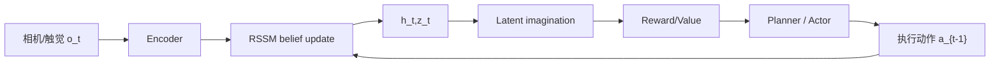

# Recurrent State-Space Model（RSSM）

> 主卡。RSSM 是一种结合确定性递归记忆与随机潜状态的世界模型核心；PlaNet、Dreamer 等系统在它周围加入观测、奖励、策略、价值或规划模块。

## L0：一分钟理解

### 一句话定义

RSSM 用确定性状态 $h_t$ 记住历史，用随机状态 $z_t$ 表达当前环境中无法从历史唯一确定的部分，并在训练时用观测 posterior 校正、在想象时用 dynamics prior 预测。

### 它解决什么问题

机器人只看到观测 $o_t$，看不到真实环境状态。单个图像还可能缺少速度、遮挡物位置或未来随机性。

- 纯确定性 RNN 能积累历史，却只能给出一个确定的未来表示；
- 纯随机状态模型能表达不确定性，但还需要稳定携带长历史信息。

RSSM 把二者组合成 belief state $s_t=(h_t,z_t)$，在“记住什么”和“哪里仍不确定”之间分工。

### 在 VLA/WAM 中有什么用

- 从图像、触觉和动作历史估计当前 belief state；
- 在 latent space 预测未来观测、奖励或终止信号；
- 不访问真实未来观测，使用 prior 展开 imagination rollout；
- 为规划器、actor 或 value model 提供紧凑的预测状态。

### 记住这三点

1. $h_t$ 是确定性记忆，$z_t$ 是随机潜状态，两者共同构成 RSSM state。
2. Posterior 训练时看当前观测；prior 只看历史状态和动作，部署想象时只能用 prior。
3. KL 的目的不是让两个分布越小越好，而是让只靠 dynamics 的 prior 学会逼近观测校正后的 posterior。

## L1：直觉与结构

### 1. 背景：latent dynamics 已经把像素预测变成状态预测

直接在像素空间预测未来，需要同时处理物体动力学与大量纹理细节。Latent world model 先把观测压成状态，再在较小空间里预测：

```math
o_t \rightarrow s_t,\qquad
(s_t,a_t)\rightarrow s_{t+1}
```

这已经降低了预测维度，但“一个好的 latent state 应该由什么组成”仍未解决。

### 2. 剩余矛盾与设计目标

确定性 RNN 可以把动作—观测历史压进 hidden state：

```math
h_t=f(h_{t-1},a_{t-1},o_t)
```

它适合记忆，却把相同历史下的所有可能状态压成一个点。部分可观测或随机环境中，同样历史可能对应多个合理解释和未来。

若每一步只有随机 latent $z_t$，模型可以表达分布，却要让随机变量独自承担长期记忆和一步不确定性，优化与多步预测都更困难。

设计目标是让两个表示分工：

- $h_t$：确定性地汇总过去动作和 latent；
- $z_t$：表示当前时刻需要随机建模或由新观测校正的信息。

### 3. 设计因果链

| 当前问题 | 设计选择 | 解决了什么 | 新问题或代价 |
|---|---|---|---|
| 单帧观测不是完整状态 | recurrent deterministic state $h_t$ | 汇总历史与动作 | 未来仍是单点预测 |
| 环境有不确定性/多种解释 | stochastic state $z_t$ | 表达 belief 分布 | 训练时如何推断 $z_t$ |
| 当前观测包含新证据 | posterior $q(z_t\mid h_t,e_t)$ | 用观测校正 belief | imagination 没有未来观测 |
| 部署只能靠历史预测 | prior $p(z_t\mid h_t)$ | 可在 latent 中展开未来 | prior 与 posterior 可能不一致 |
| 对齐两种状态来源 | KL regularization | prior 学习模仿 posterior | KL 过强会丢失观测信息 |
| 只预测 latent 不知是否有用 | observation/reward heads | 让 state 支持重建和控制 | 多个 loss 需要尺度平衡 |

### 4. 完整系统：observe 与 imagine 是两条不同路径

训练时的 observation update：



文字说明：训练时先由历史得到 $h_t$，再用当前观测 embedding $e_t$ 形成 posterior 并采样 $z_t$。

想象未来时没有 $o_t$：



文字说明：imagination 只能从 prior 采样未来 stochastic state，再预测奖励等信号；posterior 不能偷看不存在的未来观测。

### 5. 输入、输出与张量形状

设 batch 为 $B$、确定状态维度 $D_h$、随机状态维度 $D_z$、观测 embedding 维度 $D_e$：

| 对象 | 形状 | 作用 |
|---|---|---|
| $h_t$ | `[B,D_h]` | 确定性历史记忆 |
| $z_t$ | `[B,D_z]` | 随机 belief state |
| $a_t$ | `[B,D_a]` | 动作 |
| $e_t$ | `[B,D_e]` | 当前观测编码 |
| prior 参数 | `[B,2D_z]` | $\mu^p_t,\log(\sigma^p_t)^2$ |
| posterior 参数 | `[B,2D_z]` | $\mu^q_t,\log(\sigma^q_t)^2$ |

DreamerV2/V3 等版本常使用离散 categorical stochastic state；这里先用对角 Gaussian 讲清经典连续 RSSM 机制。

### 6. 在具身智能系统中的位置



文字说明：真实交互用观测更新 belief；策略学习或规划在 RSSM 想象的 latent trajectories 上评估未来。

RSSM 不等于完整的 VLA，也不自动产生语言—动作对齐。它更像世界模型中的状态估计与动力学骨架，可与视觉 Encoder、语言条件、动作模型和控制头组合。

### 7. 与相近模型的区别

| 方法 | 状态组成 | 主要优势 | 主要局限 |
|---|---|---|---|
| Deterministic RNN | $h_t$ | 记忆路径稳定 | 难表达多模态 uncertainty |
| Sequential VAE | 随机 $z_t$ | 概率解释直接 | 长期信息主要压在随机状态 |
| RSSM | $h_t,z_t$ | 记忆与随机性分工 | prior/posterior 训练更复杂 |
| Transformer world model | token history | 长依赖和并行训练 | context/compute 成本高 |

## L2：数学与实现

### 1. 符号表

| 符号 | 含义 |
|---|---|
| $o_t$ | 当前观测 |
| $a_t$ | 当前动作 |
| $e_t=\operatorname{Enc}(o_t)$ | 观测 embedding |
| $h_t$ | deterministic state |
| $z_t$ | stochastic state |
| $p_\theta(z_t\mid h_t)$ | dynamics prior |
| $q_\phi(z_t\mid h_t,e_t)$ | observation posterior |
| $p_\theta(o_t\mid h_t,z_t)$ | observation model |
| $p_\theta(r_t\mid h_t,z_t)$ | reward model |

### 2. 核心公式：先更新记忆，再决定随机状态来自哪里

确定性 transition：

```math
h_t=f_\theta(h_{t-1},z_{t-1},a_{t-1})
```

训练时 posterior：

```math
q_\phi(z_t\mid h_t,e_t)
```

想象时 prior：

```math
p_\theta(z_t\mid h_t)
```

世界模型的典型负目标可写为：

```math
\mathcal{J}_t
=
-\mathbb{E}_{q_\phi}
\left[
\log p_\theta(o_t\mid h_t,z_t)
+
\log p_\theta(r_t\mid h_t,z_t)
\right]
+
\beta D_{\mathrm{KL}}
\left(
q_\phi(z_t\mid h_t,e_t)
\|
p_\theta(z_t\mid h_t)
\right)
```

具体系统还可能预测 continuation、discount 或其他任务信号，且会使用 KL balancing、free nats 等变体。

### 3. 公式的逐步解释或推导

#### 3.1 为什么 $h_t$ 的更新不直接使用当前观测

先用 $(h_{t-1},z_{t-1},a_{t-1})$ 得到 $h_t$，可以把它理解成观测到来前的历史预测。当前观测通过 $e_t$ 进入 posterior，形成校正后的 $z_t$。

这种顺序把两类信息分开：

- dynamics 已经能从过去预测什么；
- 新观测额外告诉了模型什么。

不同实现的索引约定可能把动作写成 $a_t$ 或 $a_{t-1}$；关键是动作必须对应从前一状态到当前状态的 transition。

#### 3.2 Prior 与 posterior 为什么都需要

Posterior 使用 $e_t$，因此通常更了解真实当前状态；但 imagination 中没有未来 $e_t$，只能使用 prior。

KL 项：

```math
D_{\mathrm{KL}}
\left(
q_\phi(z_t\mid h_t,e_t)
\|
p_\theta(z_t\mid h_t)
\right)
```

迫使 prior 从 $h_t$ 预测出接近 posterior 的分布。这样，训练时由观测校正得到的 latent dynamics，才能在没有未来观测时继续 rollout。

如果 KL 过弱，posterior 可以携带 prior 完全预测不到的信息，imagination 会漂移；如果 KL 过强，posterior 可能忽略观测，导致 stochastic state 失去信息。

#### 3.3 Reconstruction loss 为什么可能表现为 MSE

若 observation model 使用固定方差 Gaussian：

```math
p_\theta(o_t\mid h_t,z_t)
=
\mathcal{N}
\left(
o_t;\mu_\theta(h_t,z_t),\sigma_o^2I
\right)
```

则忽略常数和固定比例后：

```math
-\log p_\theta(o_t\mid h_t,z_t)
\propto
\|o_t-\mu_\theta(h_t,z_t)\|_2^2
```

所以代码里的 observation MSE 是特定 likelihood 的简化 NLL，不是 RSSM 定义的一部分。图像、离散观测、reward 或 continuation 可以使用不同分布与损失。

#### 3.4 期望与时间 reduction 怎样落到代码

对每个 $t$，通常从 posterior 取一个重参数化样本估计期望。loss 先在观测维、latent 维分别聚合，得到 `[B,T]` 的每样本每时间步目标，再对 batch 和时间取均值。

若变长轨迹包含 padding，必须使用 mask；否则 padding steps 会改变三项相对尺度。

### 4. 最小数值例子

一维 Gaussian posterior 与 prior：

```math
q(z_t)=\mathcal{N}(1,0.5^2),\qquad
p(z_t)=\mathcal{N}(0,1)
```

KL 为：

```math
D_{\mathrm{KL}}(q\|p)
=
\frac12
\left(
0.5^2+1^2-1-\log 0.5^2
\right)
\approx0.818
```

若重参数化噪声 $\epsilon=0.2$：

```math
z_t=1+0.5\times0.2=1.1
```

训练时 Decoder 使用 1.1 估计 observation/reward NLL；KL 同时推动 prior 的均值和方差接近 posterior。

### 5. 训练、在线推断与 imagination

| 模式 | $z_t$ 来源 | 是否使用当前观测 | 目的 |
|---|---|---:|---|
| 世界模型训练 | posterior $q(z_t\mid h_t,e_t)$ | ✓ | 学习表示、重建与 dynamics |
| 在线 belief update | posterior | ✓ | 根据真实传感器校正状态 |
| latent imagination | prior $p(z_t\mid h_t)$ | ✗ | 展开假想未来 |
| open-loop prediction | prior | 仅起点 | 检验多步 dynamics |

训练 posterior 表现好不代表 prior rollout 一定稳定，因此需要单独检查 open-loop prediction 或 imagination 指标。

### 6. 伪代码

1. 编码当前观测得到 $e_t$；
2. 用前一 $h,z,a$ 更新 deterministic state $h_t$；
3. prior head 从 $h_t$ 输出 dynamics distribution；
4. posterior head 从 $h_t,e_t$ 输出 observation distribution；
5. 训练时从 posterior 重参数化采样 $z_t$；
6. 预测 observation、reward、continuation；
7. 计算 likelihood losses 与 prior/posterior KL；
8. imagination 时跳过 Encoder/posterior，只从 prior 采样。

### 7. 最小 PyTorch 实现

```python
import torch
from torch import nn
from torch.nn import functional as F


class GaussianRSSMCell(nn.Module):
    def __init__(self, action_dim, deter_dim, stoch_dim, embed_dim):
        super().__init__()
        self.gru = nn.GRUCell(stoch_dim + action_dim, deter_dim)
        self.prior = nn.Linear(deter_dim, 2 * stoch_dim)
        self.posterior = nn.Linear(
            deter_dim + embed_dim, 2 * stoch_dim
        )

    @staticmethod
    def stats(params):
        mean, logvar = params.chunk(2, dim=-1)
        logvar = logvar.clamp(-10.0, 10.0)
        return mean, logvar

    @staticmethod
    def sample(mean, logvar):
        # 单样本重参数化 Monte Carlo estimator。
        std = torch.exp(0.5 * logvar)
        return mean + std * torch.randn_like(std)

    def observe_step(self, h_prev, z_prev, action_prev, embed):
        # h: [B,D_h]；z/action 沿最后一维拼接。
        h = self.gru(
            torch.cat([z_prev, action_prev], dim=-1), h_prev
        )
        prior_mean, prior_logvar = self.stats(self.prior(h))
        post_input = torch.cat([h, embed], dim=-1)
        post_mean, post_logvar = self.stats(self.posterior(post_input))
        z = self.sample(post_mean, post_logvar)
        return h, z, (
            prior_mean, prior_logvar, post_mean, post_logvar
        )

    def imagine_step(self, h_prev, z_prev, action_prev):
        h = self.gru(
            torch.cat([z_prev, action_prev], dim=-1), h_prev
        )
        mean, logvar = self.stats(self.prior(h))
        return h, self.sample(mean, logvar)


def gaussian_kl(q_mean, q_logvar, p_mean, p_logvar):
    # 对角 Gaussian KL；latent 维求和，输出 [B]。
    q_var, p_var = q_logvar.exp(), p_logvar.exp()
    kl_per_dim = 0.5 * (
        p_logvar - q_logvar
        + (q_var + (q_mean - p_mean).square()) / p_var
        - 1
    )
    return kl_per_dim.sum(dim=-1)


def rssm_loss(obs_recon, obs, reward_pred, reward, stats, beta=1.0):
    p_mean, p_logvar, q_mean, q_logvar = stats

    # 固定方差 Gaussian NLL 的成比例简化；先得到每样本 [B]。
    obs_nll = F.mse_loss(
        obs_recon, obs, reduction="none"
    ).flatten(1).sum(1)
    reward_nll = F.mse_loss(
        reward_pred, reward, reduction="none"
    ).flatten(1).sum(1)
    kl = gaussian_kl(q_mean, q_logvar, p_mean, p_logvar)

    # 每样本组合，再对 batch 取均值。
    return (obs_nll + reward_nll + beta * kl).mean()
```

这是教学用连续 Gaussian RSSM cell。完整实现还需要 observation Encoder/Decoder、序列扫描、mask、reward/continuation heads，以及具体的 KL stabilization。

### 8. 公式—代码对应

| 数学对象 | 代码 | 转换依据 | 形状与 reduction |
|---|---|---|---|
| $h_t=f(h_{t-1},z_{t-1},a_{t-1})$ | `GRUCell(cat(...),h_prev)` | deterministic transition | `[B,D_h]` |
| $p(z_t\mid h_t)$ | `self.prior(h)` | dynamics prior 参数化 | 两个 `[B,D_z]` |
| $q(z_t\mid h_t,e_t)$ | `self.posterior(cat(...))` | observation posterior | 两个 `[B,D_z]` |
| posterior sample | `mean+std*randn_like` | 单样本重参数化估计 | `[B,D_z]` |
| $D_{\mathrm{KL}}(q\|p)$ | `gaussian_kl(...)` | 对角 Gaussian 闭式解 | latent 求和为 `[B]` |
| observation NLL | `mse_loss(...,none)` | 固定方差 Gaussian，省略常数/比例 | 非 batch 维求和为 `[B]` |
| 负世界模型目标 | `(...).mean()` | 每样本组合后 batch 平均 | scalar |

### 9. 常见超参数与训练策略

- deterministic/stochastic state dimensions；
- continuous Gaussian 或 discrete categorical stochastic state；
- KL weight、free nats/free bits、KL balancing；
- observation、reward、continuation loss scales；
- imagination horizon；
- sequence length、burn-in/context length；
- GRU/MLP 容量和 latent overshooting。

### 10. 失败模式与常见误解

1. **Prior/posterior 混用**：imagination 不能访问未来 observation posterior。
2. **Posterior collapse**：$z_t$ 被忽略，KL 很小但观测信息进入不足。
3. **Prior drift**：单步重建好，open-loop rollout 很快偏离。
4. **把 $h_t$ 当真实物理状态**：它只是模型学到的确定性记忆。
5. **把 RSSM 当普通 VAE**：它包含动作条件的时序 transition 和双状态结构。
6. **只优化像素重建**：可能浪费容量预测控制无关细节。
7. **忽略 episode boundary**：跨 episode 复用 recurrent state 会污染 belief。
8. **认为 stochastic 一定更真实**：分布形式和训练目标不合适时仍会失真。

## 自测

### 基础题

1. $h_t$ 与 $z_t$ 分别负责什么？
2. Prior 和 posterior 各能看到哪些信息？
3. Imagination 使用哪个分布？

### 理解题

1. 为什么只用确定性 RNN 不足以表达部分可观测环境中的 belief？
2. KL 过弱和过强分别可能出现什么问题？
3. 为什么 observation MSE 不是 RSSM 的固定定义？

### 迁移题

1. 机器人相机暂时被遮挡时，$h_t$ 与 $z_t$ 可以怎样分工？
2. 单步重建很好但 imagination 崩溃，应优先检查什么？
3. 若动作 chunk 替代单步动作，transition 的时间语义需要怎样调整？

<details>
<summary>参考答案</summary>

1. $h_t$ 确定性汇总历史，$z_t$ 表达随机或由当前观测校正的信息。
2. Prior 看 $h_t$；posterior 额外看当前 observation embedding $e_t$。
3. Prior。
4. 一个确定点不能直接表示同一历史下的多个可能环境状态。
5. 过弱会使 prior 跟不上 posterior；过强会让 posterior 忽略观测或 stochastic state collapse。
6. MSE 只对应固定方差 Gaussian likelihood 的简化。
7. $h_t$ 保留遮挡前历史，$z_t$ 表达当前状态的不确定性并在观测恢复后校正。
8. 检查 prior/posterior gap、KL、open-loop transition、动作对齐和 rollout loss。
9. 每个 transition 代表一个 chunk 的持续区间，reward/discount 与观测时间点也必须相应对齐。

</details>

## 学习导航

### 前置卡片

- [VAE](../../representations/latent/VAE.md)
- [ELBO](../../representations/latent/ELBO.md)
- State-Space Model（待创建）
- GRU/RNN（待创建）
- Partial Observability / Belief State（待创建）

### 原子子卡

- Dynamics Prior vs Observation Posterior（待创建）
- Latent Imagination（待创建）
- KL Balancing 与 Free Nats（待创建）
- Latent Overshooting（待创建）

### 对比卡片

- RSSM vs Deterministic RNN（待创建）
- RSSM vs Transformer World Model（待创建）

### 下一张推荐卡

先学习 Latent Imagination，再学习 Dreamer 如何用 imagined trajectories 训练 actor 和 value model。

## 参考资料

1. [Learning Latent Dynamics for Planning from Pixels（PlaNet）](https://arxiv.org/abs/1811.04551).
2. [Dream to Control: Learning Behaviors by Latent Imagination](https://arxiv.org/abs/1912.01603).
3. [Mastering Atari with Discrete World Models（DreamerV2）](https://arxiv.org/abs/2010.02193).
4. [DreamerV3 implementation](https://github.com/danijar/dreamerv3).

## L3：论文与源码深入（待补充）

- PlaNet latent overshooting 的多步变分目标；
- Dreamer actor/value gradients through imagination；
- DreamerV2/V3 categorical stochastic states；
- KL balancing、free nats 与 representation/dynamics losses；
- Transformer、SSM 与 RSSM 在长记忆任务中的比较。
