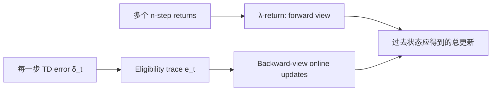

# Eligibility Traces 与 TD($\lambda$)

> 原子子卡，父卡为 [Temporal-Difference Learning](Temporal-Difference-Learning.md)。本卡专门解释多步 target 的 forward view 如何转换成可在线执行的 backward-view trace 更新。

## L0：一分钟理解

### 一句话定义

Eligibility trace 为最近访问的状态或特征保留一条按 $\gamma\lambda$ 衰减的“信用痕迹”，使当前 TD error 能同时更新多个过去状态；TD($\lambda$) 用 $\lambda$ 连续连接 TD(0) 与 Monte Carlo。

### 它解决什么问题

TD(0) 每次只把新信息向前传播一个 transition，稀疏成功 reward 可能需要许多 episode 才传回早期状态；完整 Monte Carlo 能一次影响整条轨迹，却必须等待结束且方差较高。TD($\lambda$) 用不同长度的多步 return 混合，并用 trace 在线高效实现。

### 在 VLA/WAM 中有什么用

- 在长 horizon 导航、操作和稀疏成功任务中加快信用传播；
- 每步只递推一次 trace（线性特征下成本为 $O(D)$），不随已走过的轨迹长度增长；
- 理解 Sarsa($\lambda$)、GAE 的指数加权思想及 true online TD($\lambda$)；
- 分析 RNN belief 或 learned features 上多步 bootstrap 的偏差—方差权衡。

### 记住这三点

1. Forward view 用 $\lambda$-return 混合多种 $n$-step targets；backward view 用 trace 累积 TD errors。
2. $\lambda=0$ 退化为 TD(0)；episodic forward view 下 $\lambda=1$ 使用完整 Monte Carlo Return。
3. Trace 必须在真正 episode 边界重置；off-policy traces 还需要额外校正，不能直接照搬 on-policy 公式。

## L1：直觉与结构

### 1. 背景：TD(0) 已经解决了什么

TD(0) 观察一步 transition 后立即构造 $R_{t+1}+\gamma V(S_{t+1})$，无需模型或等待 episode 结束。但刚到达终点时产生的巨大 TD error 只更新紧邻终点的状态，早期状态要靠后续访问逐步传播。

### 2. 剩余矛盾与设计目标

我们希望当前新信息立即影响最近走过的一串状态，同时保留 TD 的在线性和较低内存开销。直接为每个过去状态重新计算所有 $n$-step return 成本高且需要未来数据。

设计目标是：**用一个递推状态量记录“哪些过去预测仍有资格接收当前误差”，把多步 forward targets 转成在线 backward updates。**

### 3. 设计因果链

#### 一步传播太慢 → 混合多个 horizon

$\lambda$-return 给短 horizon 较大权重，并以几何速度衰减到更长 horizon。$\lambda$ 越大，使用的真实 rewards 越多，bootstrap 越晚；代价通常是更高方差和更长信用范围。

#### Forward view 依赖未来 → Eligibility trace

Trace 在访问状态或特征时增加，之后每步乘 $\gamma\lambda$ 衰减。当前 TD error 到来时，所有仍有 trace 的过去预测都按资格强度更新，从而无需等待未来再回头重算。

#### 重复访问会累积过大 → Accumulating 与 replacing traces

Accumulating trace 每次访问加一；replacing trace 对当前离散状态或二值特征设为一。Replacing 可限制频繁重复特征的 trace，但对一般连续特征不能不加说明地直接套用。

#### 在线 forward/backward 并非任意步长都严格等价 → True online TD($\lambda$)

传统 backward view 与离线 forward view 的经典等价通常在 episode/更新约定或小步长近似下讨论。True online TD($\lambda$) 使用 Dutch traces 与修正项，保持更严格的在线 forward-view 等价；本卡将其留在 L3。

### 4. Forward view 与 backward view



文字等价说明：forward view 用未来的多步 returns 描述理想目标，backward view 用当前 TD error 乘过去留下的 traces 在线地产生相应信用分配。

### 5. 输入、状态量与输出

| 对象 | 线性函数逼近形状 | 角色 |
|---|---|---|
| Feature $x_t$ | `[D]` | 当前状态表示 |
| Parameter $w_t$ | `[D]` | $V(s)=w^\top x(s)$ |
| Trace $e_t$ | `[D]` | 每个参数/特征的暂时资格 |
| TD error $\delta_t$ | scalar | 当前新信息 |
| Parameter update | `[D]` | $\alpha\delta_t e_t$ |

Trace 是训练算法的内部状态，部署一个已经训练好的 value/policy 时通常不需要保留它。

### 6. 在具身系统中的位置

机器人 rollout 产生 observation/history features、reward 和终止标记；critic 在线计算 TD error，trace 把误差分配给近期特征。Actor 若使用 Sarsa($\lambda$) 或 actor traces，还需分别维护对应 trace，不能把 critic trace 直接当作动作记忆。

### 7. 与相近概念的区别

| 概念 | 核心对象 | 与 TD($\lambda$) 的关系 |
|---|---|---|
| $n$-step TD | 固定 horizon $n$ | $\lambda$-return 混合多个 $n$ |
| Monte Carlo | 完整 episode Return | episodic forward view 的 $\lambda=1$ 端点 |
| Recurrent hidden state | 表示历史以改善状态 | Trace 记录参数信用，不是环境状态表示 |
| GAE($\lambda$) | 指数加权 TD residuals 估计 Advantage | 数学结构相近，但服务于 policy-gradient Advantage |
| Momentum optimizer | 平滑参数梯度 | 不编码状态访问资格，不能替代 trace |

## L2：数学与实现

### 1. 符号表

| 符号 | 含义 |
|---|---|
| $G_{t:t+n}$ | 从 $t$ 开始、在第 $n$ 步 bootstrap 的 $n$-step return |
| $G_t^\lambda$ | $\lambda$-return |
| $\lambda\in[0,1]$ | Trace-decay / horizon mixing 参数 |
| $e_t$ | Eligibility trace |
| $x_t$ | 状态特征向量 |
| $w_t$ | 线性 value 参数 |
| $\delta_t$ | 一步 TD error |

### 2. Forward view：$n$-step return

在第 $n$ 步尚未终止时：

```math
G_{t:t+n}
=\sum_{k=1}^{n}\gamma^{k-1}R_{t+k}
+\gamma^n V(S_{t+n}).
```

它使用 $n$ 个真实 rewards，再以当前 value estimate 补上更远未来。$n$ 越大，bootstrap 越晚。

### 3. Forward view：$\lambda$-return

在 continuing 或忽略有限 episode 尾项的形式下：

```math
G_t^\lambda
=(1-\lambda)\sum_{n=1}^{\infty}
\lambda^{n-1}G_{t:t+n}.
```

权重之和为一：

```math
(1-\lambda)\sum_{n=1}^{\infty}\lambda^{n-1}=1.
```

有限 episodic 轨迹需要把剩余权重放到完整 Return 上。若终止时刻为 $T$：

```math
G_t^\lambda
=(1-\lambda)\sum_{n=1}^{T-t-1}
\lambda^{n-1}G_{t:t+n}
+\lambda^{T-t-1}G_t.
```

因此 $\lambda=0$ 只保留一步 target，$\lambda=1$ 则保留完整 $G_t$。这个端点结论依赖 episodic 终止与上述尾项约定。

### 4. Backward view：Accumulating trace

对 tabular state value：

```math
e_t(s)=\gamma\lambda e_{t-1}(s)+\mathbf{1}[S_t=s].
```

一步 TD error：

```math
\delta_t=R_{t+1}+\gamma V(S_{t+1})-V(S_t).
```

对所有状态同步更新：

```math
V(s)\leftarrow V(s)+\alpha\delta_t e_t(s).
```

当前状态 trace 增加一，过去状态 trace 衰减。于是一个 TD error 会沿 traces 回传给近期访问状态。

### 5. 线性函数逼近

令：

```math
V_w(s)=w^\top x(s).
```

其梯度是 $\nabla_wV_w(s)=x(s)$，所以 semi-gradient TD($\lambda$) 为：

```math
e_t=\gamma\lambda e_{t-1}+x_t,
```

```math
w_{t+1}=w_t+\alpha\delta_t e_t.
```

一般可微网络可形式上把 $x_t$ 换成 $\nabla_wV_w(S_t)$，但显式保存与参数同维的 trace 成本高，且非线性、off-policy 与 replay 会让理论和工程更复杂；深度 RL 更常直接使用 $n$-step targets 或 GAE。

### 6. Accumulating 与 replacing traces

Tabular accumulating trace：

```math
e_t(S_t)\leftarrow e_t(S_t)+1.
```

Tabular replacing trace：

```math
e_t(S_t)\leftarrow 1.
```

其他状态仍先乘 $\gamma\lambda$。Repeated visits 时 accumulating 可超过一，replacing 将当前状态限制为一。对非二值、重叠或连续 features，“替换”存在不同定义，应按具体算法实现而不是逐元素盲目设一。

### 7. 最小数值例子

取 $\gamma=0.9$、$\lambda=0.8$，所以每步衰减因子为：

```math
\gamma\lambda=0.72.
```

时刻 0 访问状态 A，初始 trace 为零：

```math
e_0(A)=1,
\qquad e_0(B)=0.
```

时刻 1 访问 B：

```math
e_1(A)=0.72,
\qquad e_1(B)=1.
```

若此时 $\delta_1=2$、$\alpha=0.1$，则：

```math
\Delta V(A)=0.1\times2\times0.72=0.144,
```

```math
\Delta V(B)=0.1\times2\times1=0.2.
```

虽然当前在 B，A 仍因近期被访问而获得更新。若下一步再次访问 A，accumulating trace 为 $e_2(A)=0.72\times0.72+1=1.5184$；replacing trace 则会将它设为 $1$。

### 8. 训练伪代码

```text
initialize w
for each episode:
    e = zeros_like(w)
    observe feature x
    repeat:
        act, then observe reward r, next feature x', terminated
        next_value = 0 if terminated else dot(w, x')
        delta = r + gamma * next_value - dot(w, x)
        e = gamma * lambda * e + x
        w = w + alpha * delta * e
        if terminated: break
        x = x'
```

### 9. 最小 PyTorch 实现：线性 TD($\lambda$)

```python
import torch


@torch.no_grad()
def linear_td_lambda_step(
    weights: torch.Tensor,
    trace: torch.Tensor,
    features: torch.Tensor,
    reward: torch.Tensor,
    next_features: torch.Tensor,
    terminated: torch.Tensor,
    alpha: float,
    gamma: float,
    lambda_: float,
) -> tuple[torch.Tensor, torch.Tensor, torch.Tensor]:
    """One online step; weights, trace, features all have shape [D]."""
    value = torch.dot(weights, features)
    next_value = torch.dot(weights, next_features)
    bootstrap_mask = 1.0 - terminated.to(weights.dtype)
    td_error = reward + gamma * bootstrap_mask * next_value - value

    # Accumulating trace: exact linear-feature form e <- gamma*lambda*e + x.
    new_trace = gamma * lambda_ * trace + features
    new_weights = weights + alpha * td_error * new_trace
    return new_weights, new_trace, td_error
```

这段实现对应单环境、在线、on-policy、线性 semi-gradient TD($\lambda$)。它没有 batch/replay，也没有把 MSE 当作另一套目标；更新直接实现 $w\leftarrow w+\alpha\delta e$。真正 terminal 后调用方必须清零 trace，time-limit truncation 则要按任务语义决定是否 bootstrap，并处理跨窗口 trace 是否连续。

### 10. 公式—代码对应

| 数学对象 | 代码 | 转换依据 | 形状与 reduction |
|---|---|---|---|
| $V_w(s)=w^\top x$ | `torch.dot(weights, features)` | 线性 value 的精确实现 | scalar |
| $1-d$ | `bootstrap_mask` | 真 terminal 关闭下一价值 | scalar |
| $\delta=r+\gamma(1-d)V'-V$ | `td_error` | 一步 sampled TD error | scalar |
| $e\leftarrow\gamma\lambda e+x$ | `new_trace` | accumulating trace 递推 | `[D]`，无 reduction |
| $w\leftarrow w+\alpha\delta e$ | `new_weights` | semi-gradient online update | `[D]`，逐元素更新 |

### 11. 常见超参数

| 参数 | 增大后的常见影响 | 风险 |
|---|---|---|
| $\lambda$ | 信用传播更远、bootstrap 更晚 | 方差和 trace 尺度可能增大 |
| $\gamma$ | 预测 horizon 更长，同时 trace 衰减更慢 | 数值尺度更大 |
| $\alpha$ | 单次更新更强 | Trace 累积时更易震荡 |
| Trace type | Replacing 可限制重复访问 | 连续特征定义需谨慎 |
| Truncation horizon | 限制计算和历史长度 | 截断过短损失长期信用 |

### 12. 失败模式与常见误解

#### $\lambda$ 是 learning rate

$\lambda$ 控制多步 horizon/trace decay，$\alpha$ 才控制更新步长。二者会共同影响稳定性，但角色不同。

#### Trace 是 RNN memory

RNN hidden state 表示环境历史；eligibility trace 表示哪些参数或状态应接收学习信用。前者用于推断，后者用于更新。

#### $\lambda=1$ 在所有场景都等于 Monte Carlo

该说法需限定 episodic forward view 和正确处理终止尾项。Continuing、truncated、off-policy 或函数逼近设置需更谨慎。

#### Episode 结束不清空 trace

上一 episode 的信用会泄漏到 reset 后的新轨迹，产生错误跨 episode 更新。

#### Off-policy 直接使用 on-policy trace

目标与行为策略不同时，多步路径概率不匹配；需要 importance sampling、cutting traces、Retrace/Tree Backup 或稳定 off-policy trace 方法。

#### Replay 中随意恢复旧 traces

Trace 依赖严格的连续时间顺序。随机 transition replay 打乱序列后，不能把普通在线 trace 递推当作仍然有效；更常预先计算 $n$-step target 或采样连续序列。

#### 深度网络显式 trace 总是更省资源

Trace 与所有参数同维，现代大网络上维护它并不便宜。GAE 或 sequence-based multi-step targets 往往更适合批训练。

## 自测

### 基础题

1. Eligibility trace 记录的是什么？
2. $\lambda=0$ 与 episodic $\lambda=1$ 分别对应什么？
3. 为什么 episode 结束要重置 trace？

### 理解题

1. Forward view 和 backward view 分别如何表达多步信用？
2. Accumulating 与 replacing trace 在重复访问时有何区别？
3. 为什么随机 replay buffer 不能直接维护普通在线 trace？

### 迁移题

机器人在 300 步操作任务中只在最终装配成功时获得 reward。当前 TD(0) critic 学习很慢。说明如何引入 TD($\lambda$)，需要保存哪些序列状态，并分析较大 $\lambda$ 的收益与风险。

<details>
<summary>参考答案</summary>

**基础题**

1. Trace 记录最近访问的状态或激活特征对当前参数更新仍有多大“资格”；访问时增加，之后按 $\gamma\lambda$ 衰减。
2. $\lambda=0$ 只保留一步 target，backward trace 也只让当前特征接收误差，等价于 TD(0)；在正确终止的 episodic forward view 中，$\lambda=1$ 将剩余权重放在完整 Return 上，对应 Monte Carlo 端点。
3. Reset 后是独立的新 episode，之前状态不应因新 episode 的 TD error 获得信用。不清零会造成跨轨迹污染。

**理解题**

1. Forward view 为某个过去时刻显式混合多个 $n$-step returns，需要看到未来；backward view 在线维护 traces，让每个新 TD error 按 trace 强度更新多个过去状态。在线/离线等价的精确条件取决于具体 TD($\lambda$) 版本。
2. Accumulating trace 重复访问时继续加一，可能超过一；tabular replacing trace 将当前状态 trace 设为一，限制频繁访问的累积。对一般连续特征需使用算法规定的 replacing/Dutch trace，不能直接逐元素替换。
3. 普通 trace 是按相邻 transition 顺序递推的内部状态。随机 replay 打乱了前后关系，当前 trace 不再对应样本的真实历史；应采样连续 subsequence 并在边界初始化，或直接构造 $n$-step/$\lambda$ targets。

**迁移题**

可为每个连续 rollout 维护 critic trace：每步用 $e_t=\gamma\lambda e_{t-1}+\nabla V(S_t)$，再以成功附近产生的 TD errors 更新近期状态；若使用大网络批训练，更现实的方案是保存连续 observation/action/reward/terminated 序列，离线计算 $n$-step 或 $\lambda$-return。需要区分 `terminated`、`truncated` 和 padding，并在真 episode 结束清零 trace。

较大 $\lambda$ 能让成功信号更快影响远处状态、减少 bootstrap 依赖；但会引入更高 Return 方差、更大的 trace/梯度尺度，并对长序列中的 off-policy mismatch 更敏感。应联合调小学习率、监控 trace norm 与 TD error，比较多组 $\lambda$，而不是默认设为一。

</details>

## 学习导航

### 前置卡片

- [Return 与 Discount Factor](Return-and-Discount-Factor.md)
- [Value Function](Value-Function.md)
- [Temporal-Difference Learning](Temporal-Difference-Learning.md)

### 原子子卡

- $n$-step Return（本卡覆盖）
- $\lambda$-return（本卡覆盖）
- Accumulating vs Replacing Traces（本卡覆盖）
- True Online TD($\lambda$)（待创建）

### 对比卡片

- TD(0) vs Monte Carlo（见父卡）
- GAE($\lambda$) vs TD($\lambda$)（待创建）
- On-policy vs Off-policy Traces（见本卡失败模式与下一张卡）

### 下一张推荐卡

- [On-policy vs Off-policy](On-policy-vs-Off-policy.md)：理解异策略多步学习为什么需要概率校正或截断 traces。
- Generalized Advantage Estimation（待创建）：把指数加权 TD residuals 用于 policy-gradient Advantage。

## 参考资料

1. Sutton, R. S., & Barto, A. G. *Reinforcement Learning: An Introduction*, 2nd ed., Chapter 12. [作者提供的第二版草稿](https://www.incompleteideas.net/book/bookdraft2018mar21.pdf)
2. van Seijen, H., Mahmood, A. R., Pilarski, P. M., Machado, M. C., & Sutton, R. S. (2016). True Online Temporal-Difference Learning. *JMLR*, 17(145), 1–40. [论文页面](https://jmlr.org/beta/papers/v17/15-599.html)
3. Precup, D., Sutton, R. S., & Singh, S. (2000). Eligibility Traces for Off-Policy Policy Evaluation. *ICML 2000*, 759–766. [作者出版物列表](https://incompleteideas.net/publications.html)

## L3：论文与源码深入（待补充）

- 严格推导 offline forward view 与 conventional backward view 的关系；
- 推导 true online TD($\lambda$) 的 Dutch trace 与 correction term；
- 展开 Sarsa($\lambda$)、Watkins's Q($\lambda$)、Retrace 与 Tree Backup；
- 对比 GAE($\lambda$) 的 truncated advantage estimator；
- 分析非线性函数逼近与 recurrent critic 中的 trace 实现。
