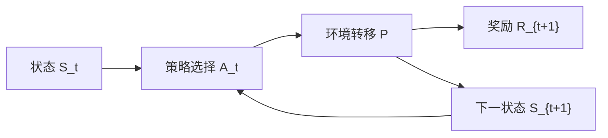

# Markov Decision Process（MDP，马尔可夫决策过程）

> 主卡。MDP 是强化学习的任务定义，不是某一种学习算法；Q-learning、PPO、SAC 和模型式 RL 都是在不同假设下求解或近似求解 MDP。

## L0：一分钟理解

### 一句话定义

马尔可夫决策过程（Markov Decision Process，MDP）用“状态、动作、环境转移、奖励与折扣”描述智能体如何在不确定环境中连续决策，并以最大化长期累计奖励为目标。

### 它解决什么问题

普通监督学习通常把每个输入独立映射到标签，但机器人当前动作会改变未来状态，未来状态又影响之后能获得的奖励。只看“这一动作眼前得多少分”可能导致短视行为。

MDP 把问题写成一个闭环：智能体读取状态并选动作，环境随机转移到下一状态并给奖励，智能体再继续决策。它提供统一语言，让我们区分环境如何变化、策略如何行动以及长期目标如何计算。

### 在 VLA/WAM 中有什么用

- 把机器人控制写成状态 $s$、动作 $a$、奖励 $r$ 与转移 $P$；
- 明确 VLA policy 只是 MDP 中选择动作的模块，不等于整个环境；
- 让世界模型学习转移或观测动力学，让 value model 估计长期结果；
- 判断当前视觉输入是否足以构成 Markov state，还是需要历史、belief 或 RSSM。

### 记住这三点

1. Markov 性要求当前状态包含预测下一步所需的全部历史信息，不等于环境必须确定。
2. Reward 是一步反馈，return 是从当前时刻开始的累计折扣奖励。
3. MDP 定义问题；policy、value function 和 RL algorithm 是在这个问题上行动、评价或学习的组件。

## L1：直觉与结构

### 1. 背景：单步决策已经解决了什么

在分类或 contextual bandit 中，可以根据当前输入选择一个动作并立即评价结果。这已经适合“动作不显著改变未来决策环境”的问题。

机器人控制却具有连续后果：机械臂先从哪一侧接近，会决定之后是否还能抓取；走得太快可能眼前省时，却增加碰撞和后续恢复成本。当前动作的价值必须包含它引起的未来状态与奖励。

### 2. 剩余矛盾与设计目标

我们既要描述环境的不确定动力学，又要避免把完整历史无限增长地塞给策略。理想表示应满足：

1. 能根据当前信息选择动作；
2. 能预测动作之后的状态与奖励分布；
3. 能累积长期结果；
4. 不必显式保存从任务开始以来的全部交互。

MDP 的设计目标是：**寻找一个足够的状态表示，使未来在给定当前状态和动作后与更早历史条件独立。**

### 3. 设计因果链

#### 完整历史太长

如果决策输入是 $H_t=(S_0,A_0,R_1,\ldots,S_t)$，长度随时间增长。MDP 假设存在状态 $S_t$，它是预测未来所需的充分统计量。这样策略和环境模型只需以当前状态为条件。代价是：错误或不完整的状态设计会破坏 Markov 性。

#### 环境可能随机

同一个状态执行同一个动作，结果可能因摩擦、传感噪声或外界变化而不同。因此转移不是单一函数，而是条件分布 $P(s',r\mid s,a)$。它表达 aleatoric randomness，但如果模型未知，还需要用数据估计。

#### 即时奖励会导致短视

只最大化 $R_{t+1}$ 可能牺牲未来。于是用 return $G_t$ 汇总之后的奖励，并用折扣因子 $\gamma$ 控制远期权重。它让长期目标可计算，但奖励设计与 $\gamma$ 会显著改变行为。

#### 环境规则不等于智能体行为

MDP 的转移由环境定义，policy $\pi(a\mid s)$ 由智能体定义。固定 policy 后，两者共同诱导轨迹分布；更换 policy 不会改写真实环境动力学，却会改变访问哪些状态。因此离线数据只覆盖 behavior policy 走过的区域。

### 4. Agent—Environment 交互流



文字等价描述：策略在当前状态选择动作，环境依据转移分布产生下一状态和一步奖励，然后决策循环继续。

本卡采用 Sutton–Barto 时间索引：先看到 $S_t$，再选 $A_t$，随后收到 $R_{t+1}$ 和 $S_{t+1}$。其他资料可能把这一步奖励记为 $r_t$，使用时必须先确认约定。

### 5. MDP 的组成与输入输出

一个折扣 MDP 常写为：

```math
\mathcal M=(\mathcal S,\mathcal A,p,\gamma,\rho_0)
```

其中：

- $\mathcal S$：状态空间；
- $\mathcal A$：动作空间；
- $p(s',r\mid s,a)$：联合一步动力学；
- $\gamma\in[0,1]$：折扣因子；
- $\rho_0(s)$：初始状态分布。

有些定义将 reward function $r(s,a)$ 或 $r(s,a,s')$ 单独列出，并将转移写为 $P(s'\mid s,a)$。这些只是不同但兼容的分解，不能在同一推导中不加说明地混用。

对于离散 tabular MDP：

- 转移张量 $P\in\mathbb R^{|S|\times|A|\times|S|}$；
- 每个 `(s,a)` 对下一状态维求和为 1；
- reward 张量可为 $R\in\mathbb R^{|S|\times|A|\times|S|}$；
- policy 为 $\Pi\in\mathbb R^{|S|\times|A|}$，每个状态的动作概率和为 1。

### 6. 在具身智能系统中的位置

| MDP 对象 | 机器人例子 |
|---|---|
| 状态 $s_t$ | 物体位姿、机器人关节、速度、接触模式 |
| 动作 $a_t$ | 关节力矩、速度命令、末端位姿增量、动作 chunk |
| 转移 $P$ | 机器人与环境的物理动力学 |
| 奖励 $r$ | 成功、距离、碰撞、能耗、平滑性 |
| Policy $\pi$ | PPO/SAC policy、VLA action head |
| 环境模型 | 仿真器、learned dynamics、RSSM |

单张 RGB 图像通常不是完整物理状态：速度、遮挡物体位置和接触力可能不可见。这时任务更接近 POMDP；历史编码器或 [RSSM](../../architectures/world-model/RSSM.md) 试图构造 belief state，而不是让原始 observation 自动满足 Markov 性。

### 7. 与相近形式的区别

| 形式 | 是否有状态转移 | 是否有动作 | 是否部分可观测 |
|---|---:|---:|---:|
| Supervised learning | 通常不建模 | 输出不是环境干预 | 不适用 |
| Multi-armed bandit | 无显式状态转移 | 有 | 否 |
| Contextual bandit | 每轮有 context | 有，但不建模长期影响 | 通常否 |
| MDP | 有 | 有 | 状态假设充分 |
| POMDP | 隐状态有 Markov 转移 | 有 | 是，agent 只见 observation |

MDP 允许随机转移；“Markov”描述条件独立结构，不是 deterministic 的同义词。

## L2：数学与实现

### 1. 符号表

| 符号 | 含义 |
|---|---|
| $S_t$ | 时刻 $t$ 的状态随机变量 |
| $A_t$ | 在 $S_t$ 下选择的动作 |
| $R_{t+1}$ | 执行 $A_t$ 后得到的一步奖励 |
| $p(s',r\mid s,a)$ | 下一状态与奖励的联合条件分布 |
| $P(s'\mid s,a)$ | 对 reward 边缘化后的状态转移概率 |
| $r(s,a)$ | 给定状态动作的期望一步奖励 |
| $\pi(a\mid s)$ | 随机策略 |
| $\rho_0(s)$ | 初始状态分布 |
| $G_t$ | 从 $t$ 开始的 return |
| $\gamma$ | 折扣因子 |
| $H_t$ | 到 $t$ 为止的完整历史 |

### 2. 核心公式

#### Markov 性

```math
\Pr(S_{t+1}=s',R_{t+1}=r\mid H_t,A_t=a)
=\Pr(S_{t+1}=s',R_{t+1}=r\mid S_t=s,A_t=a)
```

#### 从联合动力学得到转移与期望奖励

```math
P(s'\mid s,a)=\sum_r p(s',r\mid s,a)
```

```math
r(s,a)=\mathbb E[R_{t+1}\mid S_t=s,A_t=a]
=\sum_{s',r}r\,p(s',r\mid s,a)
```

连续 reward 或 state 时，求和相应替换为积分。

#### 策略与折扣 return

```math
A_t\sim\pi(\cdot\mid S_t)
```

```math
G_t=\sum_{k=0}^{\infty}\gamma^k R_{t+k+1}
=R_{t+1}+\gamma G_{t+1}
```

#### 策略目标

```math
J(\pi)=\mathbb E_{\substack{
S_0\sim\rho_0,\,A_t\sim\pi\\
(S_{t+1},R_{t+1})\sim p
}}[G_0]
```

### 3. 公式的逐步解释或推导

#### 第一步：Markov 性不是“只看一帧”

公式的左侧以完整历史 $H_t$ 为条件，右侧只保留 $S_t,A_t$。两者相等表示：一旦知道当前状态和动作，更早历史不会额外改变下一状态与奖励的条件分布。

关键在“状态如何定义”。若 $S_t$ 包含位置和速度，机械系统可能近似 Markov；若 observation 只有一张位置图像，速度信息缺失，Markov 性就可能不成立。堆叠历史帧、使用 RNN/RSSM 或维护 belief，都是改善状态充分性的办法。

#### 第二步：为什么联合写 $p(s',r\mid s,a)$

下一状态和奖励可能相关。例如抓取成功会同时进入 terminal state 并产生正奖励。联合分布能完整表达这种相关性。

若环境 reward 由 $(s,a,s')$ 确定，也可分解：

```math
p(s',r\mid s,a)=P(s'\mid s,a)P(r\mid s,a,s')
```

进一步取期望即可得到 $r(s,a)$。$r(s,a)$ 是期望，不表示每次采样都获得同一个数。

#### 第三步：策略如何与环境共同生成轨迹

长度 $T$ 的状态动作轨迹概率可分解为：

```math
p_\pi(\tau)
=\rho_0(s_0)
\prod_{t=0}^{T-1}
\pi(a_t\mid s_t)
P(s_{t+1}\mid s_t,a_t)
```

这个乘积把责任分开：$pi$ 决定动作概率，$P$ 决定动作后的环境结果。改变 policy 会改变轨迹分布，却不应改变同一真实环境的 $P$。

#### 第四步：Return 的递推从哪里来

展开定义：

```math
\begin{aligned}
G_t
&=R_{t+1}+\gamma R_{t+2}+\gamma^2R_{t+3}+\cdots\\
&=R_{t+1}+\gamma
\left(R_{t+2}+\gamma R_{t+3}+\cdots\right)\\
&=R_{t+1}+\gamma G_{t+1}
\end{aligned}
```

这个一行递推是 Bellman 方程的基础，但本卡只建立任务结构；value function 如何对未来 return 取条件期望，将在后续卡片展开。

#### 第五步：折扣因子到底做什么

$\gamma<1$ 至少有三种常见作用：

- 让无限时域且 reward 有界时的 return 收敛；
- 减小远期、不确定奖励的权重；
- 改变任务偏好，使策略更重视近期结果。

它不应简单解释成“未来奖励真的更不重要”。在 episodic task 中，也可以使用 $\gamma=1$，前提是 episode 有限且 return 定义良好。

#### 第六步：策略目标是对哪些随机性求期望

$J(\pi)$ 同时平均初始状态、policy action sampling 和环境随机转移。一次 rollout 的 $G_0$ 只是该期望的 Monte Carlo sample；训练代码用 batch trajectories 平均，是对 $J$ 或其梯度的统计估计，不是解析精确值。

### 4. 最小数值例子

考虑状态 $s$ 表示“机械臂在物体附近”，动作有 `grasp` 和 `wait`：

- policy 以 $0.75$ 概率 `grasp`，以 $0.25$ 概率 `wait`；
- `grasp` 以 $0.8$ 概率成功并得到 $10$，以 $0.2$ 概率失败、留在原状态并得到 $-1$；
- `wait` 必然留在原状态并得到 $-0.1$。

`grasp` 的期望一步奖励为：

```math
r(s,\mathrm{grasp})=0.8\times10+0.2\times(-1)=7.8
```

在该 policy 下，状态 $s$ 的期望下一步奖励为：

```math
\mathbb E[R_{t+1}\mid S_t=s]
=0.75\times7.8+0.25\times(-0.1)
=5.825
```

下一步进入成功 terminal state 的概率为：

```math
\Pr(S_{t+1}=\mathrm{terminal}\mid S_t=s,\pi)
=0.75\times0.8=0.6
```

另一个 episode 的三步奖励若为 $[-0.1,2,10]$，取 $\gamma=0.9$：

```math
G_0=-0.1+0.9\times2+0.9^2\times10=9.8
```

即时第一步奖励为负，但长期 return 很高，说明 MDP 优化不能只看眼前一步。

### 5. 建模、学习与部署

#### 建模阶段

1. 定义能支持预测未来的 state；
2. 定义 agent 可执行的 action；
3. 明确 terminal、time limit 与 reset；
4. 设计 reward 和折扣；
5. 判断任务是真正 MDP，还是 observation-level POMDP。

#### 学习阶段

- Model-free RL 不显式学习 $P$，但仍假设交互来自某个 MDP；
- Model-based RL 学习或使用 $P$，再规划或生成 imagined trajectories；
- Offline RL 只观察 behavior policy 产生的数据，必须处理分布覆盖问题；
- Imitation learning 直接拟合动作，也仍会在 MDP 闭环中受到状态分布偏移影响。

#### 部署阶段

Policy 每一步依据当前 state/belief 选动作。真实环境给出下一 observation 和 reward；系统必须更新状态估计。训练时使用未来信息构造 state、部署时却不可获得，会造成信息泄漏。

### 6. 伪代码

```text
state = sample(initial_state_distribution)
discounted_return = 0
discount = 1

for t in 0 ... horizon - 1:
    action ~ policy(. | state)
    next_state, reward ~ environment(. | state, action)
    discounted_return += discount * reward
    discount *= gamma
    state = next_state
    if state is terminal:
        break
```

### 7. 最小 PyTorch 实现

下面代码表示有限 tabular MDP，并区分 transition、transition-conditioned reward 和 policy。它用于验证公式与采样，不是深度 RL 训练算法。

```python
import torch


class TabularMDP:
    def __init__(
        self,
        transition: torch.Tensor,
        reward: torch.Tensor,
        initial: torch.Tensor,
        gamma: float,
        terminal: torch.Tensor,
    ):
        # transition P: [S, A, S_next]
        # reward R: [S, A, S_next]
        # initial rho_0: [S], terminal mask: [S]
        if transition.ndim != 3:
            raise ValueError("transition must have shape [S, A, S]")
        if reward.shape != transition.shape:
            raise ValueError("reward must match transition shape")
        if not torch.allclose(
            transition.sum(dim=-1),
            torch.ones_like(transition[..., 0]),
            atol=1e-6,
        ):
            raise ValueError("each P(. | s, a) must sum to one")
        if not torch.isclose(initial.sum(), initial.new_tensor(1.0)):
            raise ValueError("initial distribution must sum to one")
        self.P = transition
        self.R = reward
        self.rho0 = initial
        self.gamma = gamma
        self.terminal = terminal.bool()

    def expected_reward(self) -> torch.Tensor:
        # r(s,a) = sum_s' P(s'|s,a) R(s,a,s'): [S,A]
        return (self.P * self.R).sum(dim=-1)

    def step(self, state: int, action: int):
        # Sample S_{t+1} from P(. | S_t, A_t).
        next_state = torch.multinomial(self.P[state, action], 1).item()
        reward = self.R[state, action, next_state].item()
        done = bool(self.terminal[next_state])
        return next_state, reward, done


def rollout(
    mdp: TabularMDP,
    policy: torch.Tensor,
    max_steps: int = 100,
):
    # policy pi: [S,A], rows sum to one.
    if not torch.allclose(
        policy.sum(dim=-1), torch.ones_like(policy[:, 0]), atol=1e-6
    ):
        raise ValueError("each pi(. | s) must sum to one")

    state = torch.multinomial(mdp.rho0, 1).item()
    total_return = 0.0
    discount = 1.0
    trajectory = []

    for _ in range(max_steps):
        action = torch.multinomial(policy[state], 1).item()
        next_state, reward, done = mdp.step(state, action)
        trajectory.append((state, action, reward, next_state))
        total_return += discount * reward
        discount *= mdp.gamma
        state = next_state
        if done:
            break
    return trajectory, total_return


def policy_one_step_model(mdp: TabularMDP, policy: torch.Tensor):
    # P_pi(s,s') = sum_a pi(a|s) P(s'|s,a): [S,S]
    p_pi = torch.einsum("sa,san->sn", policy, mdp.P)
    # r_pi(s) = sum_a pi(a|s) r(s,a): [S]
    r_pi = (policy * mdp.expected_reward()).sum(dim=-1)
    return p_pi, r_pi
```

`max_steps` 是采样保护或外部 time limit，不自动等同于 MDP terminal state。到达真正 terminal state 意味着任务动力学终止；因时间上限截断则可能仍有未计算的未来 return，训练算法应区别处理。

### 8. 公式—代码对应

| 数学对象 | 代码 | 转换依据 | 形状与 reduction |
|---|---|---|---|
| $P(s'\mid s,a)$ | `transition[s,a]` | 离散 categorical distribution | `[S,A,S]`，末维和为 1 |
| $r(s,a)$ | `(P * R).sum(-1)` | 对下一状态分布取 reward 期望 | `[S,A,S] -> [S,A]` |
| $A_t\sim\pi(\cdot\mid S_t)$ | `multinomial(policy[state],1)` | 从离散随机 policy 采样 | 单个 action index |
| $S_{t+1}\sim P(\cdot\mid S_t,A_t)$ | `multinomial(P[state,action],1)` | 从环境 categorical transition 采样 | 单个 state index |
| $G_0=\sum_t\gamma^tR_{t+1}$ | `total_return += discount * reward` | trajectory 上的 Monte Carlo return | 每条 trajectory 一个标量 |
| $P_\pi(s,s')$ | `einsum("sa,san->sn",...)` | 对 action 按 policy 概率边缘化 | `[S,A] × [S,A,S] -> [S,S]` |
| $r_\pi(s)$ | `(policy * expected_reward).sum(-1)` | 对 action 取 policy 期望 | `[S,A] -> [S]` |

代码中的 `rollout` 只产生一次随机 return；重复 rollout 后取均值才是 $J(\pi)$ 的 Monte Carlo 估计。`expected_reward()` 则在已知 tabular model 下对下一状态解析求和，两者不要混为一谈。

### 9. 常见建模选择

- 状态粒度：物理真状态、估计状态、历史窗口或 belief；
- 动作粒度：力矩、速度、位姿增量或 action chunk；
- reward scale、稀疏/稠密 reward 与 shaping；
- discount $\gamma$；
- control frequency 与 decision timestep；
- episodic terminal、continuing task 与 time-limit truncation；
- transition 是否已知、可仿真或需要学习；
- initial-state distribution 是否覆盖部署场景。

更改控制频率会改变“一步”代表的物理时间，因此相同数值 $\gamma$ 的实际时间尺度也会变化。跨频率比较时可按期望折扣时间重新换算，而不是机械复用。

### 10. 失败模式与常见误解

#### Observation 被误当作 state

相机帧可能缺速度、力和遮挡信息。若同一图像对应不同未来动力学，单帧 observation 不满足 Markov 性。应加入历史、本体信息或 belief model。

#### Reward 与 return 混淆

$R_{t+1}$ 是一步随机反馈；$G_t$ 是一串未来 reward 的折扣和；$r(s,a)$ 又是一步 reward 的条件期望。三者单位相关但不是同一对象。

#### Policy 与 transition 混淆

$\pi(a\mid s)$ 描述 agent 选择什么，$P(s'\mid s,a)$ 描述环境如何响应。行为数据中的相关性不能直接当成可干预的环境动力学。

#### Markov 被理解为确定性

MDP 完全允许同一 $(s,a)$ 得到多个下一状态。Markov 只说其分布无需再依赖更早历史。

#### 奖励塑形改变真正任务

距离 reward、动作惩罚和碰撞惩罚能加速学习，也可能诱导钻漏洞或与成功标准冲突。应分别报告训练 reward 与任务成功指标。

#### Terminal 与 truncation 混淆

任务成功/失败导致的 terminal 和外部时间上限导致的 truncation，对 bootstrap target 的处理不同。把所有 `done` 都视为零未来价值会产生偏差。

#### 初始状态分布被忽略

$J(\pi)$ 依赖 $\rho_0$。只在容易初始状态训练和评估，不能说明策略覆盖真实部署分布。

#### 模型在数据外动作上不可靠

Offline RL 或 learned world model 只能从数据估计 $P,r$。对数据未覆盖动作进行规划，可能利用模型误差获得虚高 return。

## 自测

### 基础题

1. MDP 的核心组成有哪些？
2. $R_{t+1}$、$r(s,a)$ 和 $G_t$ 分别是什么？
3. Policy 与 transition model 分别描述谁的行为？

### 理解题

4. 为什么随机环境也可以满足 Markov 性？
5. 为什么一张机器人相机图像不一定构成 MDP state？
6. 从 $G_t$ 的定义如何得到 $G_t=R_{t+1}+\gamma G_{t+1}$？
7. 为什么改变 policy 会改变状态分布，却不改变真实环境转移？

### 迁移题

8. 对抓取任务，你会如何定义 state、action、reward 和 terminal？
9. 将控制频率从 10 Hz 改为 50 Hz 时，为什么要重新考虑 $\gamma$？
10. RSSM 在 observation-level POMDP 中补充了 MDP 的哪一部分？

<details>
<summary>参考答案</summary>

1. 状态空间、动作空间、转移/奖励动力学、折扣因子，通常还包括初始状态分布。
2. $R_{t+1}$ 是一次转移采样的一步奖励；$r(s,a)$ 是其条件期望；$G_t$ 是未来奖励的折扣累计。
3. Policy 描述 agent 的动作选择，transition 描述环境对状态动作的响应。
4. Markov 性约束条件依赖关系，不要求下一状态唯一；随机分布只需由当前状态动作充分决定。
5. 单帧可能缺速度、接触力和被遮挡对象状态，相同图像可能对应不同未来。
6. 把第一项 $R_{t+1}$ 提出，剩余每项都有一个公共 $\gamma$，括号内正是 $G_{t+1}$。
7. Policy 改变动作及访问状态的概率；真实物理规律 $P(s'|s,a)$ 在同一环境中不随 agent policy 改写。
8. 例如 state 包含物体/夹爪位姿与速度，action 是末端增量，reward 含成功、距离和碰撞，terminal 是成功或不可恢复失败；具体定义必须匹配传感与控制接口。
9. 每步物理时长缩短，同一数值折扣会对应更短的实际规划时间尺度。
10. RSSM 用历史观测和动作维护随机/确定性 latent belief，近似构造对未来预测更充分的状态。

</details>

## 学习导航

### 前置卡片

- Conditional Probability（待创建）
- Expectation（待创建）
- Markov Property（待创建）

### 原子子卡

- Reward vs Return（待创建）
- Discount Factor（待创建）
- Trajectory Distribution（待创建）
- Terminal vs Truncation（待创建）

### 对比卡片

- MDP vs POMDP（待创建）
- MDP vs Contextual Bandit（待创建）
- Model-Free vs Model-Based RL（待创建）

### 下一张推荐卡

学习 Value Function，再从 return 的条件期望推导 Bellman expectation equation；之后才能看清 TD、Q-learning、Actor-Critic 与 PPO 在估计或优化什么。

## 参考资料

1. [Reinforcement Learning: An Introduction, Second Edition](http://incompleteideas.net/book/the-book-2nd.html) — Sutton 与 Barto，第 3 章系统定义有限 MDP。
2. [MIT Press: Reinforcement Learning, Second Edition](https://mitpress.mit.edu/9780262352703/reinforcement-learning/) — 正式出版信息与开放资源入口。
3. [A Markovian Decision Process](https://iumj.org/article/1116/) — Richard Bellman 1957 年原始论文。

## L3：论文与源码深入（待补充）

- 有限 MDP 的矩阵形式、occupancy measure 与线性规划；
- discounted、average-reward 与 stochastic shortest-path formulations；
- state abstraction、bisimulation 与 Markov representation learning；
- Semi-MDP、options 与 action chunk 的持续时间建模；
- POMDP belief MDP 与 RSSM 的近似关系；
- continuous-state/action MDP 的 measure-theoretic 定义。
