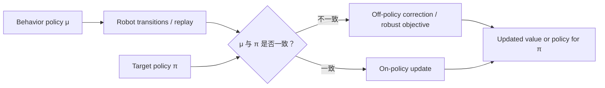

# On-policy vs Off-policy（同策略与异策略学习）

> 主对比卡。本卡只回答一个核心问题：生成数据的策略与我们想评价或改进的策略是否相同，以及不相同时需要付出什么代价。

## L0：一分钟理解

### 一句话定义

令 behavior policy $\mu$ 负责采集动作，target policy $\pi$ 是希望评价或优化的策略：两者相同是 on-policy，不同则是 off-policy。

### 它解决什么问题

On-policy 让训练数据与目标策略天然匹配，语义直接，但旧数据会随着策略更新而过时；off-policy 允许复用历史数据、其他机器人数据或探索策略数据，却必须处理动作概率与状态分布不匹配。

### 在 VLA/WAM 中有什么用

- 判断在线 robot rollout 能否反复放入 replay buffer 使用；
- 分析遥操作数据、历史日志或跨机器人数据是否匹配当前 policy；
- 理解 Sarsa、Q-learning、PPO、SAC 与 offline RL 的数据语义；
- 识别 critic 在数据未覆盖动作上产生虚高估计的风险。

### 记住这三点

1. On/off-policy 描述的是“数据策略 $\mu$”与“目标策略 $\pi$”的关系，不等于 on/offline。
2. Off-policy 学习要求 coverage：目标策略可能选择的动作必须在行为数据中有支持。
3. Importance sampling 能校正动作概率差异，但长轨迹权重乘积可能产生极高方差。

## L1：直觉与结构

### 1. 背景：同一策略采样和学习已经解决了什么

若机器人用当前策略 $\pi$ 与环境交互，再用这些轨迹评价或改进同一个 $\pi$，采样到的动作和状态正来自目标分布。无需额外纠正“这条数据在目标策略下会不会出现”。

### 2. 剩余矛盾与设计目标

真实机器人数据昂贵。只使用最新策略的数据意味着策略每更新一次，大量旧日志就变得不完全匹配；而遥操作、探索策略和历史模型生成的数据又往往比当前策略丰富。

设计目标是：**允许行为策略负责安全、探索或数据复用，同时学习另一个目标策略。** 新成本是 distribution shift、重要性权重方差，以及对数据覆盖之外动作的外推风险。

### 3. 设计因果链

#### 数据昂贵 → 分离 behavior 与 target policy

$\mu$ 可以带探索、由人类控制或来自旧 checkpoint，$\pi$ 则代表当前希望评价或优化的策略。分离后数据更易复用，但期望不再天然对应目标策略。

#### 动作概率不匹配 → importance sampling

用比率 $\pi(a\mid s)/\mu(a\mid s)$ 重新加权样本，可将 behavior 下的期望转换为 target 下的期望。代价是当 $\mu$ 很少选择而 $\pi$ 经常选择某动作时，权重会很大。

#### 长轨迹权重连乘 → 方差爆炸

完整 trajectory correction 需要多个比率相乘。可使用 weighted importance sampling、per-decision correction、截断权重或专门的 off-policy 算法降低方差，但通常引入偏差或更复杂的收敛条件。

#### 数据未覆盖目标动作 → 无法仅靠重加权修复

若 $\pi(a\mid s)>0$ 而 $\mu(a\mid s)=0$，比率无定义，日志中也没有该动作结果。需要更好的数据覆盖、限制目标策略，或使用保守离线 RL，而不是把缺失样本“算出来”。

### 4. 数据与目标关系



文字等价说明：行为策略产生数据，训练时比较其与目标策略是否一致；不一致时必须通过校正、算法结构或保守约束处理分布差异。

### 5. On-policy 与 Off-policy 不等于 Online 与 Offline

| 维度 | 问的问题 |
|---|---|
| On-policy / Off-policy | 采数据的策略与目标策略是否相同？ |
| Online / Offline | 学习期间能否继续与环境交互？ |

因此可以有：在线 off-policy（边交互边用 replay 的 SAC）、离线 off-policy（固定日志训练新策略），也可以把一批由固定目标策略生成的数据用于 batch on-policy evaluation。日常术语中“on-policy 算法”常强调需要近当前策略数据，但这不应与 online 混为一谈。

### 6. 在机器人系统中的位置

| 场景 | $\mu$ | $\pi$ | 主要问题 |
|---|---|---|---|
| 最新策略在线 rollout | 当前策略 | 当前策略 | 数据成本、更新后变旧 |
| 带探索的 Q-learning | $\epsilon$-greedy | greedy | off-policy TD target |
| 遥操作数据训练 policy | 人类/遥操作器 | 学得策略 | 行为概率未知、覆盖有限 |
| 多机器人 replay | 多个旧策略 | 当前策略 | 非平稳混合分布 |
| 安全行为策略采集 | 受约束策略 | 更高性能策略 | 支持集与安全边界 |

### 7. 常见算法如何归类

| 算法/做法 | 常见归类 | 原因 |
|---|---|---|
| Sarsa | On-policy TD control | target 使用实际由当前策略选出的 $A_{t+1}$ |
| Q-learning | Off-policy TD control | behavior 可探索，target 使用 greedy $\max_{a'}Q$ |
| PPO | On-policy family | 主要使用近旧策略的新 rollout，并限制 policy ratio 变化 |
| DQN / SAC | Off-policy | 使用 replay buffer，可复用旧策略数据 |
| Behavior Cloning | 监督学习；非标准 on/off-policy RL | 模仿数据动作，不用 RL return 直接评价另一策略 |
| Offline RL | 通常 off-policy | 只用固定行为数据优化新策略 |

## L2：数学与实现

### 1. 符号表

| 符号 | 含义 |
|---|---|
| $\mu(a\mid s)$ | Behavior policy 的动作概率 |
| $\pi(a\mid s)$ | Target policy 的动作概率 |
| $d_\mu(s),d_\pi(s)$ | 两个策略诱导的状态访问分布 |
| $\rho_t$ | 单步 importance sampling ratio |
| $\rho_{t:T-1}$ | 从 $t$ 到 episode 末的轨迹比率乘积 |
| $G_t$ | 折扣 Return |

### 2. Coverage 条件

要用 $\mu$ 的样本无偏表示 $\pi$ 的动作期望，至少需要：

```math
\pi(a\mid s)>0 \Longrightarrow \mu(a\mid s)>0.
```

这叫 support 或 coverage 条件。它只保证“有机会看到”，不保证样本足够；若 $\mu(a\mid s)$ 极小，估计仍会有巨大方差。

### 3. 单步 importance sampling

定义：

```math
\rho_t=\frac{\pi(A_t\mid S_t)}{\mu(A_t\mid S_t)}.
```

对固定状态的任意动作函数 $f$：

```math
\begin{aligned}
\mathbb{E}_{A\sim\mu}[\rho f(A)]
&=\sum_a\mu(a\mid s)\frac{\pi(a\mid s)}{\mu(a\mid s)}f(a)\\
&=\sum_a\pi(a\mid s)f(a)\\
&=\mathbb{E}_{A\sim\pi}[f(A)].
\end{aligned}
```

第一行到第二行的约分依赖 coverage；没有行为策略支持的动作不会神奇地出现。

### 4. 轨迹 importance sampling

环境转移在两个策略下相同，因此轨迹概率比中环境项相消，只剩动作概率比：

```math
\rho_{t:T-1}
=\prod_{k=t}^{T-1}
\frac{\pi(A_k\mid S_k)}{\mu(A_k\mid S_k)}.
```

Ordinary importance sampling 的 value estimate 可写为：

```math
\hat v_{\mathrm{ordinary}}(s)
=\frac{1}{N}\sum_{i=1}^{N}\rho^{(i)}G^{(i)}.
```

Weighted importance sampling 为：

```math
\hat v_{\mathrm{weighted}}(s)
=\frac{\sum_{i=1}^{N}\rho^{(i)}G^{(i)}}
{\sum_{i=1}^{N}\rho^{(i)}}.
```

Ordinary 形式在满足条件时可无偏但方差可能很高；weighted 形式有限样本下通常有偏，却更稳定并具有一致性。分母为零时必须等待有正权重样本，不能直接除零。

### 5. 最小数值例子

状态 $s$ 有 `grasp` 和 `wait` 两个动作：

| 动作 | $\mu(a\mid s)$ | $\pi(a\mid s)$ | $\rho$ |
|---|---:|---:|---:|
| grasp | $0.4$ | $0.8$ | $2$ |
| wait | $0.6$ | $0.2$ | $1/3$ |

若 behavior 采到 `grasp` 且 Return 为 $10$，ordinary IS 对求和项的贡献为 $2\times10=20$。这不是说真实 Return 变成了 $20$，而是 `grasp` 在 behavior 数据中出现得比 target 下少，因此该样本代表更多 target-policy 概率质量。

验证单步期望：若 $f(\text{grasp})=10$、$f(\text{wait})=1$，则：

```math
\mathbb{E}_{\mu}[\rho f]
=0.4\times2\times10
+0.6\times\frac{1}{3}\times1
=8.2.
```

直接在 target policy 下计算同样为：

```math
\mathbb{E}_{\pi}[f]
=0.8\times10+0.2\times1
=8.2.
```

### 6. Sarsa 与 Q-learning 的策略语义

Sarsa target：

```math
Y_t^{\mathrm{Sarsa}}
=R_{t+1}+\gamma Q(S_{t+1},A_{t+1}),
\qquad A_{t+1}\sim\pi.
```

它评价正在执行的策略，包括其探索行为。

Q-learning target：

```math
Y_t^{\mathrm{Q}}
=R_{t+1}+\gamma\max_{a'}Q(S_{t+1},a').
```

Behavior 可以是 $\epsilon$-greedy，而 target 对应 greedy policy。这种结构使其 off-policy，但函数逼近下仍需处理过估计和分布外动作。

### 7. 最小 PyTorch 实现：单步权重

```python
import torch


def importance_weighted_mean(
    losses: torch.Tensor,
    target_action_probs: torch.Tensor,
    behavior_action_probs: torch.Tensor,
    max_weight: float | None = None,
) -> torch.Tensor:
    """All inputs have shape [B]; output is one scalar batch estimate."""
    if torch.any(behavior_action_probs <= 0):
        raise ValueError("behavior probabilities must be positive on sampled actions")

    ratios = target_action_probs / behavior_action_probs
    if max_weight is not None:
        # Clipping lowers variance but introduces bias.
        ratios = ratios.clamp(max=max_weight)

    # detach: ratios are sampling corrections, not a path for optimizing pi here.
    return (ratios.detach() * losses).mean()
```

这段代码只实现“已知两策略动作概率时的单步 ordinary IS batch mean”，不是完整 off-policy RL 算法。Replay 中若没有记录 behavior probability，不能凭空精确恢复 ratio；连续动作还需使用 probability density 而不是离散概率质量。

### 8. 公式—代码对应

| 数学对象 | 代码 | 转换依据 | 形状与 reduction |
|---|---|---|---|
| $\pi(A_t\mid S_t)$ | `target_action_probs` | 对实际采样动作取 target 概率 | `[B]` |
| $\mu(A_t\mid S_t)$ | `behavior_action_probs` | 数据采集时记录 | `[B]` |
| $\rho_t$ | `ratios` | 概率比的精确单步计算 | `[B]` |
| $\min(\rho,c)$ | `.clamp(max=...)` | 有偏的方差控制，不是原始 IS 等式 | `[B]` |
| $N^{-1}\sum_i\rho_i\ell_i$ | `(ratios * losses).mean()` | mini-batch ordinary IS estimate | scalar，跨 batch mean |

### 9. Training 与 deployment

训练时需要区分并记录 behavior policy、target policy、checkpoint 版本和动作 log-probability。部署时通常只执行最终 target policy，不再计算 IS ratio；ratio 是利用异策略数据进行学习的工具，不是动作生成模块。

### 10. 常见超参数与工程选择

| 选择 | 作用 | 代价 |
|---|---|---|
| Exploration rate | 提高行为覆盖 | 降低即时性能或安全性 |
| Replay age/window | 增加数据复用 | 数据策略更陈旧 |
| Ratio clipping | 限制极端梯度 | 引入偏差 |
| Target-policy constraint | 限制偏离 behavior | 可能限制性能上界 |
| Conservative Q penalty | 压低 OOD 动作价值 | 可能过度保守 |

### 11. 失败模式与常见误解

#### Off-policy 等于 Offline

Off-policy 只说明 $\mu\ne\pi$；在线 replay 算法同样可以 off-policy。

#### Replay buffer 自动让任何算法变成可靠 off-policy

能读取旧数据不代表目标仍正确。算法必须在 target、校正或目标约束上处理策略差异。

#### 有 importance sampling 就不需要 coverage

分母为零时 ratio 无定义；极小分母也会导致巨大方差。

#### 只校正动作比例就解决所有深度离线 RL 问题

长时程还涉及状态访问分布变化，behavior probability 也常未知。函数逼近会在 OOD 动作上外推，需额外的保守或约束机制。

#### PPO 完全使用当前策略数据

PPO 通常用 rollout policy 的固定 batch 做若干轮更新，并通过 probability ratio 与 clipping 限制新旧策略偏移；更准确的理解是 on-policy family 的近策略更新，而不是假装 $\mu$ 与每一步更新后的 $\pi$ 永远严格相等。

#### Behavior Cloning 就是 off-policy RL

BC 使用监督动作标签拟合 behavior，不利用 Return 去评价另一个策略；它与 off-policy RL 的目标不同，尽管两者都可使用离线数据。

## 自测

### 基础题

1. Behavior policy 与 target policy 分别负责什么？
2. On-policy/off-policy 与 online/offline 有何区别？
3. Coverage 条件为什么不可缺少？

### 理解题

1. 为什么 trajectory importance ratio 中环境转移概率可以相消？
2. Ordinary 与 weighted importance sampling 的偏差—方差特点是什么？
3. 为什么 Sarsa 通常称为 on-policy，而 Q-learning 称为 off-policy？

### 迁移题

一个机器人团队把三年前多个旧策略的 replay 与当前策略数据混合训练新 critic，但日志没有保存 behavior log-probability。说明不能直接做什么、仍可采取哪些方案，以及最需要监控的风险。

<details>
<summary>参考答案</summary>

**基础题**

1. Behavior policy $\mu$ 产生训练数据中的动作；target policy $\pi$ 是希望评价或改进的策略。二者可以相同，也可以不同。
2. On/off-policy 比较采样策略与目标策略；online/offline 描述训练期间是否还能继续收集环境数据。在线 SAC 是 off-policy，固定日志训练新策略通常也是 off-policy。
3. 若 $\pi(a\mid s)>0$ 但 $\mu(a\mid s)=0$，数据永远不会包含该动作结果，importance ratio 也因分母为零而无定义。重加权无法补回完全缺失的支持。

**理解题**

1. 两种策略面对的是同一环境，给定状态动作后的初始分布与环境转移项相同；轨迹概率相除时这些共同项抵消，只剩策略动作概率的连乘比。若环境或机器人本体也改变，则不能直接沿用这一假设。
2. Ordinary IS 在标准条件下无偏，但极端比率会造成高方差；weighted IS 用权重和归一化，有限样本通常有偏，却更稳定且一致。两者都不能解决无 coverage。
3. Sarsa 的下一动作由正在执行的目标策略采样，学习该策略含探索的 $Q^\pi$；Q-learning 的数据可由探索 behavior 生成，但 target 使用 greedy 最大 Q，因而学习另一个贪心目标策略。

**迁移题**

没有 behavior log-probability 时，不能精确计算逐样本 importance ratio，也不应假装所有旧数据来自当前策略。可按 checkpoint/数据来源分组并在可能时重建旧 policy；无法重建时，可限制新策略接近数据动作、采用 conservative offline RL、过滤过旧或明显 OOD 数据、增加当前策略安全采样，或先做 behavior modeling，但估计的 behavior probability 本身也有误差。重点监控 critic 对数据外动作的虚高 Q、不同数据源覆盖差异、有效样本权重和真实机器人闭环性能，而不能只看训练 loss。

</details>

## 学习导航

### 前置卡片

- [Markov Decision Process](MDP.md)
- [Value Function](Value-Function.md)
- [Temporal-Difference Learning](Temporal-Difference-Learning.md)

### 原子子卡

- Importance Sampling（本卡覆盖基础）
- Behavior Policy 与 Target Policy（本卡覆盖）
- State Distribution Shift（待创建）

### 对比卡片

- Sarsa vs Q-learning（待创建）
- Online RL vs Offline RL（待创建）
- Behavior Cloning vs Offline RL（待创建）

### 下一张推荐卡

- Q-Learning（待创建）：学习最经典的 off-policy TD control target。
- Offline RL（待创建）：处理固定行为数据下的策略约束和保守价值估计。

## 参考资料

1. Sutton, R. S., & Barto, A. G. *Reinforcement Learning: An Introduction*, 2nd ed., Chapters 5–7 and 11. [作者提供的第二版草稿](https://www.incompleteideas.net/book/bookdraft2018mar21.pdf)
2. Sutton, R. S., Mahmood, A. R., & White, M. (2016). An Emphatic Approach to the Problem of Off-policy Temporal-Difference Learning. *JMLR*, 17(73), 1–29. [论文页面](https://www.jmlr.org/papers/v17/14-488.html)

## L3：论文与源码深入（待补充）

- 推导 per-decision importance sampling 与 control variate；
- 分析 off-policy function approximation 的 deadly triad；
- 对比 Retrace、V-trace、Tree Backup 与 emphatic TD；
- 深入 offline RL 的 concentrability、pessimism 与 support constraint。
