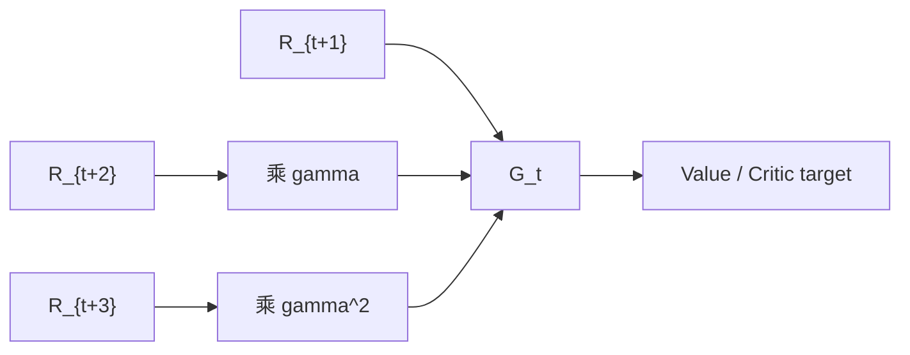

# Return 与 Discount Factor（回报与折扣因子）

> 主卡。MDP 的整体定义见 [MDP](./MDP.md)。本卡只聚焦一步 reward 如何组成长期 return，以及折扣因子如何改变时间尺度。

## L0：一分钟理解

### 一句话定义

Return $G_t$ 是从时刻 $t$ 开始的未来奖励累计；discount factor $\gamma$ 决定越远奖励以多快的速度衰减。

### 它解决什么问题

机器人当前动作可能先付出代价，之后才成功。例如机械臂先绕开障碍会产生负的时间成本，却换来后续抓取奖励。如果只最大化下一步 reward，策略会忽略这种延迟后果。

Return 把整条未来奖励序列压成一个标量目标；折扣让无限序列可控，并规定决策关注的时间尺度。

### 在 VLA/WAM 中有什么用

- 评价一段动作 rollout 最终是否值得；
- 为 value model、critic、PPO、SAC 提供学习目标；
- 在世界模型 imagination 中累计预测 reward；
- 决定机器人策略更关注即时安全、短期进展还是长期任务成功。

### 记住这三点

1. Reward $R_{t+1}$ 是一步反馈，return $G_t$ 是未来 reward 的累计。
2. $\gamma$ 同时影响收敛、远期权重和有效规划时间尺度，不只是“耐心参数”。
3. Terminal 与 time-limit truncation 不同：真正终止后没有未来 return，截断后可能仍需 bootstrap。

## L1：直觉与结构

### 1. 背景：一步 reward 已经解决了什么

Reward 能立即评价一次状态转移，例如碰撞给 $-10$、成功抓取给 $+100$、每步耗时给 $-0.1$。它把任务偏好转成环境反馈。

但一步 reward 只描述局部结果。相同的当前 reward 可能通往完全不同的未来；一个动作甚至可能当前得分较低，却把机器人带到更容易成功的状态。

### 2. 剩余矛盾与设计目标

我们需要比较不同时刻、不同长度的轨迹，同时处理：

- 奖励延迟；
- episode 长度不同；
- continuing task 没有自然终点；
- 远期预测更不确定；
- 控制频率改变后一步对应的物理时间不同。

设计目标是：**把未来奖励变成一个定义明确、可递推、可用于优化的标量。**

### 3. 设计因果链

#### 只看即时 reward 太短视

把所有未来 reward 相加得到 return，当前动作就能为之后结果负责。新问题是：无限 continuing task 的和可能发散。

#### 无限和可能发散

引入 $0\le\gamma<1$，让有界 reward 的权重形成几何级数，保证折扣和有限。代价是远期 reward 被系统性减弱，任务偏好发生变化。

#### 轨迹可能提前结束

真正 terminal 后未来 reward 为零，因此递推在此停止。但数据采集常因时间上限截断；环境其实仍可继续，此时将未来值强制设为零会低估 return。

#### 控制周期不同导致相同 gamma 含义不同

10 Hz 的一步是 0.1 秒，50 Hz 的一步是 0.02 秒。机械复用相同 $\gamma$ 会改变实际秒级 horizon。可用连续时间折扣率换算，使不同频率具有相近时间偏好。

### 4. 奖励到 Return 的数据流



文字等价描述：当前 reward 原权重进入 return，越远 reward 依次乘更高次的 $\gamma$，所得标量可作为 value 或 critic 的学习目标。

### 5. 输入、输出与张量形状

对 batch trajectories：

- rewards：`[B,T]`，元素对应 $R_{t+1}$；
- terminated：`[B,T]`，表示该 transition 后是否真正终止；
- bootstrap value：`[B]`，截断边界之后的估计 value；
- returns：`[B,T]`，每个位置对应 $G_t$。

动作维度不直接进入 return；多维 reward components 必须先按任务定义组合成标量，或使用向量价值/多目标 RL 的扩展。

### 6. 在具身智能系统中的位置


文字等价描述：机器人执行动作产生奖励序列，return 汇总长期结果，再用于 critic 和 policy 更新。

### 7. 与相近概念的区别

| 概念 | 定义 | 是否随机 |
|---|---|---:|
| Reward $R_{t+1}$ | 一次 transition 的反馈 | 通常是 |
| Expected reward $r(s,a)$ | 给定状态动作的一步 reward 期望 | 否，给定模型后是数值 |
| Return $G_t$ | 一条实际未来轨迹的累计奖励 | 是 |
| Value $V^\pi(s)$ | 给定状态后 return 的条件期望 | 否，固定 MDP 与 policy 后是函数值 |

Return 是 sample-level target；value 是对许多可能 returns 的平均，二者不能交换名称。

## L2：数学与实现

### 1. 符号表

| 符号 | 含义 |
|---|---|
| $R_{t+1}$ | 执行 $A_t$ 后收到的一步 reward |
| $G_t$ | 从 $t$ 开始的 return |
| $\gamma$ | discount factor |
| $T$ | episode 终止时刻或 rollout 边界 |
| $V(S_T)$ | 截断边界的 bootstrap value |
| $\Delta t$ | 每个决策步的物理时间 |
| $\lambda$ | 连续时间指数折扣率 |

### 2. 核心公式

无限时域折扣 return：

```math
G_t=\sum_{k=0}^{\infty}\gamma^kR_{t+k+1}
```

有限 episode：

```math
G_t=\sum_{k=0}^{T-t-1}\gamma^kR_{t+k+1}
```

一步递推：

```math
G_t=R_{t+1}+\gamma G_{t+1}
```

若 rollout 在 $T$ 被截断而非真正终止：

```math
\hat G_t
=\sum_{k=0}^{T-t-1}\gamma^kR_{t+k+1}
+\gamma^{T-t}\hat V(S_T)
```

连续时间折扣与离散折扣可对应为：

```math
\gamma=\exp(-\lambda\Delta t)
```

### 3. 公式的逐步解释或推导

#### 第一步：递推式如何得到

```math
\begin{aligned}
G_t
&=R_{t+1}+\gamma R_{t+2}+\gamma^2R_{t+3}+\cdots\\
&=R_{t+1}+\gamma
\left(R_{t+2}+\gamma R_{t+3}+\cdots\right)\\
&=R_{t+1}+\gamma G_{t+1}
\end{aligned}
```

这只是代数恒等式，没有使用期望或 Bellman 假设。Bellman equation 是之后对该递推取条件期望得到的。

#### 第二步：为什么 $\gamma<1$ 可保证有界

若 $|R_t|\le R_{\max}$，则：

```math
|G_t|
\le\sum_{k=0}^{\infty}\gamma^kR_{\max}
=\frac{R_{\max}}{1-\gamma}
```

这个结论要求 $0\le\gamma<1$。Episodic finite-horizon task 即使 $\gamma=1$，有限项求和仍可定义。

#### 第三步：有效 horizon 如何理解

几何权重的总和为 $1/(1-\gamma)$，因此常用

```math
H_{\mathrm{eff}}\approx\frac{1}{1-\gamma}
```

作为步数级直觉。它不是硬截断：第 $H_{\mathrm{eff}}$ 步之后的权重并不会突然变为零。另一种更明确的定义是求满足 $\gamma^h\le\varepsilon$ 的 $h$。

#### 第四步：为什么 truncation 需要 bootstrap

若 episode 因成功或失败真正终止，边界之后没有奖励，可设 $G_T=0$。若只是日志长度或 time limit 截断，真实过程仍会继续；把 $G_T$ 设零会丢掉剩余 return。于是使用 $\hat V(S_T)$ 近似尾部期望。

Bootstrap 降低必须等待完整 episode 的需求，却引入 value estimate 的偏差。这是 MC 与 TD 方法差异的起点。

#### 第五步：控制频率如何换算 gamma

希望每经过真实时间 $\tau$，未来权重衰减为 $e^{-\lambda\tau}$。一步时长为 $\Delta t$ 时，单步权重应为 $e^{-\lambda\Delta t}$。因此控制频率改变后，可先保持 $\lambda$ 不变，再计算新 $\gamma$。

若旧系统一步 $\Delta t_{old}$、折扣 $\gamma_{old}$，新一步为 $\Delta t_{new}$：

```math
\gamma_{new}
=\gamma_{old}^{\Delta t_{new}/\Delta t_{old}}
```

### 4. 最小数值例子

奖励序列为 $[-0.1,2,10]$，$\gamma=0.9$：

```math
G_0=-0.1+0.9\times2+0.9^2\times10=9.8
```

从后向前递推同样得到：

```math
G_2=10,qquad
G_1=2+0.9\times10=11,qquad
G_0=-0.1+0.9\times11=9.8
```

若 rollout 在两步后截断，奖励为 $[-0.1,2]$，边界 value 估计为 $10$：

```math
\hat G_0=-0.1+0.9\times2+0.9^2\times10=9.8
```

若错误地把截断当 terminal，则只得到 $1.7$，明显低估后续价值。

$\gamma=0.99$ 时，步数直觉 $H_{eff}\approx100$。如果 10 Hz 控制，每步 0.1 秒，约对应 10 秒量级，而不是 100 秒。

### 5. 训练与推理

#### 数据生成

环境按 MDP 产生 reward。Return 通常在 rollout 后从后向前计算，不需要神经网络。

#### Value / policy 训练

- Monte Carlo：用完整 $G_t$ 监督 value；
- TD：用若干真实 rewards 加 bootstrap value；
- Actor-Critic：critic 估计 return，actor 使用 advantage 更新；
- 世界模型：在 imagined rollout 中累积预测 rewards 和 terminal/discount。

#### 部署

Policy 部署时通常不显式等待未来 return；它使用训练好的 value/critic 或直接输出动作。Return 是训练与评价概念，不是必须实时观测的传感器信号。

### 6. 伪代码

```text
running = bootstrap_value
for t from T-1 down to 0:
    if transition t truly terminates:
        running = 0
    running = reward[t] + gamma * running
    return[t] = running
```

### 7. 最小 PyTorch 实现

```python
import torch


def discounted_returns(
    rewards: torch.Tensor,
    terminated: torch.Tensor,
    gamma: float,
    bootstrap_value: torch.Tensor | None = None,
) -> torch.Tensor:
    # rewards, terminated: [B, T]. terminated refers to the transition at t.
    if rewards.shape != terminated.shape:
        raise ValueError("rewards and terminated must have the same shape")
    batch, horizon = rewards.shape
    if bootstrap_value is None:
        running = torch.zeros(batch, device=rewards.device, dtype=rewards.dtype)
    else:
        running = bootstrap_value.to(device=rewards.device, dtype=rewards.dtype)

    returns = torch.empty_like(rewards)
    for t in reversed(range(horizon)):
        # True termination removes all value beyond this transition.
        continuation = (~terminated[:, t].bool()).to(rewards.dtype)
        running = rewards[:, t] + gamma * continuation * running
        returns[:, t] = running
    return returns


def monte_carlo_value_loss(
    predicted_values: torch.Tensor,
    returns: torch.Tensor,
) -> torch.Tensor:
    # predicted_values and returns: [B, T].
    # Return is a sampled regression target; mean sets equal weight per valid item.
    return (predicted_values - returns.detach()).pow(2).mean()
```

真实变长 batch 还需 `valid_mask`，否则 padding positions 会参与 loss。`bootstrap_value` 只应在 rollout 边界仍可继续时使用；真正 terminal transition 会由 `continuation=0` 截断尾部。

### 8. 公式—代码对应

| 数学对象 | 代码 | 转换依据 | 形状与 reduction |
|---|---|---|---|
| 边界 $G_T$ | `bootstrap_value` 或零 | 截断时估计尾部，terminal 后为零 | `[B]` |
| $G_t=R_{t+1}+\gamma G_{t+1}$ | 反向循环的 `running` | 精确递推 | `[B]` 每步更新 |
| Terminal 截断 | `continuation = ~terminated` | terminal 后未来 return 为零 | `[B]` 0/1 mask |
| 全部 $G_t$ | `returns[:,t] = running` | 保存每个起点的 return | `[B,T]` |
| Value regression | `(V - returns.detach())**2` | sampled return 的平方回归；最优解为条件均值 | 全元素 mean 为标量 |

Value MSE 的 target 是 Monte Carlo/bootstrapped return，不是 Gaussian observation likelihood。平方损失在无限数据下选择条件均值，这才是它与 value function 定义的对应依据。

### 9. 常见超参数与设计选择

- $\gamma$；
- rollout horizon 与 bootstrap boundary；
- terminal/truncation 语义；
- reward scale 与各 reward component 权重；
- control frequency；
- 是否使用 variable/state-dependent discount；
- value target 使用 MC、$n$-step、TD($\lambda$) 或 GAE。

### 10. 失败模式与常见误解

#### Reward 被叫作 return

日志中的 `reward` 是一步值；把 episode reward sum 叫作“当前 reward”会掩盖时间索引和折扣。

#### Gamma 越大越正确

大 $\gamma$ 增加长期信息，也提高 return variance、credit assignment 难度和对模型误差的敏感性。它应匹配任务时间尺度。

#### Gamma 被当作终止概率的唯一解释

数学上可把固定 discount 解释成每步继续概率，但工程上它也用于时间偏好与数值收敛；不要把一种解释当成唯一物理机制。

#### Truncation 当 terminal

Time limit 并不表示未来价值为零。错误 mask 会系统性低估边界附近状态。

#### Padding 参与 return/loss

变长 episode 对齐后必须有 valid mask；否则 padding reward 和 value 会污染统计量。

#### 控制频率改变但 gamma 不变

这会改变秒级有效 horizon，使不同实验难以公平比较。

#### Reward scale 被 gamma 放大

若 reward 上界为 $R_{max}$，value 尺度可达 $R_{max}/(1-\gamma)$。$\gamma$ 接近 1 时，critic target 数值可能很大，应注意归一化和优化稳定性。

## 自测

### 基础题

1. Reward 与 return 有什么区别？
2. 为什么 $G_t$ 可以从后向前递推？
3. Terminal 与 truncation 对尾部 value 的处理有什么不同？

### 理解题

4. 为什么 $\gamma<1$ 可让有界 reward 的无限 return 有界？
5. $1/(1-\gamma)$ 为什么只是有效 horizon 的近似直觉？
6. Value MSE 为什么不是 reconstruction likelihood？

### 迁移题

7. 机器人控制从 10 Hz 提升到 50 Hz，应如何保持相近真实时间折扣？
8. 稀疏成功奖励在 200 步后出现，$\gamma$ 太小时会有什么后果？

<details>
<summary>参考答案</summary>

1. Reward 是一次 transition 的反馈；return 是从某时刻开始的未来 rewards 折扣和。
2. 把第一项提出后，剩余序列正好是 $\gamma G_{t+1}$。
3. Terminal 后未来为零；truncation 后过程可能继续，应 bootstrap 边界 value。
4. 绝对值被上界为 $R_{max}\sum_k\gamma^k=R_{max}/(1-\gamma)$。
5. 折扣没有硬截止点；该值来自几何权重总和，只表达步数尺度。
6. Target 是 sampled return；平方回归的条件均值最优解对应 value 定义，不需要观测 likelihood 假设。
7. 使用 $\gamma_{new}=\gamma_{old}^{\Delta t_{new}/\Delta t_{old}}$，并结合任务验证。
8. 成功信号被衰减得很小，早期动作几乎得不到 credit，策略会偏向短期 shaping reward。

</details>

## 学习导航

### 前置卡片

- [MDP](./MDP.md)
- Geometric Series（待创建）

### 原子子卡

- Terminal vs Truncation（待创建）
- $n$-Step Return（待创建）
- TD($\lambda$) Return（待创建）

### 对比卡片

- Monte Carlo Return vs TD Target（待创建）
- Discounted vs Average Reward（待创建）

### 下一张推荐卡

学习 [Value Function](./Value-Function.md)，理解为什么对随机 return 取条件期望后，能用一个函数评价状态与动作。

## 参考资料

1. [Reinforcement Learning: An Introduction, Second Edition](http://incompleteideas.net/book/the-book-2nd.html) — Sutton 与 Barto，第 3 章的 return、discount 和 MDP 定义。
2. [MIT Press: Reinforcement Learning, Second Edition](https://mitpress.mit.edu/9780262352703/reinforcement-learning/) — 正式出版信息。

## L3：论文与源码深入（待补充）

- State-dependent discount 与 general value functions；
- Average-reward、differential return 与 continuing control；
- Continuous-time discount 和控制频率不变性；
- Reward transformations、potential-based shaping 与 policy invariance；
- Distributional return、risk-sensitive return 与 constrained RL。
