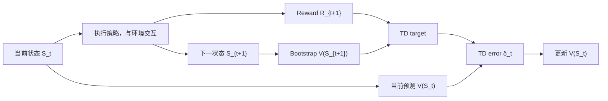

# Temporal-Difference Learning（时序差分学习）

> 主卡。Bellman Equation 给出 value 应满足的一步关系；本卡解释在不知道环境模型、也不等待完整 episode 时，如何用 transition samples 逐步逼近这个关系。

## L0：一分钟理解

### 一句话定义

Temporal-Difference Learning（TD Learning）使用“当前预测”和“一步之后预测”之间的差异来学习 Value：观察一步 reward 后，立即用带 bootstrap 的目标修正当前估计。

### 它解决什么问题

- Dynamic Programming 能做 Bellman backup，但要求知道完整环境模型；
- Monte Carlo 不需要模型，却必须等到 episode 结束才能得到完整 Return；
- TD 同时采用真实 transition sample 和下一状态 value estimate，因此可以 model-free、online、incremental 地学习。

它的代价是：bootstrap target 本身不准确，会引入偏差和移动目标；与非线性函数逼近、off-policy 数据结合时还可能不稳定。

### 在 VLA/WAM 中有什么用

- 在线更新机器人 critic，不必等一次长任务完全结束；
- 为 actor-critic、PPO、SAC 等方法构造 value 或 Q target；
- 在 world model 的短 imagined rollout 末端 bootstrap 长期价值；
- 从稀疏成功 reward 向更早的状态逐步传播信用。

### 记住这三点

1. TD target 是 $R_{t+1}+\gamma V(S_{t+1})$，TD error 是 target 减当前预测。
2. TD “采样”环境转移，同时“bootstrap”自己的下一步估计。
3. TD(0) 是预测算法；Sarsa、Expected Sarsa 和 Q-learning 是把 TD 思想用于动作价值控制的不同方式。

## L1：直觉与结构

### 1. 背景：Bellman Equation 已经解决了什么

Bellman Equation 告诉我们，固定策略的真实 value 满足：

```math
v_\pi(s)=\mathbb{E}_\pi[R_{t+1}+\gamma v_\pi(S_{t+1})\mid S_t=s].
```

如果环境模型 $p(s',r\mid s,a)$ 已知，可以枚举下一状态求期望。但现实机器人通常只有交互数据，不知道所有接触结果、传感噪声和动力学分支的精确概率。

### 2. 剩余矛盾与设计目标

Monte Carlo 可以绕开模型：实际运行到 episode 末尾，用完整 $G_t$ 监督 value。可是长 horizon 机器人任务可能持续很久，甚至没有自然 episode；等待结束会延迟更新，Return 方差也会累积。

设计目标因此是：**不需要模型、不等待 episode 结束，只用刚发生的一步 transition 更新当前预测。**

### 3. 设计因果链

#### 完整期望不可得 → 用 transition sample

观察 $(S_t,R_{t+1},S_{t+1})$，用一次真实采样近似 Bellman 条件期望。这样不需要转移模型，但单样本 target 有噪声。

#### 完整 Return 尚未发生 → bootstrap

用当前估计 $V(S_{t+1})$ 代替尚未观测的剩余 Return。这样能立即更新，但 target 会继承 value estimate 的偏差。

#### 预测需要朝 target 移动 → TD error

计算 target 与当前预测之差 $\delta_t$，再以步长 $\alpha$ 修正 $V(S_t)$。步长太大会震荡，太小则传播缓慢。

#### 一步传播太局部 → multi-step 与 eligibility traces

$n$-step TD 使用更多真实 rewards 后再 bootstrap，TD($\lambda$) 混合多个 horizon。它们在 bias、variance、延迟和计算开销间提供连续权衡。

### 4. 单步训练数据流



文字等价说明：当前状态产生预测，与环境交互得到一步 reward 和下一状态，再用下一状态预测构造 TD target，以 target 与当前预测的差更新 value。

### 5. 训练与部署责任

| 阶段 | 使用的信息 | 发生的工作 |
|---|---|---|
| 数据采集 | 当前状态、动作、reward、下一状态、终止类型 | 形成 transition |
| critic 训练 | transition 与 bootstrap 网络 | 构造 TD target，更新 value/Q |
| actor 训练 | TD error、Advantage 或 Q | 改变动作策略 |
| 部署 | observation/history 与 actor；可选 critic | 产生动作，通常不再计算训练 loss |

TD 是训练 critic 的机制，不应把包含 TD loss 的训练管线误称为部署时必需步骤。

### 6. 输入、输出与张量形状

| 对象 | 常见形状 | 说明 |
|---|---|---|
| `states` | `[B, D_s]` | 当前状态或 history embedding |
| `rewards` | `[B]` | 执行动作后获得的 $R_{t+1}$ |
| `next_states` | `[B, D_s]` | 下一状态 |
| `terminated` | `[B]` | 任务语义上的终止标记 |
| `values`, `targets`, `td_error` | `[B]` | 每个 transition 一个标量 |

序列 batch 还会出现 `[B, T, ...]`，此时需用 valid mask 排除 padding，并明确对 batch 与 time 维的 reduction。

### 7. 与相近方法的区别

| 方法 | 需要环境模型 | 等 episode 结束 | Bootstrap | 典型特点 |
|---|---:|---:|---:|---|
| Dynamic Programming | 是 | 否 | 是 | 枚举模型期望 |
| Monte Carlo | 否 | 是 | 否 | target 无 bootstrap 偏差、方差高 |
| TD(0) | 否 | 否 | 是 | 一步、在线、target 有偏 |
| $n$-step TD | 否 | 等 $n$ 步 | 是 | 介于 TD(0) 与 MC 之间 |

## L2：数学与实现

### 1. 符号表

| 符号 | 含义 |
|---|---|
| $V_t(s)$ | 更新时刻 $t$ 的 value estimate |
| $R_{t+1}$ | 执行动作后得到的一步 reward |
| $S_{t+1}$ | 下一状态 |
| $\gamma$ | discount factor |
| $\alpha$ | learning rate / step size |
| $Y_t^{\mathrm{TD}}$ | 一步 TD target |
| $\delta_t$ | TD error |
| $\phi$ | 参数化 value network 的参数 |

### 2. TD(0) 的三个核心公式

一步 TD target：

```math
Y_t^{\mathrm{TD}}=R_{t+1}+\gamma V_t(S_{t+1}).
```

TD error：

```math
\delta_t=Y_t^{\mathrm{TD}}-V_t(S_t)
=R_{t+1}+\gamma V_t(S_{t+1})-V_t(S_t).
```

表格 value 更新：

```math
V_{t+1}(S_t)=V_t(S_t)+\alpha\delta_t.
```

若 $S_{t+1}$ 是真正 terminal state，约定它没有后续回报：

```math
Y_t^{\mathrm{TD}}=R_{t+1}.
```

### 3. 从 Bellman Equation 到样本更新

#### 第一步：Bellman 右侧是条件期望

真实 value 满足：

```math
v_\pi(s)=\mathbb{E}_\pi[R_{t+1}+\gamma v_\pi(S_{t+1})\mid S_t=s].
```

实际不知道完整转移分布，所以不能精确求这个期望。

#### 第二步：用一个 transition 作 Monte Carlo 估计

对刚观察到的 transition，$R_{t+1}+\gamma V_t(S_{t+1})$ 是 Bellman 右侧随机变量的一次样本。这里的“Monte Carlo 估计”只指用样本估计期望，不等于 episodic Monte Carlo RL。

#### 第三步：用估计值代替未知真实 value

真实的 $v_\pi(S_{t+1})$ 也未知，TD 用当前估计 $V_t(S_{t+1})$ 替代。这一步就是 bootstrap，带来 bias，但让更新无需等待完整 Return。

#### 第四步：沿误差方向做增量更新

若把本次 target 暂时视为常数，最小化半平方误差：

```math
\mathcal{L}_t(\phi)
=\frac{1}{2}\left(Y_t^{\mathrm{TD}}-V_\phi(S_t)\right)^2.
```

其对当前预测的负梯度方向正比于 $\delta_t$。表格情形只更新访问到的 $S_t$，得到 $V\leftarrow V+\alpha\delta_t$。

#### 第五步：为什么叫 semi-gradient

Target 中的 $V(S_{t+1})$ 也可能来自同一个参数网络，但标准 TD 更新不对 target 求导，只对当前预测 $V_\phi(S_t)$ 求导。这是 semi-gradient 方法，而非完整最小化“两个都依赖 $\phi$”的平方 Bellman residual。

### 4. 最小数值例子

假设当前估计为：

```math
V(S_t)=4,
\qquad
V(S_{t+1})=6.
```

观察到 $R_{t+1}=1$，取 $\gamma=0.9$、$\alpha=0.1$。TD target 为：

```math
Y_t^{\mathrm{TD}}=1+0.9\times6=6.4.
```

TD error 为：

```math
\delta_t=6.4-4=2.4.
```

更新后：

```math
V_{t+1}(S_t)=4+0.1\times2.4=4.24.
```

若下一状态是真正 terminal，则 target 只等于 reward $1$，此时 $\delta_t=1-4=-3$、更新后 value 为 $3.7$。这说明 terminal mask 会实质改变学习目标。

### 5. 从预测到控制

TD(0) 上式评价固定策略的 $V^\pi$。控制通常学习 action value：

**Sarsa（on-policy）**使用实际策略选出的下一动作：

```math
Y_t^{\mathrm{Sarsa}}
=R_{t+1}+\gamma Q(S_{t+1},A_{t+1}).
```

**Expected Sarsa** 对目标策略的下一动作求期望：

```math
Y_t^{\mathrm{Expected\ Sarsa}}
=R_{t+1}+\gamma\sum_{a'}\pi(a'\mid S_{t+1})Q(S_{t+1},a').
```

**Q-learning（off-policy control）**使用贪心下一动作：

```math
Y_t^{\mathrm{Q}}
=R_{t+1}+\gamma\max_{a'}Q(S_{t+1},a').
```

三者共享“一步真实 reward + bootstrap”的 TD 骨架，但 target 对下一动作的处理不同，因此策略语义也不同。

### 6. $n$-step target：偏差与方差的连续权衡

在 episode 尚未终止时，$n$-step return 为：

```math
G_{t:t+n}
=R_{t+1}+\gamma R_{t+2}+\cdots
+\gamma^{n-1}R_{t+n}+\gamma^n V(S_{t+n}).
```

- $n=1$ 时就是 TD(0) target；
- $n$ 增大时使用更多真实 rewards，bootstrap bias 通常减少，但采样方差和更新延迟增加；
- 直到 episode 结束且不再 bootstrap 时，target 退化为 Monte Carlo Return。

TD($\lambda$) 使用 eligibility traces 或 $\lambda$-return 混合多个 $n$-step targets，本卡只保留导航，不展开完整推导。

### 7. 训练伪代码

```text
initialize value parameters φ
observe state S
repeat:
    choose action A from policy π
    execute A; observe reward R, next state S', terminated
    if terminated:
        target = R
    else:
        target = R + γ * stop_gradient(Vφ_target(S'))
    δ = target - Vφ(S)
    update φ to reduce mean(δ²)
    if terminated: reset environment
    else: S = S'
```

### 8. 最小 PyTorch 实现

```python
import torch
import torch.nn as nn
import torch.nn.functional as F


class ValueNetwork(nn.Module):
    def __init__(self, state_dim: int, hidden_dim: int = 128):
        super().__init__()
        self.net = nn.Sequential(
            nn.Linear(state_dim, hidden_dim),
            nn.ReLU(),
            nn.Linear(hidden_dim, 1),
        )

    def forward(self, states: torch.Tensor) -> torch.Tensor:
        # states: [B, state_dim] -> values: [B]
        return self.net(states).squeeze(-1)


def td0_value_loss(
    value_net: nn.Module,
    target_net: nn.Module,
    states: torch.Tensor,
    rewards: torch.Tensor,
    next_states: torch.Tensor,
    terminated: torch.Tensor,
    gamma: float,
) -> tuple[torch.Tensor, torch.Tensor]:
    # 当前预测 V_phi(S_t)，形状 [B]。
    values = value_net(states)

    # Target 是 Bellman 右侧的单 transition 样本。
    # no_grad 实现 semi-gradient；真正 terminal 才关闭 bootstrap。
    with torch.no_grad():
        next_values = target_net(next_states)
        bootstrap_mask = 1.0 - terminated.to(values.dtype)
        targets = rewards + gamma * bootstrap_mask * next_values

    # MSE 对 batch 求 mean；它回归 sampled TD target，
    # 并不表示单个 target 就是真实的条件期望。
    loss = F.mse_loss(values, targets, reduction="mean")
    td_errors = targets - values.detach()
    return loss, td_errors
```

### 9. 公式—代码对应

| 数学对象 | 代码 | 转换依据 | 形状与 reduction |
|---|---|---|---|
| $V_\phi(S_t)$ | `value_net(states)` | 参数化 value estimate | `[B]` |
| $V_{\bar\phi}(S_{t+1})$ | `target_net(next_states)` | 工程上用慢更新网络稳定 bootstrap | `[B]` |
| $1-d_t$ | `bootstrap_mask` | 仅真正 terminal 关闭未来价值 | `[B]` |
| $R+\gamma(1-d)V'$ | `targets` | Bellman 右侧的一次 transition sample | `[B]` |
| $\delta=Y-V$ | `targets - values.detach()` | 每条样本的 TD error | `[B]`，不聚合 |
| $\mathbb{E}[\delta^2]$ 的样本均值 | `F.mse_loss(..., reduction="mean")` | 用 mini-batch Monte Carlo estimate 训练 | 标量，跨 batch mean |

这里的 MSE 不是把 Bellman Equation “改成”均方误差。Bellman Equation 定义固定点；单个 transition 给出右侧的有噪样本；MSE 是让网络预测靠近这些样本 target 的优化 surrogate。代码没有乘公式中的 $1/2$，只会整体缩放梯度，不改变最优点。

### 10. 常见超参数与设计选择

| 选择 | 作用 | 风险 |
|---|---|---|
| $\alpha$ / optimizer LR | 决定每次修正幅度 | 太大震荡，太小传播慢 |
| $\gamma$ | 决定预测时间尺度 | 接近 1 时 target 方差与尺度增大 |
| $n$ 或 $\lambda$ | 调节 bootstrap horizon | 更长通常方差、延迟更大 |
| target update rate | 控制 target 漂移速度 | 太快不稳，太慢产生滞后 |
| replay ratio | 每条数据复用次数 | 太高可能过拟合陈旧分布 |
| loss type | MSE 或 Huber | MSE 对异常 TD error 更敏感 |

### 11. 失败模式与常见误解

#### TD target 等于真实 Value

Target 只是一个带采样噪声、且含近似 bootstrap 的监督信号；多次更新才可能逼近固定点。

#### Bootstrap 一定比 Monte Carlo 更准确

Bootstrap 降低等待和部分方差，却引入由当前估计造成的偏差。两者是 bias–variance 权衡，不存在脱离任务的绝对优劣。

#### 把 truncation 当 terminal

时间上限不代表未来回报为零。错误关闭 bootstrap 会在窗口边界产生系统性低估。

#### Reward 与 transition 错位

$R_{t+1}$ 对应执行 $A_t$ 后从 $S_t$ 到 $S_{t+1}$ 的结果。序列切片错一位会让 TD target 学习错误因果关系。

#### Target 未 stop-gradient

标准 semi-gradient TD 把 target 当常数。让梯度穿过同一网络的下一状态分支会改变算法，并可能出现预测和目标共同漂移。

#### Deadly triad

Function approximation、bootstrap、off-policy 三者同时存在时可能发散。深度 RL 常用 replay、target network、双 Q、梯度裁剪或保守目标缓解，但不自动消除问题。

#### TD error 被当成完整 Advantage

一步 TD error 在特定 on-policy 条件下可作为 Advantage 的有噪估计，但二者定义不同；off-policy、函数误差或多步设置下尤其不能无条件等同。

#### 稀疏 reward 会立刻传播到所有早期状态

TD(0) 每次只向前一状态传播一步。长 horizon 稀疏奖励可能传播很慢，需要多步 target、eligibility traces、规划或更好的 reward/representation。

## 自测

### 基础题

1. TD target、TD error 和 TD update 分别是什么？
2. TD 为什么既叫 model-free，又叫 bootstrap 方法？
3. 下一状态为真正 terminal 时，TD target 如何变化？

### 理解题

1. TD(0) 相比 Monte Carlo 的主要 bias–variance 与更新时机差异是什么？
2. 为什么标准神经网络 TD loss 通常对 target stop-gradient？
3. Sarsa 与 Q-learning 的下一动作 target 有何不同，这反映了什么策略语义？

### 迁移题

一个机器人导航 critic 使用 200 步固定窗口训练。任务经常在窗口结束时尚未到达目标，代码却统一令 `done=1`；同时 reward 只在成功时为 $+1$。分析两个学习问题，并提出至少两项修改。

<details>
<summary>参考答案</summary>

**基础题**

1. TD target 是 $Y_t=R_{t+1}+\gamma V(S_{t+1})$；TD error 是 $\delta_t=Y_t-V(S_t)$；表格 TD update 是 $V(S_t)\leftarrow V(S_t)+\alpha\delta_t$。真正 terminal 时去掉下一状态 value。
2. 它 model-free，是因为直接使用实际 transition sample，不要求知道或枚举 $p(s',r\mid s,a)$；它 bootstrap，是因为用尚未收敛的 $V(S_{t+1})$ 估计未观测的剩余 Return。
3. 真正 terminal 没有后续回报，所以 target 变为 $Y_t=R_{t+1}$，不能再加 $\gamma V(S_{t+1})$。

**理解题**

1. TD(0) 一步后即可更新，target 包含当前 value estimate，通常方差较低但有 bootstrap bias；Monte Carlo 等到 episode 结束，使用完整 Return 而无 bootstrap bias，但更新延迟长，且整个未来 reward 序列带来更高方差。
2. 标准 TD 采用 semi-gradient，把 bootstrap target 暂时视作监督常数，只让当前状态预测朝 target 移动。若梯度穿过 target，网络可以同时改变两侧，产生不同于 TD 更新的额外梯度和更强的移动目标耦合；`no_grad` 或 target network 用于切断该路径。
3. Sarsa 使用行为/目标策略实际选出的 $A_{t+1}$，target 为 $R+\gamma Q(S',A')$，是 on-policy；Q-learning 使用 $\max_{a'}Q(S',a')$，学习贪心目标策略，即使数据由探索行为策略产生也可以是 off-policy。

**迁移题**

第一，把窗口结束统一标成 `done=1` 会把 time-limit truncation 错当 terminal，强行令 bootstrap 为零，导致窗口边界附近系统性低估。应分别记录 `terminated` 和 `truncated`，只用任务语义上的 `terminated` 关闭 bootstrap，并对 padding 使用独立 mask。

第二，成功 reward 稀疏且 TD(0) 每次只向前传播一步，200 步任务中的信用传播会很慢。可使用 $n$-step return、TD($\lambda$) 或 model-based planning 加速传播；也可在不改变最优策略的前提下谨慎设计 potential-based shaping。还应确认 replay 中包含足够成功轨迹，并监控 target scale 与成功率分布。

</details>

## 学习导航

### 前置卡片

- [Markov Decision Process](MDP.md)
- [Return 与 Discount Factor](Return-and-Discount-Factor.md)
- [Value Function](Value-Function.md)
- [Bellman Equation](Bellman-Equation.md)

### 原子子卡

- TD Error（本卡覆盖）
- TD(0)（本卡覆盖）
- $n$-step Return（本卡概述）
- [Eligibility Traces 与 TD($\lambda$)](Eligibility-Traces-and-TD-Lambda.md)

### 对比卡片

- Monte Carlo vs Temporal-Difference（本卡覆盖）
- Sarsa vs Expected Sarsa vs Q-learning（待创建）
- [On-policy vs Off-policy](On-policy-vs-Off-policy.md)

### 下一张推荐卡

- [Eligibility Traces 与 TD($\lambda$)](Eligibility-Traces-and-TD-Lambda.md)：用 trace 高效实现多步信用传播。
- [On-policy vs Off-policy](On-policy-vs-Off-policy.md)：分清采样策略与学习目标，并理解异策略校正。
- Q-Learning（待创建）：将 off-policy TD target 用于动作价值控制。
- Actor-Critic（待创建）：用 TD critic 为可微策略提供低方差学习信号。

## 参考资料

1. Sutton, R. S., & Barto, A. G. *Reinforcement Learning: An Introduction*, 2nd ed., Chapter 6. [作者提供的第二版草稿](https://www.incompleteideas.net/book/bookdraft2018mar21.pdf)
2. Sutton, R. S. (1988). Learning to Predict by the Methods of Temporal Differences. *Machine Learning*, 3, 9–44. [论文信息与作者 PDF 链接](https://www.cs.utexas.edu/~shivaram/readings/b2hd-Sutton1988.html)
3. Sutton, R. S., & Barto, A. G. *Reinforcement Learning: An Introduction*. [MIT Press](https://mitpress.mit.edu/9780262039246/reinforcement-learning/)

## L3：论文与源码深入（待补充）

- 推导 tabular on-policy TD(0) 的收敛条件；
- 展开 forward-view $\lambda$-return 与 backward-view eligibility trace 的对应；
- 区分 semi-gradient TD、residual gradient、MSBE 与 MSPBE；
- 分析 off-policy TD、importance sampling 与 gradient-TD 方法；
- 映射 PPO、SAC、DQN 实现中的多步 target、target network 与 replay 细节。
