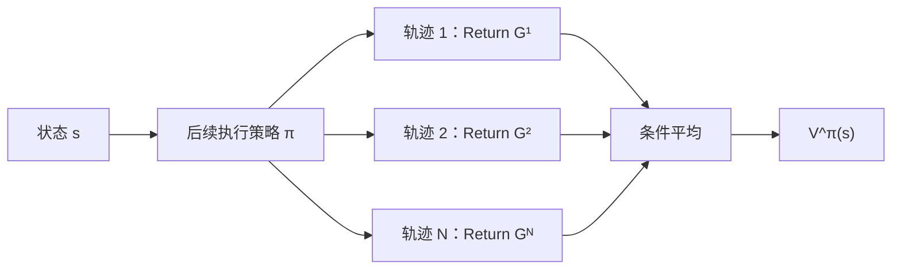

# Value Function（价值函数）

> 目标：理解价值函数为什么是“未来 Return 的条件期望”，分清 $V^\pi$、$Q^\pi$、$A^\pi$，并能把公式对应到 critic 的回归代码。

## L0：一分钟理解

### 一句话定义

价值函数把大量可能的未来轨迹压缩成一个数：**从当前状态（或状态—动作）出发，继续执行策略 $\pi$ 时，预期能获得多少折扣回报。**

### 它解决什么问题

Return $G_t$ 只描述一条实际采样轨迹，受环境随机性和后续动作影响；同一状态多走几次，Return 可能不同。价值函数对这些可能未来取条件期望，因此能稳定地比较状态或动作。

### 在具身智能中有什么用

- 判断机器人当前是否接近成功，而不只看眼前 reward；
- 为动作、轨迹候选或高层子目标打分；
- 在 actor-critic 中作为 critic，向策略提供低方差学习信号；
- 在世界模型中评价 imagined rollout 的长期结果。

### 记住这三点

1. $G_t$ 是轨迹上的随机变量，$V^\pi(s)$ 和 $Q^\pi(s,a)$ 是它的条件期望。
2. $V^\pi$ 评价“处在状态里”，$Q^\pi$ 评价“在状态里先做某动作”。
3. 价值依赖 reward、折扣因子、动力学和策略；换策略后，旧价值通常也会改变。

## L1：直觉与结构

### 1. 背景：Return 还缺少什么

假设机器人在同一个抓取前状态尝试十次。即使执行同一策略，也可能因摩擦、视觉噪声或动作采样得到十个不同 Return。仅记住某一次 Return，会把偶然性误当成状态本身的质量。

Value Function 的设计目标是：给定当前已知信息，对所有尚未发生的随机分支做平均。

### 2. 从轨迹样本到价值估计



真实期望通常不能枚举求出，所以实际算法使用 Monte Carlo 样本、时序差分目标，或模型预测来逼近它。

### 3. 三个常用量分别回答什么

| 量 | 条件 | 回答的问题 |
|---|---|---|
| $V^\pi(s)$ | 已知状态 | 继续按 $\pi$ 行动，这个状态有多好？ |
| $Q^\pi(s,a)$ | 已知状态和首个动作 | 先做 $a$，之后按 $\pi$ 行动，有多好？ |
| $A^\pi(s,a)$ | $Q$ 相对 $V$ | 动作 $a$ 比策略在该状态下的平均表现好多少？ |

### 4. 为什么需要 Q 而不只需要 V

$V^\pi(s)$ 把策略会选的动作也平均掉了，因此只知道 $V$ 不能直接判断哪个动作更好。$Q^\pi(s,a)$ 保留第一个动作作为条件，可以用于动作选择：

```math
a=\arg\max_a Q(s,a).
```

连续控制中无法枚举所有动作，常用 actor 直接产生动作，再由 $Q$ critic 评价。

### 5. 为什么还需要 Advantage

策略更新关心的通常不是绝对价值，而是某动作是否优于当前策略的平均动作。减去状态基线得到 Advantage，既保留相对偏好，又能降低策略梯度的方差。

### 6. 输入、输出与张量形状

| 模块 | 输入 | 输出 | 常见形状 |
|---|---|---|---|
| V critic | 状态或观测表示 | 标量价值 | `[B, D] -> [B]` |
| 离散 Q critic | 状态表示 | 每个动作的 Q | `[B, D] -> [B, A]` |
| 连续 Q critic | 状态与动作 | 标量 Q | `[B, D_s]`, `[B, D_a] -> [B]` |

在部分可观测任务中，输入往往不是严格的 MDP state，而是历史、RNN belief 或视觉—语言上下文；此时模型学习的是相对于该信息表示的预测价值。

### 7. 与相近概念的区别

| 概念 | 是否随机样本 | 是否依赖策略 | 主要角色 |
|---|---:|---:|---|
| Reward $R_{t+1}$ | 是 | 间接 | 单步反馈 |
| Return $G_t$ | 是 | 是 | 一条轨迹的累计结果 |
| Value $V^\pi,Q^\pi$ | 否，是真实分布下的期望 | 是 | 预测长期结果 |
| Value estimate $V_\phi,Q_\phi$ | 学得的近似 | 取决于训练目标 | 逼近真实 value |

## L2：数学与实现

### 1. 符号表

| 符号 | 含义 |
|---|---|
| $G_t$ | 从时刻 $t$ 开始的折扣 Return |
| $\pi(a\mid s)$ | 在状态 $s$ 选择动作 $a$ 的概率 |
| $v_\pi(s)$ | 策略 $\pi$ 的状态价值 |
| $q_\pi(s,a)$ | 策略 $\pi$ 的动作价值 |
| $A_\pi(s,a)$ | 策略 $\pi$ 的 Advantage |
| $\phi$ | 价值网络参数 |

### 2. 核心定义

状态价值为：

```math
v_\pi(s)
=\mathbb{E}_\pi\left[G_t\mid S_t=s\right].
```

动作价值为：

```math
q_\pi(s,a)
=\mathbb{E}_\pi\left[G_t\mid S_t=s,A_t=a\right].
```

Advantage 为：

```math
A_\pi(s,a)=q_\pi(s,a)-v_\pi(s).
```

最优价值定义为所有策略中可达到的最佳长期回报：

```math
v_*(s)=\max_\pi v_\pi(s),
\qquad
q_*(s,a)=\max_\pi q_\pi(s,a).
```

### 3. 公式逐步解释

#### 第一步：条件期望在平均哪些随机性

固定 $S_t=s$ 后，未来动作可能由随机策略采样，下一状态和奖励也可能由随机环境产生。$v_\pi(s)$ 同时对这些未来随机性取平均。它不是当前已获得的 reward，也不是某次 rollout 的 Return。

#### 第二步：V 与 Q 如何关联

在状态 $s$ 下，策略首先按 $\pi(a\mid s)$ 选择动作。对这个首动作再使用全期望公式：

```math
v_\pi(s)
=\sum_a \pi(a\mid s)q_\pi(s,a).
```

所以 $V$ 是该策略动作分布下的 Q 加权平均，而不是所有动作 Q 的简单平均。

#### 第三步：Advantage 为什么以 V 为基线

将上式代入 Advantage，可得：

```math
\sum_a\pi(a\mid s)A_\pi(s,a)=0.
```

因此 Advantage 的正负具有清晰含义：正值动作优于策略平均水平，负值动作劣于平均水平。

#### 第四步：为什么平方损失能学习条件期望

令网络输出 $f_\phi(s)$，训练目标是一条轨迹产生的 Return 样本 $G$。对固定状态考虑总体平方误差：

```math
\mathcal{L}(f)=\mathbb{E}\left[(f(S)-G)^2\right].
```

对固定 $S=s$ 的预测值求导并令其为零：

```math
\frac{\partial}{\partial f(s)}
\mathbb{E}\left[(f(s)-G)^2\mid S=s\right]
=2\left(f(s)-\mathbb{E}[G\mid S=s]\right)=0.
```

于是最优预测满足：

```math
f^*(s)=\mathbb{E}[G\mid S=s]=v_\pi(s).
```

这就是代码使用 MSE 回归 Return 样本的原因：MSE 不是价值函数的定义，而是以采样数据逼近条件期望的一种训练方法。

### 4. 最小数值例子

在状态 $s$，策略以 $0.75$ 概率抓取、以 $0.25$ 概率等待。已知：

```math
q_\pi(s,\text{grasp})=8,
\qquad
q_\pi(s,\text{wait})=4.
```

则：

```math
v_\pi(s)=0.75\times 8+0.25\times 4=7.
```

两个动作的 Advantage 为：

```math
A_\pi(s,\text{grasp})=8-7=1,
```

```math
A_\pi(s,\text{wait})=4-7=-3.
```

按策略加权后：

```math
0.75\times 1+0.25\times(-3)=0,
```

与 Advantage 的零均值性质一致。

### 5. 训练与部署

#### 训练

1. 用当前策略或数据集收集状态、动作、奖励与终止标记；
2. 构造 Monte Carlo Return 或带 bootstrap 的 TD target；
3. 用监督回归更新 critic；
4. actor-critic 中再用 critic 构造 Advantage 或策略目标。

#### 部署

- critic 可用于在线动作选择、候选轨迹排序或安全阈值判断；
- 纯 actor 部署时，critic 可能只在训练阶段存在；
- 世界模型规划时，critic 常估计有限 imagined horizon 之后的尾部价值。

### 6. 伪代码

```text
for each batch of trajectories:
    targets = discounted_returns(rewards)
    predictions = value_network(states)
    loss = mean((predictions - stop_gradient(targets)) ** 2)
    update(value_network, loss)
```

### 7. 最小 PyTorch 实现

```python
import torch
import torch.nn as nn
import torch.nn.functional as F


class ValueNetwork(nn.Module):
    def __init__(self, state_dim: int, hidden_dim: int = 128):
        super().__init__()
        self.net = nn.Sequential(
            nn.Linear(state_dim, hidden_dim),
            nn.ReLU(),
            nn.Linear(hidden_dim, 1),
        )

    def forward(self, states: torch.Tensor) -> torch.Tensor:
        # states: [B, state_dim] -> values: [B]
        return self.net(states).squeeze(-1)


def value_regression_loss(
    predicted_values: torch.Tensor,
    return_targets: torch.Tensor,
    valid_mask: torch.Tensor | None = None,
) -> torch.Tensor:
    # target 是采样 Return；回归大量样本后逼近 E[G | S=s]。
    per_item_loss = F.mse_loss(
        predicted_values,
        return_targets.detach(),
        reduction="none",
    )
    if valid_mask is None:
        return per_item_loss.mean()

    valid_mask = valid_mask.to(per_item_loss.dtype)
    return (per_item_loss * valid_mask).sum() / valid_mask.sum().clamp_min(1.0)
```

### 8. 公式—代码对应

| 数学对象 | 代码对象 | 说明 |
|---|---|---|
| $s$ | `states` | critic 的条件输入 |
| $v_\phi(s)$ | `predicted_values` | 网络对条件期望的近似 |
| $G_t$ 或 TD target | `return_targets` | 随机监督目标，不等于真实 value |
| $(v_\phi-G)^2$ | `F.mse_loss(...)` | 通过回归逼近条件均值 |
| 不对目标反传 | `.detach()` | 防止 critic 通过改写目标降低损失 |
| 有效时刻 | `valid_mask` | 排除 padding 或无效 token |

这里最容易混淆的是：公式将 value **定义**为 $\mathbb{E}[G\mid S=s]$，代码却无法直接拿到真实期望，只能看到有限的 $G$ 样本。平方损失的总体最优解恰好是条件均值，所以两者并不矛盾。

### 9. 常见设计选择

| 选择 | 常见影响 |
|---|---|
| Monte Carlo target | 无 bootstrap 偏差，但方差大、等待整条轨迹 |
| TD target | 方差较低，可在线学习，但依赖当前估计 |
| V critic | 输入简单，适合 baseline |
| Q critic | 可比较动作，连续动作下更难优化 |
| 双 Q 网络 | 减轻最大化导致的高估 |
| 归一化 Return | 改善数值尺度，但部署时需一致还原 |

### 10. 失败模式与常见误解

#### 把一次 Return 当作真实 Value

Return 是有噪声的监督样本；只有在分布上平均才对应 value。

#### 忽略策略依赖

同一状态在保守策略和熟练策略下的 $v_\pi(s)$ 可以完全不同。

#### 将 observation 直接称作 Markov state

单帧相机图像可能缺少速度或被遮挡信息。此时需堆叠历史或学习 belief，否则 value 会面对感知混叠。

#### 在数据分布外相信 Q

离线 RL 中，未被数据覆盖的动作可能得到虚高 Q。需要保守估计、行为约束或不确定性处理。

#### 目标未停止梯度

当 target 自身来自另一个 value 估计时，通常需 stop-gradient 或 target network；否则目标和预测会一起漂移。

#### Reward scale 或 gamma 变化后复用旧 critic

价值的数值尺度由 reward 和 gamma 共同决定。定义变化后，旧 critic 不再对应同一个学习问题。

## 自测

### 基础题

1. $G_t$ 与 $v_\pi(s)$ 的区别是什么？
2. 为什么 $Q$ 比 $V$ 多条件化一个动作？
3. $A_\pi(s,a)>0$ 表示什么？

### 理解题

1. 为什么 MSE 回归单条 Return 样本能学习 value？
2. 为什么 $\sum_a\pi(a\mid s)A_\pi(s,a)=0$？
3. 策略改变后，为什么 value target 也随之改变？

### 迁移题

在机器人抓取任务中，critic 输入只有单帧 RGB，两个视觉相同的状态却分别对应“机械臂正在靠近”和“正在远离”。分析 value 学习会遇到什么问题，并给出一种输入表示上的改进。

<details>
<summary>参考答案</summary>

**基础题**

1. $G_t$ 是某一条实际轨迹从时刻 $t$ 开始得到的折扣回报样本，会随未来动作和环境随机性变化；$v_\pi(s)=\mathbb{E}_\pi[G_t\mid S_t=s]$ 是固定策略下对所有这些可能未来取条件期望。
2. $V$ 只条件化状态，并把策略在该状态选择的首动作也平均掉；$Q$ 额外固定首动作 $A_t=a$，所以可以比较“在同一状态先做不同动作”的长期结果。首动作之后仍按策略 $\pi$ 行动。
3. $A_\pi(s,a)>0$ 表示该动作的 $Q$ 高于策略在状态 $s$ 的平均价值，因此它优于当前策略的平均动作；这不保证即时 reward 为正，也不保证最终一定成功。

**理解题**

1. 对固定状态 $s$，总体平方误差 $\mathbb{E}[(f(s)-G)^2\mid S=s]$ 的最小值在 $f(s)=\mathbb{E}[G\mid S=s]$ 处取得。因此单个 Return 只是有噪声的监督样本，而对大量样本最小化 MSE 会逼近条件均值，即 value。
2. 由 $A_\pi(s,a)=q_\pi(s,a)-v_\pi(s)$ 和 $v_\pi(s)=\sum_a\pi(a\mid s)q_\pi(s,a)$，可得 $\sum_a\pi(a\mid s)A_\pi(s,a)=v_\pi(s)-v_\pi(s)=0$。
3. Value 对未来动作分布取期望。策略改变会改变后续动作的概率，进而改变未来状态、reward 和 Return 的分布，所以即便环境与状态不变，$v_\pi$ 和 $q_\pi$ 的目标也通常随策略变化。

**迁移题**

单帧观测无法区分速度方向，发生 perceptual aliasing：相同输入对应不同 Return 分布，critic 只能学到混合平均值。可加入历史帧、本体速度，或使用 RNN/状态空间模型形成 belief state。

</details>

## 学习导航

### 前置卡片

- [Markov Decision Process](MDP.md)
- [Return 与 Discount Factor](Return-and-Discount-Factor.md)

### 原子子卡

- Conditional Expectation（待创建）
- State-Value Function（本卡覆盖）
- Action-Value Function（本卡覆盖）
- Advantage Function（本卡覆盖）

### 对比卡片

- Reward vs Return（见 Return 卡）
- [Monte Carlo vs Temporal-Difference](Temporal-Difference-Learning.md#7-与相近方法的区别)（见 TD 卡）
- On-policy vs Off-policy（待创建）

### 下一张推荐卡

- [Bellman Equation](Bellman-Equation.md)：理解价值为什么能分解为“一步奖励 + 下一状态价值”。

## 参考资料

1. Sutton, R. S., & Barto, A. G. *Reinforcement Learning: An Introduction*, 2nd ed., Chapter 3. [作者官网](http://incompleteideas.net/book/the-book-2nd.html)
2. Sutton, R. S., & Barto, A. G. *Reinforcement Learning: An Introduction*. [MIT Press](https://mitpress.mit.edu/9780262352703/reinforcement-learning/)

## L3：论文与源码深入（待补充）

- 从条件期望与正交投影视角理解 value regression；
- 分析 function approximation 下的 projected Bellman equation；
- 对比 distributional value、expectile value 与普通期望价值；
- 阅读 actor-critic 实现中的 target network、双 Q 与 value normalization。
