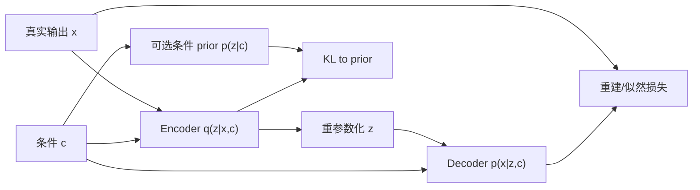
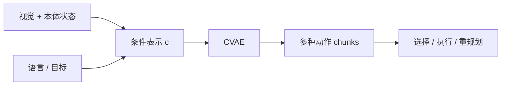

# Conditional Variational Autoencoder（CVAE，条件变分自编码器）

> 主卡。建议先学习 [VAE](./VAE.md) 与 [ELBO](./ELBO.md)；本卡关注条件 $c$ 如何改变生成分布，而不重复普通 VAE 的全部基础。

## L0：一分钟理解

### 一句话定义

CVAE 是“带条件的 VAE”：它不只学习生成 $x$，而是学习在给定条件 $c$ 时生成 $x$ 的分布 $p(x\mid c)$，并用潜变量 $z$ 表示同一条件下仍存在的多种可能。

### 它解决什么问题

普通 VAE 可以生成不同样本，但无法保证样本满足指定要求。例如机器人看到同一桌面状态时，可能从左侧或右侧绕过障碍；我们既想固定“当前状态与目标”，又想保留“多条动作轨迹都合理”的多模态性。

CVAE 将已知信息作为条件 $c$，让 decoder 同时读取 $c$ 和随机 latent $z$：$c$ 决定要解决什么问题，$z$ 表示在该条件下采用哪一种合理模式。

### 在 VLA/WAM 中有什么用

- 根据当前观测、语言目标或任务 ID 生成多种动作序列；
- 根据历史状态与候选机器人动作预测多种人类未来轨迹；
- 把示范动作压缩为 style/strategy latent，供条件策略解码；
- 作为理解 ACT 一类 latent action modeling 的概率基础。

经典 CVAE 本身不是完整 VLA：视觉/语言编码、时序架构、闭环执行和安全约束仍需额外模块。

### 记住这三点

1. $c$ 是部署时已知的控制信息，$z$ 是同一条件下仍需采样的不确定因素。
2. 训练时 encoder 可看到真实 $x$，部署生成时不能看到 $x$，只能从 prior 取得 $z$。
3. 条件可以进入 encoder 和 decoder；prior 可以固定，也可以设计为条件先验 $p_\psi(z\mid c)$。

## L1：直觉与结构

### 1. 背景：VAE 已经解决了什么

VAE 用随机 latent 建模数据分布：

```math
z\sim p(z),\qquad x\sim p_\theta(x\mid z)
```

训练时用近似后验 $q_\phi(z\mid x)$ 推断能解释样本 $x$ 的 latent，并通过 ELBO 兼顾重建和 prior 约束。它已经回答“怎样学习一个可采样的潜变量生成模型”。

### 2. 剩余矛盾与设计目标

很多具身任务不是无条件生成。我们已知当前观测、目标或语言指令 $c$，希望生成与它匹配的动作或未来 $x$。如果把不同条件的数据混进普通 VAE：

- decoder 必须让 $z$ 同时记住任务条件与模式差异；
- 从 prior 采样时难以指定想要哪个目标；
- 确定性回归在多模态数据上容易输出模式之间的平均值。

设计目标是：**显式控制已知条件，同时保留条件分布 $p(x\mid c)$ 内部的多样性。**

### 3. 设计因果链

#### 将条件交给生成模型

当前问题是无条件 decoder 不知道当前任务。于是让 likelihood 变为 $p_\theta(x\mid z,c)$。这使生成受 $c$ 控制，但如果 decoder 很强，它可能完全依赖 $c$，忽略 $z$，形成 posterior collapse。

#### 将真实输出交给训练期 encoder

训练时需要知道“这条示范属于哪一种模式”，所以 approximate posterior 使用 $q_\phi(z\mid x,c)$。它根据真实输出和条件推断 latent；但部署时真实未来 $x$ 不存在，因此不能继续使用这个 posterior。

#### 用 prior 接通训练和生成

生成时从 prior 采样 $z$。最简 CVAE 使用与条件无关的 $p(z)=\mathcal N(0,I)$；更灵活的模型学习 $p_\psi(z\mid c)$。KL 项让训练期 posterior 接近部署期可用的 prior。条件先验表达力更强，却增加网络、优化和过拟合风险。

#### 用随机 latent 避免平均动作

同一个 $c$ 下反复采样不同 $z$，decoder 可生成不同模式。它解决单点回归的平均化问题，但“不同 $z$ 是否真的对应有意义的策略”取决于数据多样性、KL 权重和 decoder 是否使用 latent。

### 4. 完整训练与部署数据流



文字等价描述：训练时 posterior 看见真实 $x$ 和条件 $c$ 后采样 $z$，decoder 重建 $x$，KL 将 posterior 对齐到生成时可用的 prior。


文字等价描述：部署时没有真实目标 $x$，只能依据条件从 prior 采样 $z$，再由 decoder 生成一个或多个候选。

### 5. 输入、输出与张量形状

以动作 chunk 为例：

- 条件特征 $c\in\mathbb R^{B\times C}$：当前视觉、机器人状态和语言目标的融合表示；
- 真实动作序列 $x\in\mathbb R^{B\times T\times A}$；
- posterior 参数 $\mu_q,\log\sigma_q^2\in\mathbb R^{B\times Z}$；
- latent $z\in\mathbb R^{B\times Z}$；
- decoder 输出 $\hat x\in\mathbb R^{B\times T\times A}$。

最小 MLP 示例会把动作 chunk 展平为 $[B,T A]$。真实系统常使用 Transformer 或时序 decoder 保留时间结构。

### 6. 在具身智能系统中的位置



文字等价描述：观测和目标形成条件，CVAE 采样多个动作 chunk，系统还需选择、执行并在新观测到来时闭环重规划。

### 7. 与相近方法的区别

| 方法 | 是否有条件 $c$ | 是否有随机 latent | 典型输出特征 |
|---|---:|---:|---|
| 条件回归 | 是 | 否 | 常给单个均值，易平均多种模式 |
| VAE | 否 | 是 | 无法直接指定条件 |
| CVAE | 是 | 是 | 条件内多模态生成 |
| Conditional GAN | 是 | 是 | 隐式分布、无显式 ELBO |
| Conditional Diffusion | 是 | 是 | 多步去噪，表达力强但采样通常更慢 |

CVAE 的核心是条件概率建模，不是“把类别 one-hot 拼到输入”这一种特定实现。条件也可以通过 cross-attention、FiLM 或条件归一化注入。

## L2：数学与实现

### 1. 符号表

| 符号 | 含义 |
|---|---|
| $x$ | 要生成的输出，如动作 chunk 或未来轨迹 |
| $c$ | 已知条件，如当前观测、目标或语言指令 |
| $z$ | 表示条件内剩余变化的 latent |
| $p_\theta(x\mid z,c)$ | 条件 decoder / likelihood |
| $q_\phi(z\mid x,c)$ | 训练时 approximate posterior |
| $p_\psi(z\mid c)$ | 可学习条件 prior；简化时可用 $p(z)$ |
| $\mu_q,\sigma_q$ | posterior 高斯参数 |
| $\mu_p,\sigma_p$ | conditional prior 高斯参数 |

### 2. 核心公式

条件生成模型把 latent 积分掉：

```math
p_{\theta,\psi}(x\mid c)
=\int p_\theta(x\mid z,c)p_\psi(z\mid c)\,dz
```

因为该积分通常难以直接计算，引入 $q_\phi(z\mid x,c)$，得到 conditional ELBO：

```math
\log p_{\theta,\psi}(x\mid c)
\ge
\mathbb E_{z\sim q_\phi(z\mid x,c)}
[\log p_\theta(x\mid z,c)]
-D_{\mathrm{KL}}\!\left(
q_\phi(z\mid x,c)\,\|\,p_\psi(z\mid c)
\right)
```

代码通常最小化负 ELBO：

```math
\mathcal L_{\mathrm{CVAE}}
=\underbrace{
-\mathbb E_{z\sim q_\phi(z\mid x,c)}
[\log p_\theta(x\mid z,c)]
}_{\mathcal L_{\mathrm{NLL}}}
+\beta\underbrace{
D_{\mathrm{KL}}(q_\phi(z\mid x,c)\|p_\psi(z\mid c))
}_{\mathcal L_{\mathrm{KL}}}
```

### 3. 公式的逐步解释或推导

#### 第一步：从条件似然插入 approximate posterior

对固定的一对 $(x,c)$：

```math
\begin{aligned}
\log p(x\mid c)
&=\log\int p(x,z\mid c)\,dz\\
&=\log\int q_\phi(z\mid x,c)
\frac{p_\theta(x\mid z,c)p_\psi(z\mid c)}{q_\phi(z\mid x,c)}\,dz
\end{aligned}
```

第二行只是乘除同一个 $q_\phi$，前提是它覆盖相关 latent 区域。

#### 第二步：使用 Jensen 不等式

因为对数是凹函数，$\log\mathbb E[u]\ge\mathbb E[\log u]$：

```math
\log p(x\mid c)
\ge
\mathbb E_{q_\phi(z\mid x,c)}
\left[
\log p_\theta(x\mid z,c)
+\log p_\psi(z\mid c)
-\log q_\phi(z\mid x,c)
\right]
```

将后两项识别为负 KL，就得到 conditional ELBO。与普通 ELBO 相比，逻辑没有改变，只是每个相关分布都应明确条件 $c$。

#### 第三步：重参数化如何估计期望

若 posterior 是对角高斯：

```math
q_\phi(z\mid x,c)
=\mathcal N\!\left(z;\mu_q(x,c),\operatorname{diag}(\sigma_q^2(x,c))\right)
```

使用：

```math
\epsilon\sim\mathcal N(0,I),\qquad
z=\mu_q+\sigma_q\odot\epsilon,qquad
\sigma_q=\exp\!\left(\tfrac12\log\sigma_q^2\right)
```

代码通常每个样本取一个 $\epsilon$，因此 NLL 是单样本 Monte Carlo 估计，而不是解析期望。

#### 第四步：为什么动作 MSE 可以对应 Gaussian NLL

假设 decoder 定义各动作维度独立、方差固定为 $\sigma_x^2$ 的 Gaussian：

```math
p_\theta(x\mid z,c)
=\mathcal N\!\left(x;\hat x_\theta(z,c),\sigma_x^2 I\right)
```

则：

```math
-\log p_\theta(x\mid z,c)
=\frac{1}{2\sigma_x^2}\|x-\hat x\|_2^2+\mathrm{const}
```

所以 MSE 不是突然替换了 $\log p_\theta(x\mid z,c)$：它来自固定方差 Gaussian likelihood。若代码用元素均值 MSE，则相对逐样本平方和还差一个维度缩放；这会改变与 KL 的相对权重，需要由 $\beta$ 或显式系数配平。

#### 第五步：条件高斯之间的 KL

若 posterior 与 conditional prior 都是对角高斯，则单个样本的 KL 为：

```math
D_{\mathrm{KL}}(q\|p)
=\frac12\sum_{j=1}^{Z}
\left[
\log\frac{\sigma_{p,j}^2}{\sigma_{q,j}^2}
+\frac{\sigma_{q,j}^2+(\mu_{q,j}-\mu_{p,j})^2}{\sigma_{p,j}^2}
-1
\right]
```

当 $\mu_p=0$、$\sigma_p=1$ 时，它退化为普通 VAE 常见公式。KL 方向必须是 posterior 到 prior，因为训练期分布要被部署期可采样的 prior 覆盖。

### 4. 最小数值例子

给定条件 $c$，设一维 posterior 为 $q=\mathcal N(1,0.5^2)$，conditional prior 为 $p=\mathcal N(0,1)$。KL 为：

```math
\begin{aligned}
D_{\mathrm{KL}}(q\|p)
&=\frac12\left[
\log\frac{1}{0.25}+0.25+(1-0)^2-1
\right]\\
&=\frac12(1.3863+0.25)\\
&\approx0.8182
\end{aligned}
```

若动作目标为 $x=[1,2]$，decoder 输出 $\hat x=[0,2.5]$，元素均值 MSE 为：

```math
\operatorname{MSE}=\frac{(1-0)^2+(2-2.5)^2}{2}=0.625
```

取 $\beta=0.1$，该样本的示例损失约为 $0.625+0.1\times0.8182=0.7068$。这里 MSE 是固定方差 Gaussian NLL 的比例形式，数值尺度取决于 reduction。

### 5. 训练与推理

#### 训练

1. encoder 读取真实输出 $x$ 与条件 $c$，输出 posterior 参数；
2. 重参数化采样 $z$；
3. decoder 读取 $z,c$，预测 $x$；
4. 用 likelihood 对应的 reconstruction/NLL 与 KL 更新网络；
5. 若有 conditional prior network，它只读取 $c$。

#### 条件生成

1. 给定部署条件 $c$；
2. 从 $p_\psi(z\mid c)$ 或固定 $p(z)$ 采样；
3. decoder 生成 $x$；
4. 重复采样可得到多个候选。

部署时把未知的真实未来 $x$ 塞进 encoder 会造成信息泄漏。若系统只输出 posterior mean 对应的单个结果，也会牺牲 CVAE 的多样性。

### 6. 伪代码

```text
for (x, c) in demonstrations:
    mu_q, logvar_q = encoder(x, c)
    mu_p, logvar_p = prior(c)       # or zeros for N(0, I)
    eps = sample_standard_normal()
    z = mu_q + exp(0.5 * logvar_q) * eps
    x_hat = decoder(z, c)
    recon = gaussian_nll_or_scaled_mse(x_hat, x)
    kl = diagonal_gaussian_kl(q, p)
    loss = mean_over_batch(recon + beta * kl)
    update encoder, decoder, and optional prior

generation(c):
    sample z from prior(c)
    return decoder(z, c)
```

### 7. 最小 PyTorch 实现

```python
import torch
import torch.nn as nn
import torch.nn.functional as F


class CVAE(nn.Module):
    def __init__(self, x_dim: int, c_dim: int, z_dim: int, hidden: int = 128):
        super().__init__()
        self.z_dim = z_dim
        self.encoder = nn.Sequential(
            nn.Linear(x_dim + c_dim, hidden),
            nn.ReLU(),
            nn.Linear(hidden, 2 * z_dim),
        )
        # A learned conditional prior. Replace with zeros for N(0, I).
        self.prior_net = nn.Sequential(
            nn.Linear(c_dim, hidden),
            nn.ReLU(),
            nn.Linear(hidden, 2 * z_dim),
        )
        self.decoder = nn.Sequential(
            nn.Linear(z_dim + c_dim, hidden),
            nn.ReLU(),
            nn.Linear(hidden, x_dim),
        )

    @staticmethod
    def split_stats(stats: torch.Tensor):
        return stats.chunk(2, dim=-1)  # each [B, Z]

    @staticmethod
    def reparameterize(mu: torch.Tensor, logvar: torch.Tensor):
        std = torch.exp(0.5 * logvar)
        eps = torch.randn_like(std)
        return mu + std * eps

    def forward(self, x: torch.Tensor, c: torch.Tensor):
        # x: [B, X], c: [B, C]
        mu_q, logvar_q = self.split_stats(
            self.encoder(torch.cat([x, c], dim=-1))
        )
        mu_p, logvar_p = self.split_stats(self.prior_net(c))
        z = self.reparameterize(mu_q, logvar_q)
        x_hat = self.decoder(torch.cat([z, c], dim=-1))
        return x_hat, mu_q, logvar_q, mu_p, logvar_p

    @torch.no_grad()
    def sample(self, c: torch.Tensor):
        # Generation cannot use x or q(z | x, c).
        mu_p, logvar_p = self.split_stats(self.prior_net(c))
        z = self.reparameterize(mu_p, logvar_p)
        return self.decoder(torch.cat([z, c], dim=-1))


def diagonal_gaussian_kl(
    mu_q: torch.Tensor,
    logvar_q: torch.Tensor,
    mu_p: torch.Tensor,
    logvar_p: torch.Tensor,
) -> torch.Tensor:
    # Returns one KL sum over latent dimensions per sample: [B].
    var_ratio = torch.exp(logvar_q - logvar_p)
    mean_term = (mu_q - mu_p).pow(2) * torch.exp(-logvar_p)
    kl_per_dim = 0.5 * (logvar_p - logvar_q + var_ratio + mean_term - 1.0)
    return kl_per_dim.sum(dim=-1)


def cvae_loss(
    x_hat: torch.Tensor,
    x: torch.Tensor,
    mu_q: torch.Tensor,
    logvar_q: torch.Tensor,
    mu_p: torch.Tensor,
    logvar_p: torch.Tensor,
    beta: float = 1.0,
):
    # Fixed-variance Gaussian assumption: squared error is NLL up to scale/constant.
    # Sum output dimensions first so recon and KL are both per-sample quantities.
    recon_per_sample = F.mse_loss(x_hat, x, reduction="none").sum(dim=-1)  # [B]
    kl_per_sample = diagonal_gaussian_kl(mu_q, logvar_q, mu_p, logvar_p)  # [B]
    loss = (recon_per_sample + beta * kl_per_sample).mean()  # batch mean
    return loss, recon_per_sample.mean(), kl_per_sample.mean()
```

若 $x$ 是 `[B,T,A]`，可在进入 MLP 前展平，或把 `recon_per_sample` 写成对时间和动作维度求和。若动作尺度不同，应先标准化或显式学习 likelihood 方差。

### 8. 公式—代码对应

| 数学对象 | 代码 | 转换依据 | 形状与 reduction |
|---|---|---|---|
| $q_\phi(z\mid x,c)$ | `encoder(cat([x,c]))` | 对角 Gaussian 参数化 | 两个 `[B,Z]` 张量 |
| $p_\psi(z\mid c)$ | `prior_net(c)` | 条件先验不能读取真实 $x$ | 两个 `[B,Z]` 张量 |
| $z=\mu_q+\sigma_q\epsilon$ | `mu + exp(0.5*logvar)*eps` | 重参数化；一次 Monte Carlo sample | `[B,Z]` |
| $p_\theta(x\mid z,c)$ 的均值 | `decoder(cat([z,c]))` | decoder 输出固定方差 Gaussian mean | `[B,X]` |
| $-\log p_\theta(x\mid z,c)$ | `mse_loss(..., none).sum(-1)` | 与固定方差 Gaussian NLL 成比例，省略常数与方差系数 | 输出维求和得 `[B]` |
| $D_{KL}(q\|p)$ | `diagonal_gaussian_kl(...)` | 对角 Gaussian 的解析 KL | latent 维求和得 `[B]` |
| 数据期望 | `.mean()` | minibatch 对数据分布期望的估计 | batch 均值得标量 |

代码故意让 reconstruction 与 KL 都先得到 per-sample sum，再做 batch mean，避免一个按全元素 mean、另一个按 latent sum 导致权重随维度隐式变化。

### 9. 常见超参数

- latent 维度 $Z$：太小难以表示多模态，太大可能闲置或过拟合；
- KL 权重 $\beta$ 与 annealing：控制可采样性和信息容量；
- 条件注入方式：拼接简单，cross-attention 更适合多 token 条件；
- prior 类型：固定标准 Gaussian 或 learned conditional Gaussian；
- likelihood 方差/动作归一化：直接决定 reconstruction 尺度；
- 生成候选数：候选越多覆盖越好，但筛选与执行成本更高。

### 10. 失败模式与常见误解

#### Posterior collapse

decoder 只依赖强条件 $c$，忽略 $z$，KL 接近零。可检查不同 $z$ 下输出差异、每维 KL 和 mutual-information proxy；常见缓解包括 KL warm-up、free bits、减弱 decoder 或提高 latent 的必要性。

#### 训练—部署 prior mismatch

训练 posterior 能看 $x$，若 KL 太弱，它会占据 prior 很少访问的区域；部署从 prior 采样时输出变差。不能只看 posterior reconstruction。

#### 条件泄漏

训练时把未来动作、未来图像等部署不可得信息放进 $c$，离线指标会虚高。条件必须按真实部署时的信息边界设计。

#### 条件被忽略

若 $z$ 容量过大，模型可能把条件信息也塞进 $z$。交换不同样本的 $c$、固定 $z$ 做干预，可检查输出是否按条件变化。

#### MSE 产生平均轨迹

CVAE 有随机 latent 不代表自动学会多模态。如果 decoder 不使用 $z$，固定方差 Gaussian MSE 仍会偏向条件均值。

#### 把 posterior 当作部署 sampler

$q_\phi(z\mid x,c)$ 需要真实 $x$，只适合训练、分析或重建。真正生成必须使用 $p_\psi(z\mid c)$ 或固定 $p(z)$。

#### 开环动作 chunk 风险

一次生成长动作序列可提高连贯性，但环境偏差会累积。实际机器人通常需要短 horizon、动作融合或滚动重规划。

## 自测

### 基础题

1. CVAE 中 $c$ 和 $z$ 分别表示什么？
2. 训练时 posterior 为什么能看 $x$，部署时为什么不能？

### 理解题

3. 固定 prior $p(z)$ 和条件 prior $p(z\mid c)$ 有什么取舍？
4. 为什么代码里的动作 MSE 可以对应 conditional likelihood？这个对应在哪些假设下成立？
5. 为什么 KL 的方向是 $q(z\mid x,c)\|p(z\mid c)$？

### 迁移题

6. 用 CVAE 生成抓取动作 chunk 时，你会把哪些信息放进 $c$，哪些变化留给 $z$？
7. 模型 reconstruction 很好，但从 prior 采样动作很差，应检查哪些指标和训练设置？

<details>
<summary>参考答案</summary>

1. $c$ 是部署时已知的约束/任务信息，$z$ 表示给定条件后仍存在的模式或随机性。
2. 训练有示范 $x$ 可推断其模式；部署要生成未知 $x$，使用它会泄漏答案。
3. 固定 prior 简单稳定；条件 prior 能让不同条件拥有不同 latent 分布，但增加模型复杂度并可能过拟合。
4. 假设 decoder likelihood 是以预测为均值、方差固定且各维独立的 Gaussian；MSE 与 NLL 只在常数和尺度意义下对应，reduction 也影响尺度。
5. 要让训练期 posterior 的样本分布靠近部署期可采样 prior，从而缩小训练—生成分布差距。
6. $c$ 可含当前图像、本体状态、目标位姿和语言指令；$z$ 可表示抓取侧、接近方向、速度风格等未被条件唯一决定的选择。
7. 检查 KL、active latent dimensions、posterior/prior 统计差距、不同 prior samples 的输出、KL 权重/annealing，以及 conditional prior 是否错误读取了未来信息。

</details>

## 学习导航

### 前置卡片

- [VAE](./VAE.md)
- [ELBO](./ELBO.md)
- Conditional Probability（待创建）

### 原子子卡

- Conditional Prior（待创建）
- Posterior Collapse（待创建）
- Multimodal Regression（待创建）

### 对比卡片

- CVAE vs Conditional Diffusion（待创建）
- CVAE vs Mixture Density Network（待创建）
- CVAE vs Conditional GAN（待创建）

### 下一张推荐卡

学习 Action Chunking Transformer（ACT），观察 CVAE latent 如何从“条件生成原理”进入双臂机器人动作序列建模，并重点区分训练期 action encoder 与部署期 prior sampling。

## 参考资料

1. [Learning Structured Output Representation using Deep Conditional Generative Models](https://papers.nips.cc/paper_files/paper/2015/hash/8d55a249e6baa5c06772297520da2051-Abstract.html) — CVAE 经典论文。
2. [Auto-Encoding Variational Bayes](https://arxiv.org/abs/1312.6114) — VAE 与重参数化基础。
3. [Multimodal Deep Generative Models for Trajectory Prediction: A Conditional Variational Autoencoder Approach](https://arxiv.org/abs/2008.03880) — 面向人机交互轨迹预测的 CVAE 教程。

## L3：论文与源码深入（待补充）

- 原论文 Gaussian stochastic neural network 与 CVAE 的结构化输出建模；
- learned conditional prior、mixture prior 与 normalizing-flow posterior；
- conditional posterior collapse 的信息论分析；
- ACT 中 action encoder、style latent 与推理期零 latent 的具体实现；
- CVAE、diffusion policy 与 flow matching 的多模态动作建模比较。
