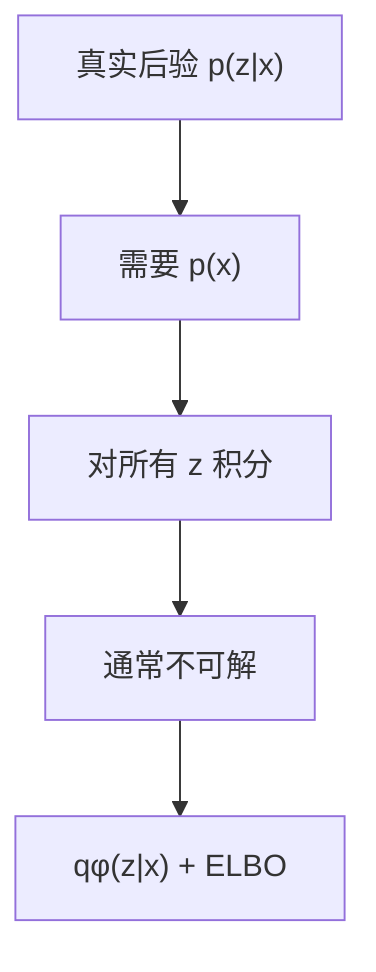

# ELBO（Evidence Lower Bound，证据下界）

> [VAE 主卡](./VAE.md) 的数学子卡。

## L0：一分钟理解

### 一句话定义

ELBO 是不可直接计算的 $\log p_\theta(x)$ 的可优化下界。

### 它解决什么问题

```math
\log p_\theta(x)
=
\log\int p_\theta(x,z)\,dz
```

复杂模型通常使这个积分不可解析。ELBO 引入近似后验 $q_\phi(z\mid x)$，把问题变为可采样、可梯度优化的目标。

### 在 VLA/WAM 中有什么用

- 训练图像或动作 VAE/CVAE；
- 对齐世界模型中的 observation posterior 与 dynamics prior；
- 为随机潜状态与 latent imagination 提供训练基础。

### 记住这三点

1. Evidence 是 $p_\theta(x)$。
2. $\log p_\theta(x)$ 与 ELBO 的差是真实后验 KL。
3. `reconstruction + KL` 严格来说是负 ELBO。

## L1：直觉与结构

### 1. 从旧方法的局限出发

```math
p_\theta(z\mid x)
=
\frac{p_\theta(x,z)}{p_\theta(x)}
```

计算后验需要 evidence，而 evidence 又需要对所有 $z$ 积分。

### 2. 核心思想

```math
\mathcal{L}_{\mathrm{ELBO}}
=
\mathbb{E}_{q_\phi(z\mid x)}
\left[\log p_\theta(x\mid z)\right]
-
D_{\mathrm{KL}}
\left(q_\phi(z\mid x)\|p(z)\right)
```

第一项要求 latent 解释数据，第二项让 posterior 与先验保持联系。

### 3. 结构或数据流



文字说明：真实后验依赖不可解的边缘似然，因此用近似后验与 ELBO 训练。

### 4. 输入、输出与张量形状

| 对象 | 形状 |
|---|---|
| `mu, logvar` | `[B, D_z]` |
| 每维 KL | `[B, D_z]` |
| 每样本 KL | `[B]` |
| batch ELBO | scalar |

### 5. 在具身智能系统中的位置

动作 CVAE 中，训练 posterior 可以看到真实动作 chunk，而部署时只能使用先验。世界模型中，posterior 使用当前观测，prior 只使用历史和动作；KL 让 imagination 不依赖未来真实观测。

### 6. 与相近方法的区别

- MSE/BCE 只是特定似然下的重建项；
- prior KL 是 ELBO 的正则；
- true-posterior KL 是 ELBO gap；
- IWAE 使用多个 importance samples 得到更紧的下界。

## L2：数学与实现

### 1. 符号表

| 符号 | 含义 |
|---|---|
| $x$ | 已观测数据 |
| $z$ | 潜变量 |
| $p(z)$ | 先验 |
| $p_\theta(x\mid z)$ | 似然 |
| $p_\theta(z\mid x)$ | 真实后验 |
| $q_\phi(z\mid x)$ | 近似后验 |

### 2. 核心公式

从 KL 开始：

```math
D_{\mathrm{KL}}
\left(q_\phi(z\mid x)\|p_\theta(z\mid x)\right)
=
\mathbb{E}_{q_\phi(z\mid x)}
\left[
\log\frac{q_\phi(z\mid x)}{p_\theta(z\mid x)}
\right]
```

使用 Bayes 公式并移项：

```math
\boxed{
\log p_\theta(x)
=
\mathcal{L}_{\mathrm{ELBO}}(x)
+
D_{\mathrm{KL}}
\left(q_\phi(z\mid x)\|p_\theta(z\mid x)\right)
}
```

KL 非负，所以：

```math
\boxed{
\mathcal{L}_{\mathrm{ELBO}}(x)\le\log p_\theta(x)
}
```

### 3. 公式的逐步解释或推导

使用 $p_\theta(x,z)=p_\theta(x\mid z)p(z)$：

```math
\begin{aligned}
\mathcal{L}_{\mathrm{ELBO}}(x)
&=
\mathbb{E}_{q_\phi(z\mid x)}
\left[
\log p_\theta(x,z)-\log q_\phi(z\mid x)
\right]\\
&=
\mathbb{E}_{q_\phi(z\mid x)}
\left[\log p_\theta(x\mid z)\right]
-
D_{\mathrm{KL}}
\left(q_\phi(z\mid x)\|p(z)\right)
\end{aligned}
```

因此最小化：

```math
\mathcal{J}_{\mathrm{VAE}}
=
-\mathbb{E}_{q_\phi(z\mid x)}
\left[\log p_\theta(x\mid z)\right]
+
D_{\mathrm{KL}}
\left(q_\phi(z\mid x)\|p(z)\right)
```

Jensen 路线：

```math
\begin{aligned}
\log p_\theta(x)
&=
\log
\mathbb{E}_{q_\phi(z\mid x)}
\left[
\frac{p_\theta(x,z)}{q_\phi(z\mid x)}
\right]\\
&\ge
\mathbb{E}_{q_\phi(z\mid x)}
\left[
\log\frac{p_\theta(x,z)}{q_\phi(z\mid x)}
\right]\\
&=
\mathcal{L}_{\mathrm{ELBO}}(x)
\end{aligned}
```

Jensen 直接证明下界；KL 恒等式说明 gap。

### 4. 最小数值例子

设：

```math
q(z\mid x)=(0.75,0.25),\qquad p(z)=(0.5,0.5)
```

并且：

```math
p(x\mid z=0)=0.8,\qquad p(x\mid z=1)=0.2
```

则：

```math
\mathbb{E}_q[\log p(x\mid z)]\approx-0.570
```

```math
D_{\mathrm{KL}}(q\|p)\approx0.131
```

```math
\mathcal{L}_{\mathrm{ELBO}}\approx-0.701
```

而：

```math
\log p(x)=\log0.5\approx-0.693
```

所以 $-0.701\le-0.693$。

### 5. 训练与推理

训练时从 $q_\phi(z\mid x)$ 采样，估计期望对数似然并计算 KL。生成时使用 $p(z)$；稳定表征常使用 posterior mean。

### 6. 伪代码

1. 计算 posterior 参数；
2. 重参数化采样；
3. 计算 `log p(x|z)`；
4. 计算 prior KL；
5. 最大化 ELBO或最小化负 ELBO。

### 7. 最小 PyTorch 实现

```python
def negative_elbo(log_px_given_z, mu, logvar):
    kl = -0.5 * (
        1 + logvar - mu.square() - logvar.exp()
    ).sum(dim=-1)
    elbo = log_px_given_z - kl
    return -elbo.mean(), {
        "elbo": elbo.mean().detach(),
        "kl": kl.mean().detach(),
    }
```

### 8. 公式—代码对应

| 数学对象 | PyTorch |
|---|---|
| $\log p_\theta(x\mid z)$ | `log_px_given_z` |
| prior KL | `kl` |
| ELBO | `log_px_given_z - kl` |
| 负 ELBO | `-elbo.mean()` |

### 9. 常见超参数

- KL 权重 $\beta$；
- Monte Carlo sample 数；
- loss reduction；
- KL warm-up、free bits、KL balancing。

### 10. 失败模式与常见误解

1. `reconstruction + KL` 是负 ELBO；
2. reconstruction 应理解为 negative expected log-likelihood；
3. prior KL 与 true-posterior KL 不是同一个量；
4. KL 降到 0 可能导致 posterior collapse；
5. reduction 不一致会改变两项相对尺度。

## 自测

### 基础题

1. ELBO 下界的对象是什么？
2. ELBO gap 是什么？
3. 为什么代码最小化负 ELBO？

### 理解题

1. 为什么同时有似然项和 prior KL？
2. 两条推导路线分别说明什么？
3. 两种 KL 为什么不能混淆？

### 迁移题

1. 动作 CVAE 为什么要对齐训练 posterior 与部署 prior？
2. 世界模型为什么要对齐 observation posterior 与 dynamics prior？
3. KL 接近 0 但重建仍好时可能发生什么？

<details>
<summary>参考答案</summary>

1. $\log p_\theta(x)$。
2. $D_{\mathrm{KL}}(q_\phi(z\mid x)\|p_\theta(z\mid x))$。
3. 常规优化器按最小化定义。
4. 似然项要求 latent 解释数据，prior KL 让 posterior 可由先验支持。
5. Jensen 证明下界，KL 恒等式说明 gap。
6. 一个是目标正则，一个是下界差距。
7. 部署时没有真实未来动作。
8. imagination 时没有未来观测。
9. Posterior collapse。

</details>

## 学习导航

### 前置卡片

- Conditional Probability（待创建）
- Expectation（待创建）
- KL Divergence（待创建）
- Jensen's Inequality（待创建）

### 原子子卡

- Reparameterization Trick（待创建）
- Posterior Collapse（待创建）

### 对比卡片

- ELBO vs Maximum Likelihood（待创建）
- ELBO vs IWAE Bound（待创建）

### 下一张推荐卡

返回 [VAE 主卡](./VAE.md)，再学习 Reparameterization Trick。

## 参考资料

1. [Auto-Encoding Variational Bayes](https://arxiv.org/abs/1312.6114).
2. [An Introduction to Variational Autoencoders](https://arxiv.org/abs/1906.02691).
3. [PyTorch VAE Example](https://github.com/pytorch/examples/blob/main/vae/main.py).

## L3：论文与源码深入（待补充）

- amortization gap 与 approximation gap；
- IWAE；
- sequential ELBO 与 RSSM；
- free bits 与 KL balancing。
