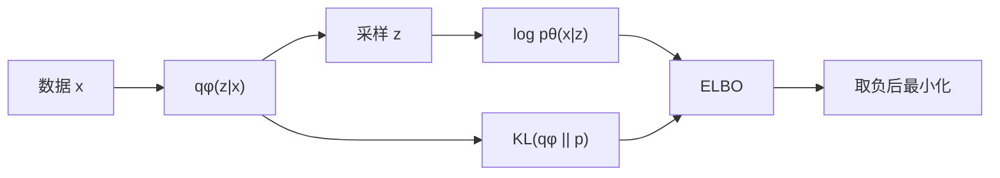

# ELBO（Evidence Lower Bound，证据下界）

> [VAE 主卡](./VAE.md) 的数学子卡。

## L0：一分钟理解

### 一句话定义

ELBO 是不可直接计算的 $\log p_\theta(x)$ 的可优化下界。

### 它解决什么问题

```math
\log p_\theta(x)
=
\log\int p_\theta(x,z)\,dz
```

复杂模型通常使这个积分不可解析。ELBO 引入近似后验 $q_\phi(z\mid x)$，把问题变为可采样、可梯度优化的目标。

### 在 VLA/WAM 中有什么用

- 训练图像或动作 VAE/CVAE；
- 对齐世界模型中的 observation posterior 与 dynamics prior；
- 为随机潜状态与 latent imagination 提供训练基础。

### 记住这三点

1. Evidence 是 $p_\theta(x)$。
2. $\log p_\theta(x)$ 与 ELBO 的差是真实后验 KL。
3. `reconstruction + KL` 严格来说是负 ELBO。

## L1：直觉与结构

### 1. 背景：我们真正想优化的是 evidence

对包含潜变量 $z$ 的生成模型，理想目标是让已观测数据 $x$ 的边缘似然尽可能大：

```math
p_\theta(x)=\int p_\theta(x,z)\,dz
```

这一步已经把“哪些 latent 能解释 $x$”全部积分掉，因此直接衡量模型对数据的解释能力。

### 2. 剩余矛盾与设计目标

要计算 posterior：

```math
p_\theta(z\mid x)=\frac{p_\theta(x,z)}{p_\theta(x)}
```

分母正是通常不可解析的 evidence；而直接计算 evidence 又需要对所有 $z$ 积分。于是出现循环：

- 想训练生成模型，需要 $\log p_\theta(x)$；
- 想推断哪些 $z$ 解释 $x$，需要 posterior；
- posterior 和 evidence 都依赖同一个难积分。

设计目标因此不是“发明一个新的 loss”，而是找到一个可采样、可求梯度、又确实与 $\log p_\theta(x)$ 有关系的替代目标。

### 3. 设计因果链

| 当前问题 | 设计选择 | 解决了什么 | 新问题或代价 |
|---|---|---|---|
| 真实 posterior 不可算 | 引入 $q_\phi(z\mid x)$ | 可以从近似 posterior 采样 | $q_\phi$ 与真实 posterior 有误差 |
| evidence 难直接优化 | 构造 ELBO | 得到 $\log p_\theta(x)$ 的可优化下界 | 下界可能不紧 |
| latent 必须解释数据 | expected log-likelihood | 奖励由 $z$ 重建/解释 $x$ | 期望通常需 Monte Carlo 估计 |
| posterior 要能被 prior 支持 | prior KL | 连接训练 posterior 与生成 prior | KL 过强可能忽略 latent |
| 优化器通常做最小化 | 取负 ELBO | 得到代码中的 loss | 容易混淆符号和 reduction |

### 4. 结构或数据流



文字说明：近似 posterior 提供可采样的 $z$；likelihood 项要求 $z$ 解释数据，prior KL 连接训练时 posterior 与生成时 prior。

还应区分两个 KL：

- $D_{\mathrm{KL}}(q_\phi(z\mid x)\|p(z))$ 出现在可计算的 ELBO 中，是训练正则；
- $D_{\mathrm{KL}}(q_\phi(z\mid x)\|p_\theta(z\mid x))$ 是 ELBO 与 log evidence 的 gap，通常不能直接计算。

### 5. 输入、输出与张量形状

| 对象 | 形状 | reduction |
|---|---|---|
| `mu, logvar` | `[B,D_z]` | 尚未聚合 |
| 每维 KL | `[B,D_z]` | latent 维待求和 |
| 每样本 KL | `[B]` | latent 维已求和 |
| 每样本 log-likelihood 估计 | `[B]` | 观测维已按 likelihood 聚合 |
| batch 负 ELBO | scalar | 最后对 batch 取均值 |

### 6. 在具身智能系统中的位置

动作 CVAE 中，训练 posterior 可以看到真实动作 chunk，而部署时只能使用 prior；prior KL 缩小两者差距。世界模型中，observation posterior 使用当前观测，dynamics prior 只依赖历史与动作；ELBO 类目标使 latent imagination 在部署时不依赖未来真实观测。

### 7. 与相近目标的区别

- MSE/BCE 是特定 likelihood 假设下的 reconstruction NLL，不等于完整 ELBO；
- prior KL 是可计算的训练项，true-posterior KL 是通常不可计算的下界 gap；
- maximum likelihood 是最终方向，ELBO 是在潜变量积分困难时采用的可优化下界；
- IWAE 用多个 importance samples 构造通常更紧的下界，但计算更重。

## L2：数学与实现

### 1. 符号表

| 符号 | 含义 |
|---|---|
| $x$ | 已观测数据 |
| $z$ | 潜变量 |
| $p(z)$ | 先验 |
| $p_\theta(x\mid z)$ | 似然 |
| $p_\theta(z\mid x)$ | 真实后验 |
| $q_\phi(z\mid x)$ | 近似后验 |

### 2. 核心公式

从 KL 开始：

```math
D_{\mathrm{KL}}
\left(q_\phi(z\mid x)\|p_\theta(z\mid x)\right)
=
\mathbb{E}_{q_\phi(z\mid x)}
\left[
\log\frac{q_\phi(z\mid x)}{p_\theta(z\mid x)}
\right]
```

使用 Bayes 公式并移项：

```math
\boxed{
\log p_\theta(x)
=
\mathcal{L}_{\mathrm{ELBO}}(x)
+
D_{\mathrm{KL}}
\left(q_\phi(z\mid x)\|p_\theta(z\mid x)\right)
}
```

KL 非负，所以：

```math
\boxed{
\mathcal{L}_{\mathrm{ELBO}}(x)\le\log p_\theta(x)
}
```

### 3. 公式的逐步解释或推导

使用 $p_\theta(x,z)=p_\theta(x\mid z)p(z)$：

```math
\begin{aligned}
\mathcal{L}_{\mathrm{ELBO}}(x)
&=
\mathbb{E}_{q_\phi(z\mid x)}
\left[
\log p_\theta(x,z)-\log q_\phi(z\mid x)
\right]\\
&=
\mathbb{E}_{q_\phi(z\mid x)}
\left[\log p_\theta(x\mid z)\right]
-
D_{\mathrm{KL}}
\left(q_\phi(z\mid x)\|p(z)\right)
\end{aligned}
```

因此最小化：

```math
\mathcal{J}_{\mathrm{VAE}}
=
-\mathbb{E}_{q_\phi(z\mid x)}
\left[\log p_\theta(x\mid z)\right]
+
D_{\mathrm{KL}}
\left(q_\phi(z\mid x)\|p(z)\right)
```

Jensen 路线：

```math
\begin{aligned}
\log p_\theta(x)
&=
\log
\mathbb{E}_{q_\phi(z\mid x)}
\left[
\frac{p_\theta(x,z)}{q_\phi(z\mid x)}
\right]\\
&\ge
\mathbb{E}_{q_\phi(z\mid x)}
\left[
\log\frac{p_\theta(x,z)}{q_\phi(z\mid x)}
\right]\\
&=
\mathcal{L}_{\mathrm{ELBO}}(x)
\end{aligned}
```

Jensen 直接证明下界；KL 恒等式说明 gap。

把推导和训练实现连起来，可以分成四步：

1. **目标**：最大化 $\mathbb{E}_{q_\phi}[\log p_\theta(x\mid z)]-D_{\mathrm{KL}}(q_\phi\|p)$；优化器通常改为最小化其相反数。
2. **期望的估计**：从 $q_\phi(z\mid x)$ 取 $L$ 个重参数化样本，用 Monte Carlo 平均近似期望；常见最小实现取 $L=1$，它是随机估计而非代数恒等式。
3. **似然的实现**：`log_px_given_z` 必须由选定的观测分布得到。固定方差 Gaussian 可化为与平方误差成比例的 NLL，Bernoulli 则对应 BCE；ELBO 本身没有规定必须使用哪一种。
4. **KL 与 reduction**：标准 VAE 的 Gaussian KL 有闭式解，先对 latent 维求和得到每样本 `[B]`，再和每样本 log-likelihood 组合，最后对 batch 取均值。

因此代码中的 loss 不是公式之外的新目标，而是“选择似然 + 估计期望 + 采用明确 reduction”之后的负 ELBO。

### 4. 最小数值例子

设：

```math
q(z\mid x)=(0.75,0.25),\qquad p(z)=(0.5,0.5)
```

并且：

```math
p(x\mid z=0)=0.8,\qquad p(x\mid z=1)=0.2
```

则：

```math
\mathbb{E}_q[\log p(x\mid z)]\approx-0.570
```

```math
D_{\mathrm{KL}}(q\|p)\approx0.131
```

```math
\mathcal{L}_{\mathrm{ELBO}}\approx-0.701
```

而：

```math
\log p(x)=\log0.5\approx-0.693
```

所以 $-0.701\le-0.693$。

### 5. 训练与推理

训练时从 $q_\phi(z\mid x)$ 采样，估计期望对数似然并计算 KL。生成时使用 $p(z)$；稳定表征常使用 posterior mean。

### 6. 伪代码

1. 计算 posterior 参数；
2. 重参数化采样；
3. 计算 `log p(x|z)`；
4. 计算 prior KL；
5. 最大化 ELBO或最小化负 ELBO。

### 7. 最小 PyTorch 实现

```python
def negative_elbo(log_px_given_z, mu, logvar):
    # 对角 Gaussian posterior 到标准正态 prior 的闭式 KL。
    # 对 latent 维求和，kl 和 log_px_given_z 都应为每样本 shape [B]。
    kl = -0.5 * (
        1 + logvar - mu.square() - logvar.exp()
    ).sum(dim=-1)

    # log_px_given_z 是一次或多次 Monte Carlo 样本给出的期望对数似然估计。
    # 它的具体计算取决于 likelihood；例如固定方差 Gaussian 可用平方误差实现。
    elbo = log_px_given_z - kl

    # 优化器最小化负 ELBO；最后只在 batch 维取均值。
    return -elbo.mean(), {
        "elbo": elbo.mean().detach(),
        "kl": kl.mean().detach(),
    }
```

### 8. 公式—代码对应

| 数学对象 | PyTorch | 转换依据 | 形状与 reduction |
|---|---|---|---|
| $\log p_\theta(x\mid z)$ | `log_px_given_z` | 由选定 likelihood 计算；不是固定等于某种 loss | 每样本 `[B]` |
| $\mathbb{E}_{q_\phi}[\log p_\theta(x\mid z)]$ | 重参数化采样后的 `log_px_given_z` | 单样本或多样本 Monte Carlo 估计 | 样本维平均后为 `[B]` |
| $D_{\mathrm{KL}}(q_\phi\|p)$ | `-0.5 * (...).sum(-1)` | 对角 Gaussian KL 的闭式解 | latent 维求和为 `[B]` |
| $\mathcal{L}_{\mathrm{ELBO}}$ | `log_px_given_z - kl` | 与公式严格同号组合 | `[B]` |
| $-\mathcal{L}_{\mathrm{ELBO}}$ | `-elbo.mean()` | 改写为最小化目标，并对经验 batch 平均 | scalar |

### 9. 常见超参数

- KL 权重 $\beta$；
- Monte Carlo sample 数；
- loss reduction；
- KL warm-up、free bits、KL balancing。

### 10. 失败模式与常见误解

1. `reconstruction + KL` 是负 ELBO；
2. reconstruction 应理解为 negative expected log-likelihood；
3. prior KL 与 true-posterior KL 不是同一个量；
4. KL 降到 0 可能导致 posterior collapse；
5. reduction 不一致会改变两项相对尺度。

## 自测

### 基础题

1. ELBO 下界的对象是什么？
2. ELBO gap 是什么？
3. 为什么代码最小化负 ELBO？

### 理解题

1. 为什么同时有似然项和 prior KL？
2. 两条推导路线分别说明什么？
3. 两种 KL 为什么不能混淆？

### 迁移题

1. 动作 CVAE 为什么要对齐训练 posterior 与部署 prior？
2. 世界模型为什么要对齐 observation posterior 与 dynamics prior？
3. KL 接近 0 但重建仍好时可能发生什么？

<details>
<summary>参考答案</summary>

1. $\log p_\theta(x)$。
2. $D_{\mathrm{KL}}(q_\phi(z\mid x)\|p_\theta(z\mid x))$。
3. 常规优化器按最小化定义。
4. 似然项要求 latent 解释数据，prior KL 让 posterior 可由先验支持。
5. Jensen 证明下界，KL 恒等式说明 gap。
6. 一个是目标正则，一个是下界差距。
7. 部署时没有真实未来动作。
8. imagination 时没有未来观测。
9. Posterior collapse。

</details>

## 学习导航

### 前置卡片

- Conditional Probability（待创建）
- Expectation（待创建）
- KL Divergence（待创建）
- Jensen's Inequality（待创建）

### 原子子卡

- Reparameterization Trick（待创建）
- Posterior Collapse（待创建）

### 对比卡片

- ELBO vs Maximum Likelihood（待创建）
- ELBO vs IWAE Bound（待创建）

### 下一张推荐卡

返回 [VAE 主卡](./VAE.md)，再学习 Reparameterization Trick。

## 参考资料

1. [Auto-Encoding Variational Bayes](https://arxiv.org/abs/1312.6114).
2. [An Introduction to Variational Autoencoders](https://arxiv.org/abs/1906.02691).
3. [PyTorch VAE Example](https://github.com/pytorch/examples/blob/main/vae/main.py).

## L3：论文与源码深入（待补充）

- amortization gap 与 approximation gap；
- IWAE；
- sequential ELBO 与 RSSM；
- free bits 与 KL balancing。
