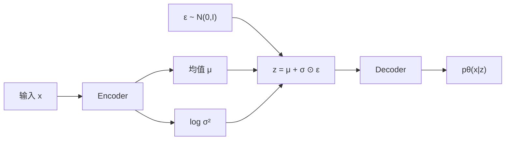
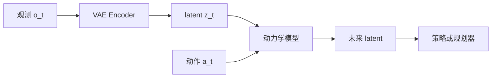

# Variational Autoencoder（VAE，变分自编码器）

> 主卡。ELBO 的完整推导见原子卡 [ELBO](./ELBO.md)。

## L0：一分钟理解

### 一句话定义

VAE 是带概率约束的自编码器：Encoder 输出潜变量分布的参数，Decoder 从该分布采样得到的潜变量中重建数据。

### 它解决什么问题

普通 AutoEncoder 只保证训练样本可以重建，却不保证整个 latent space 连续、规整或可采样。VAE 同时追求：

1. 从 $z$ 中重建 $x$；
2. 让近似后验 $q_\phi(z\mid x)$ 不要偏离先验 $p(z)$ 太远。

### 在 VLA/WAM 中有什么用

- 压缩高维观测，供动力学模型或策略使用；
- 用随机 latent 表示部分可观测性与未来不确定性；
- CVAE 用 latent style 表示同一观测下多种合理动作。

ACT 使用动作序列 CVAE；Dreamer 的 RSSM 是更一般的随机潜状态模型。VAE 是理解它们的基础，不是完整等价物。

### 记住这三点

1. Encoder 通常输出 $\mu$ 和 $\log\sigma^2$。
2. VAE 在保留信息和规整潜空间之间折中。
3. 重参数化使采样过程可以用普通反向传播训练。

## L1：直觉与结构

### 1. 从旧方法的局限出发

普通 AutoEncoder：

```math
z=f_\phi(x),\qquad \hat{x}=g_\theta(z)
```

只优化 $d(x,\hat{x})$ 时，训练编码之间可能存在 Decoder 从未见过的区域，从简单分布随机采样也未必得到有效样本。

### 2. 核心思想

VAE 把确定性编码改为概率编码：

```math
x\rightarrow q_\phi(z\mid x)
```

常见近似后验为：

```math
q_\phi(z\mid x)
=
\mathcal{N}\!\left(
z;\mu_\phi(x),\operatorname{diag}(\sigma_\phi^2(x))
\right)
```

并选择简单先验：

```math
p(z)=\mathcal{N}(0,I)
```

### 3. 结构或数据流



文字说明：Encoder 预测 $\mu$ 和 $\log\sigma^2$，重参数化产生 $z$，Decoder 根据 $z$ 定义观测分布。

### 4. 输入、输出与张量形状

设 batch size 为 $B$、latent dim 为 $D_z$：

| 张量 | 形状 |
|---|---|
| `mu` | `[B, D_z]` |
| `logvar` | `[B, D_z]` |
| `eps` | `[B, D_z]` |
| `z` | `[B, D_z]` |

### 5. 在具身智能系统中的位置



文字说明：VAE 先压缩观测，动力学模型在 latent 中预测未来，策略或规划器使用预测结果。

典型关联：

- [World Models](https://arxiv.org/abs/1803.10122)：VAE 压缩图像后学习 latent dynamics；
- [ACT](https://arxiv.org/abs/2304.13705)：CVAE 建模动作序列中的隐式风格；
- [Dreamer](https://arxiv.org/abs/1912.01603)：在随机潜状态空间中学习未来。

### 6. 与相近方法的区别

| 方法 | latent | 优点 | 局限 |
|---|---|---|---|
| AutoEncoder | 确定向量 | 简单直接 | 不一定可采样 |
| VAE | 连续分布 | 可采样、概率解释清楚 | 可能 posterior collapse |
| CVAE | 条件连续分布 | 表达条件下多种输出 | 条件过强时可能忽略 latent |
| VQ-VAE | 离散 code | 适合 token 化 | 可能 codebook collapse |

## L2：数学与实现

### 1. 符号表

| 符号 | 含义 |
|---|---|
| $x$ | 观测数据 |
| $z$ | 潜变量 |
| $p(z)$ | 先验 |
| $p_\theta(x\mid z)$ | 生成/似然模型 |
| $p_\theta(z\mid x)$ | 真实后验 |
| $q_\phi(z\mid x)$ | 近似后验 |

### 2. 核心公式

```math
\mathcal{L}_{\mathrm{ELBO}}(x)
=
\mathbb{E}_{q_\phi(z\mid x)}
\left[\log p_\theta(x\mid z)\right]
-
D_{\mathrm{KL}}
\left(q_\phi(z\mid x)\|p(z)\right)
```

训练通常最小化负 ELBO：

```math
\mathcal{J}_{\mathrm{VAE}}
=
-\mathbb{E}_{q_\phi(z\mid x)}
\left[\log p_\theta(x\mid z)\right]
+
D_{\mathrm{KL}}
\left(q_\phi(z\mid x)\|p(z)\right)
```

重建项不是预先指定为 MSE 或 BCE，而是由观测似然决定。若 Decoder 把连续观测建模为固定方差高斯分布：

```math
p_\theta(x\mid z)=\mathcal{N}\!\left(x;\mu_\theta(z),\sigma_x^2I\right)
```

则单样本负对数似然为：

```math
-\log p_\theta(x\mid z)
=
\frac{1}{2\sigma_x^2}\left\|x-\mu_\theta(z)\right\|_2^2+C
```

$C$ 与模型参数无关；当 $\sigma_x^2$ 固定时，前面的比例系数也固定。因此最小化负对数似然，与最小化平方误差具有相同的最优点。代码使用 MSE 是在实现这个特定似然假设下的简化目标，而不是把 $\log p_\theta(x\mid z)$ 任意替换掉。若像素服从 Bernoulli 分布，则对应 BCE；若还要学习高斯方差，Decoder 必须额外输出方差，裸 MSE 就不再是完整 NLL。

ELBO 中的期望也需要落到计算上。训练时通常对每个 $x$ 从 $q_\phi(z\mid x)$ 采一个 $z$，用单样本 Monte Carlo 估计：

```math
\mathbb{E}_{q_\phi(z\mid x)}[\log p_\theta(x\mid z)]
\approx
\log p_\theta(x\mid z^{(1)})
```

这只是无偏的随机估计，不是把期望严格变成一个确定值；batch 平均会进一步降低梯度噪声。

### 3. 公式的逐步解释或推导

对角高斯与标准正态之间的 KL：

```math
D_{\mathrm{KL}}(q\|p)
=
\frac{1}{2}\sum_{j=1}^{d}
\left(
\mu_j^2+\sigma_j^2-\log\sigma_j^2-1
\right)
```

若代码输出 $\mathrm{logvar}=\log\sigma^2$：

```math
D_{\mathrm{KL}}(q\|p)
=
-\frac{1}{2}\sum_{j=1}^{d}
\left(
1+\mathrm{logvar}_j-\mu_j^2-\exp(\mathrm{logvar}_j)
\right)
```

重参数化：

```math
\epsilon\sim\mathcal{N}(0,I),\qquad
z=\mu_\phi(x)+\sigma_\phi(x)\odot\epsilon
```

### 4. 最小数值例子

设 $\mu=1.0$、$\log\sigma^2=-0.693$，则 $\sigma^2\approx0.5$、$\sigma\approx0.707$。若 $\epsilon=0.3$：

```math
z=1.0+0.707\times0.3\approx1.212
```

该维 KL 约为：

```math
\frac12\left(1.0^2+0.5-\log0.5-1\right)\approx0.597
```

### 5. 训练与推理

| 用途 | latent 来源 |
|---|---|
| 训练/重建 | $z\sim q_\phi(z\mid x)$ |
| 生成 | $z\sim p(z)$ |
| 稳定表征 | 常使用 $z=\mu_\phi(x)$ |

### 6. 伪代码

1. Encoder 预测 `mu` 与 `logvar`；
2. 采样独立噪声 `eps`；
3. 通过重参数化得到 `z`；
4. Decoder 输出观测分布参数；
5. 计算负对数似然与 KL；
6. 反向传播更新 Encoder 和 Decoder。

### 7. 最小 PyTorch 实现

```python
import torch
from torch import nn
from torch.nn import functional as F


class VAE(nn.Module):
    def __init__(self, input_dim, hidden_dim, latent_dim):
        super().__init__()
        self.encoder = nn.Sequential(
            nn.Linear(input_dim, hidden_dim), nn.ReLU()
        )
        self.to_mu = nn.Linear(hidden_dim, latent_dim)
        self.to_logvar = nn.Linear(hidden_dim, latent_dim)
        self.decoder = nn.Sequential(
            nn.Linear(latent_dim, hidden_dim),
            nn.ReLU(),
            nn.Linear(hidden_dim, input_dim),
        )

    def forward(self, x):
        h = self.encoder(x)
        mu, logvar = self.to_mu(h), self.to_logvar(h)
        std = torch.exp(0.5 * logvar)
        z = mu + std * torch.randn_like(std)
        return self.decoder(z), mu, logvar


def vae_loss(recon, x, mu, logvar):
    # 固定方差 Gaussian likelihood 的 NLL 与平方误差只差固定比例和常数。
    # reduction="none" 保留逐元素误差，再对非 batch 维求和，得到 [B]。
    recon_nll = F.mse_loss(
        recon, x, reduction="none"
    ).flatten(1).sum(1)

    # 对角 Gaussian q(z|x) 与 N(0, I) 的解析 KL；对 latent 维求和为 [B]。
    kl = -0.5 * (
        1 + logvar - mu.square() - logvar.exp()
    ).sum(1)

    # 先组成每个样本的负 ELBO，再对 batch 取均值。
    return (recon_nll + kl).mean()
```

### 8. 公式—代码对应

| 数学对象 | PyTorch | 转换依据 | 形状与 reduction |
|---|---|---|---|
| $\mu_\phi(x)$ | `self.to_mu(h)` | Encoder 直接参数化 posterior mean | `[B, D_z]` |
| $\log\sigma_\phi^2(x)$ | `self.to_logvar(h)` | 用无约束实数表示正方差 | `[B, D_z]` |
| $\sigma=\exp(\frac12\log\sigma^2)$ | `torch.exp(0.5 * logvar)` | 从 log variance 恢复标准差，严格等式 | `[B, D_z]` |
| $z=\mu+\sigma\odot\epsilon$ | `mu + std * torch.randn_like(std)` | 重参数化；一次噪声样本给出期望的 Monte Carlo 估计 | `[B, D_z]` |
| $-\log p_\theta(x\mid z)$ | `F.mse_loss(..., reduction="none")` | 固定方差 Gaussian NLL，忽略常数与固定比例 | 逐元素，再对非 batch 维求和为 `[B]` |
| $D_{\mathrm{KL}}(q_\phi\|p)$ | `-0.5 * (...).sum(1)` | 对角高斯到标准正态 KL 的闭式解 | latent 维求和为 `[B]` |
| $-\mathcal{L}_{\mathrm{ELBO}}$ | `(recon_nll + kl).mean()` | 每样本负 ELBO 后进行经验 batch 平均 | scalar |

### 9. 常见超参数

- `latent_dim`；
- KL 权重 $\beta$；
- Decoder 容量；
- likelihood 类型；
- KL warm-up。

### 10. 失败模式与常见误解

Posterior collapse：

```math
q_\phi(z\mid x)\approx p(z)
```

此时 Decoder 基本忽略 $z$。常见信号是 KL 接近 0、改变 $z$ 对输出影响很小。

VAE 不只是“给 AE latent 加噪声”；KL 也不是越小越好；连续 latent 不保证自动获得可解释语义。

## 自测

### 基础题

1. Encoder 输出哪两个量？
2. 重参数化公式是什么？
3. VAE loss 的两项是什么？

### 理解题

1. 为什么普通 AE 重建良好仍不代表可以随机采样？
2. 为什么常输出 `logvar`？
3. 为什么 MSE/BCE 对应不同似然假设？

### 迁移题

1. 如果 $x$ 是动作 chunk，latent 可以表示什么？
2. 强条件下 KL 接近 0，可能发生了什么？
3. 只需稳定压缩时是否一定要用 VAE？

<details>
<summary>参考答案</summary>

1. $\mu$ 与 $\log\sigma^2$。
2. $z=\mu+\sigma\odot\epsilon$。
3. 负期望对数似然与 KL。
4. 普通 AE 没有约束训练编码之外的区域。
5. `logvar` 无正值约束，指数变换可保证方差为正。
6. 它们来自不同观测似然。
7. 动作策略或示范中未被条件完全解释的风格。
8. 可能 posterior collapse。
9. 不一定，确定性 AE 或任务驱动表征可能更直接。

</details>

## 学习导航

### 前置卡片

- AutoEncoder（待创建）
- Probability Distribution（待创建）
- KL Divergence（待创建）

### 原子子卡

- [ELBO](./ELBO.md)
- Reparameterization Trick（待创建）
- Posterior Collapse（待创建）

### 对比卡片

- VAE vs AutoEncoder（待创建）
- [VAE vs VQ-VAE：见 VQ-VAE 对比表](./VQ-VAE.md#6-与相近方法的区别)

### 下一张推荐卡

先学习 [ELBO](./ELBO.md)，再进入 CVAE 与 ACT。

## 参考资料

1. [Auto-Encoding Variational Bayes](https://arxiv.org/abs/1312.6114).
2. [An Introduction to Variational Autoencoders](https://arxiv.org/abs/1906.02691).
3. [PyTorch VAE Example](https://github.com/pytorch/examples/blob/main/vae/main.py).
4. [World Models](https://arxiv.org/abs/1803.10122).
5. [ACT](https://arxiv.org/abs/2304.13705).

## L3：论文与源码深入（待补充）

- AEVB/SGVB estimator；
- $\beta$-VAE、IWAE、VQ-VAE；
- posterior collapse；
- ACT 的 CVAE 源码映射。
