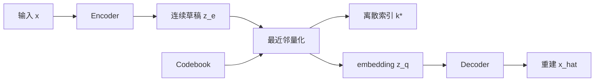
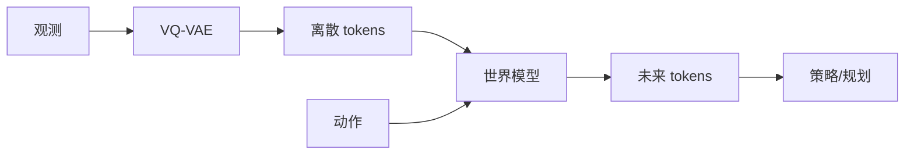

# Vector-Quantized Variational Autoencoder（VQ-VAE）

> 主卡。VQ-VAE 沿用 [VAE](./VAE.md) 的编码—解码结构，但把连续随机 latent 换成有限 codebook 中的离散向量。

## L0：一分钟理解

### 一句话定义

VQ-VAE 先让 Encoder 产生连续向量，再把它替换为 codebook 中最近的条目，使高维观测变成可学习的离散 token。

### 它解决什么问题

VAE 用连续分布和 KL 约束 latent，强 Decoder 下可能忽略 latent。VQ-VAE 强制信息通过有限词典，同时解决最近邻不可导、codebook 学习和 Encoder 输出漂移三个训练问题。

### 在 VLA/WAM 中有什么用

- 将图像、深度或触觉观测压成 token，供 Transformer 或世界模型预测；
- 将动作片段或技能编码成有限词表，形成高层规划符号；
- 在 latent dynamics 中预测 code index，而不是回归像素。

这是从离散表示性质推得的用途，并不表示所有 VLA/WAM 都使用原始 VQ-VAE。

### 记住这三点

1. 量化是选择最近 code，不是高斯采样。
2. Straight-through estimator 让前向使用离散向量、反向近似传递梯度。
3. 重建、codebook、commitment 三项的梯度对象不同。

## L1：直觉与结构

### 1. 从 AE 到 VQ-VAE：问题是怎样一步步出现的

先看 AE 已经做到的事情。AE 能把高维输入 $x$ 压缩成较短的连续表示 $z$，再由 Decoder 重建 $x$。这适合压缩，却没有告诉我们：离开训练样本的编码区域后，哪些 $z$ 仍然合理？因此，直接随机取一个连续向量交给 Decoder，通常没有可靠的生成含义。

VAE 为连续 latent 指定 prior，并用 KL 把 posterior 拉向 prior，使采样和生成具有概率解释。但这个方案也带来新的取舍：likelihood 与 KL 需要平衡，强 Decoder 可能忽略 latent；而在某些任务里，我们还希望 latent 本身是有限词表中的 token，便于后续模型进行分类式预测、组合和序列建模。

VQ-VAE 的设计目标不是简单地“把 VAE 取整”，而是建立一个离散信息瓶颈：每个位置只能从有限 codebook 中选择一个表示。Encoder 产生的任意连续输出，都必须映射到某个共享 code。

### 2. 为什么离散 token 还需要连续 codebook

如果只把 token 写成整数 $1,2,\ldots,K$，整数大小会引入并不存在的距离关系，而且 Decoder 需要的是可参与神经网络计算的向量。因此，VQ-VAE 为每个离散 index 配一个可学习 embedding：

```math
\mathcal{E}=\{e_1,\ldots,e_K\},\qquad e_k\in\mathbb{R}^{D}
```

整数 index 表示“选了哪个词”，$e_k$ 表示“这个词在连续特征空间中的含义”；所有 $e_k$ 组成 codebook。

Encoder 也不直接输出整数。它先输出连续候选 $z_e(x)$，再选择最近的 code：

```math
k^*(x)=\arg\min_k\|z_e(x)-e_k\|_2^2,\qquad z_q(x)=e_{k^*(x)}
```

可以把 $z_e$ 理解成 Encoder 写出的“草稿”，量化器从词典中找出最接近的“正式词条” $z_q$。最近邻选择同时产生两个结果：

- 离散索引 $k^*$：可交给后续 prior 或世界模型预测；
- 连续 embedding $z_q$：可直接交给 Decoder。

这解决了“怎样得到离散 token”，却立刻制造了两个新问题：`argmin` 不可导，codebook 本身也还没有学会代表 Encoder 输出。后面的 straight-through、codebook loss 和 commitment loss 正是依次回应这些问题，而不是三项互不相关的技巧。

### 3. 先看完整系统：压缩模型与生成 prior 是两阶段的

第一阶段训练量化自编码器：



文字说明：第一阶段学习“输入与离散 token 之间如何互译”，但还没有学习“哪些 token 组合是合理的”。

第二阶段把训练数据编码成 token grids，再用 PixelCNN、Transformer 或其他离散模型学习它们的联合分布。真正生成时：


文字说明：prior 负责生成合理 token 组合，codebook 和 Decoder 负责把 token 翻译回观测；随机均匀抽 code 通常不能替代 prior。

因此应区分两个问题：

1. **表示学习问题**：怎样把大观测压成短小、离散的 token grid？
2. **生成建模问题**：怎样学习这些 tokens 的空间或时间联合分布？

VQ-VAE 主要回答第一个问题，并为第二个问题提供更短、更结构化的建模对象。

### 4. 一条设计因果链

| 当前问题 | 设计选择 | 解决了什么 | 新问题或代价 |
|---|---|---|---|
| 希望得到有限 latent 词表 | 离散 index | latent 可作为 token 建模 | 整数不能直接表达丰富特征 |
| Decoder 需要连续向量 | 可学习 codebook | 每个 token 有一个 embedding | codebook 需要训练 |
| Encoder 如何选择 token | 最近邻量化 | 连续输出映射到硬 index | `argmin` 不可导 |
| 重建梯度如何到 Encoder | straight-through | 近似复制 Decoder 梯度 | 使用有偏 surrogate |
| embedding 如何靠近数据 | codebook loss | 更新被选中的 code | Encoder 仍可能漂移 |
| Encoder 如何稳定贴近 code | commitment loss | 约束 Encoder 输出 | 引入权重 $\beta$ |
| 如何无条件生成 | 离散 prior | 学习合理 token 组合 | 需要第二阶段模型 |

阅读 L2 时，可以把每个公式放回这条因果链：它必须明确回答其中一个问题。

### 5. 输入、输出与张量形状

| 对象 | 形状 | 含义 |
|---|---|---|
| $z_e$ | `[B,D,H,W]` | Encoder 输出的连续草稿 |
| 展平 $z_e$ | `[BHW,D]` | 每个空间位置独立量化 |
| codebook | `[K,D]` | $K$ 个 $D$ 维共享 code |
| indices | `[B,H,W]` | 每个位置的离散 token |
| $z_q$ | `[B,D,H,W]` | 查表后交给 Decoder 的 latent |

### 6. 在具身智能系统中的位置



文字说明：VQ-VAE 离散化观测，时序模型学习 token 与动作之间的转移，策略或规划器使用预测结果。

在具身系统中，离散化的价值不只是“压缩得更小”。它还把连续感知预测转成有限词表上的预测，使 Transformer 可以像处理序列 token 一样建模视觉、触觉或动作片段。但量化也会丢掉 codebook 容量之外的连续细节，因此并非所有控制任务都适合离散 latent。

### 7. 与相近方法的区别

| 方法 | latent | 训练约束 | 主要用途或风险 |
|---|---|---|---|
| AutoEncoder | 连续确定值 | 重建 | 压缩直接，但 latent 空间可能空洞 |
| VAE | 连续分布 | likelihood + prior KL | 可采样，但可能 posterior collapse |
| VQ-VAE | 离散 code | 重建 + codebook + commitment | 便于 token 建模，但可能 codebook collapse |

VQ-VAE 仍可放在变分框架下理解：若离散 posterior 是 one-hot，而训练量化自编码器时采用均匀 categorical prior，对应 KL 是与参数无关的常数。因此工程实现常呈现为 AE 式重建目标加量化辅助项，但这不等于 VQ-VAE 与 VAE 框架毫无关系。

## L2：数学与实现

### 1. 符号表

| 符号 | 含义 |
|---|---|
| $z_e(x)$ | Encoder 连续输出 |
| $e_k$ | 第 $k$ 个 code |
| $k^*$ | 最近 code 索引 |
| $z_q(x)$ | 量化向量 |
| $\operatorname{sg}$ | stop-gradient：前向恒等，反向梯度为 0 |
| $\beta$ | commitment 权重 |

### 2. 核心公式：先看三项各自负责什么

训练目标不是先凭经验凑出三个 loss，再分别命名。它来自三个尚未解决的责任：

1. Decoder 要根据真正的量化 latent 重建 $x$；
2. 被选中的 code 要学会靠近它所代表的 Encoder 输出；
3. Encoder 要承诺输出靠近某个 code，不能让 codebook 一直追赶漂移的目标。

对应目标为：

```math
\mathcal{J}
=
-\log p_\theta(x\mid z_q)
+\|\operatorname{sg}[z_e]-e_{k^*}\|_2^2
+\beta\|z_e-\operatorname{sg}[e_{k^*}]\|_2^2
```

判断这三项时，不只要看数值，还要问“谁能收到梯度”。$\operatorname{sg}$ 不改变前向数值，却切断反向梯度，因此它决定了每一项的更新对象。

### 3. 公式的逐步解释或推导

#### 3.1 问题一：量化不可导，重建梯度怎样到达 Encoder

Decoder 前向必须看到 $z_q$，否则模型可以绕过离散瓶颈；Encoder 反向又必须收到 reconstruction 梯度，否则它学不会为重建保留信息。我们需要一个表达式同时满足：

1. 前向数值等于 $z_q$；
2. 对 $z_e$ 的替代导数等于恒等映射。

最近邻中的 $\arg\min$ 输出离散整数：输入小幅变化时索引不变，跨越 Voronoi 边界时又突然跳变，因此普通反向传播没有稳定梯度。VQ-VAE 构造：

```math
z_{\mathrm{st}}=z_e+\operatorname{sg}[z_q-z_e]
```

前向时，stop-gradient 不改变括号中的值：

```math
z_{\mathrm{st}}
=
z_e+(z_q-z_e)
=
z_q
```

所以 Decoder 确实看到量化后的 code。反向时，stop-gradient 项导数为 0：

```math
\frac{\partial z_{\mathrm{st}}}{\partial z_e}=I
```

于是 Decoder 传回的梯度被近似原样交给 Encoder。这不是 $\arg\min$ 的真实导数，而是有偏的 straight-through surrogate：它用人为指定的反向路径换取可训练性。

#### 3.2 问题二：重建梯度能训练 Encoder，但谁来训练 codebook

Straight-through 切断了 reconstruction loss 到最近邻选择和 codebook 的真实梯度。若没有额外目标，embedding 不知道应该移动到哪里。因此加入 codebook loss：

```math
\mathcal{J}_{\mathrm{codebook}}
=
\|\operatorname{sg}[z_e]-e_{k^*}\|_2^2
```

这里冻结 $z_e$，只把选中的 $e_{k^*}$ 拉向当前 Encoder 输出。从聚类角度看，code 像一个可学习的聚类中心，负责概括分配给它的一组 Encoder vectors。

但只让 codebook 追赶 Encoder 仍不够：Encoder 可以不断改变输出尺度或在 codes 之间漂移，让词典疲于追赶。因此加入 commitment loss：

```math
\mathcal{J}_{\mathrm{commit}}
=
\beta\|z_e-\operatorname{sg}[e_{k^*}]\|_2^2
```

这一次冻结 embedding，只更新 Encoder，使 $z_e$ 承诺停留在选中 code 附近。两个距离项的数值形式相似，但 stop-gradient 位置相反，因此不能简单合并。

#### 3.3 三项损失的梯度责任表

| Loss | Encoder | Codebook | Decoder | 设计目的 |
|---|---:|---:|---:|---|
| Reconstruction NLL | ✓，经 straight-through | ✗，标准梯度被量化阻断 | ✓ | 保留重建所需信息 |
| Codebook loss | ✗，$z_e$ 被 stop-gradient | ✓ | ✗ | 让 code 靠近其负责的 Encoder 输出 |
| Commitment loss | ✓ | ✗，$e_{k^*}$ 被 stop-gradient | ✗ | 防止 Encoder 输出远离 codebook |

这张表是理解总 loss 的核心：三项并非重复惩罚同一个距离，而是在分配不同模块的学习责任。

#### 3.4 问题三：为什么重建公式在代码中可能变成 MSE

第一项写成 $-\log p_\theta(x\mid z_q)$，是为了保留观测模型的概率含义。若 Decoder 使用固定方差 Gaussian likelihood：

```math
p_\theta(x\mid z_q)=\mathcal{N}(x;\mu_\theta(z_q),\sigma_x^2I)
```

则：

```math
-\log p_\theta(x\mid z_q)
=
\frac{1}{2\sigma_x^2}\|x-\mu_\theta(z_q)\|_2^2+C
```

固定 $\sigma_x^2$ 时，忽略与参数无关的常数 $C$ 和固定比例后，NLL 与平方误差具有相同最优点。因此重建 MSE 是特定 likelihood 下的成比例目标，而不是 VQ-VAE 必须使用的唯一重建损失；Bernoulli likelihood 对应 BCE，学习方差的 Gaussian 还必须包含方差相关项。

### 4. 最小数值例子

若 $z_e=1.6$，codebook 为 $e_1=0,e_2=1,e_3=3$，则三个平方距离为：

```math
(1.6-0)^2=2.56,\quad
(1.6-1)^2=0.36,\quad
(1.6-3)^2=1.96
```

因此选择 $k^*=2$、$z_q=e_2=1$。当 $\beta=0.25$ 时，codebook loss 的数值为 $0.36$，commitment loss 为 $0.25\times0.36=0.09$。

虽然两个距离来自同一个 $0.6$，反向传播时却承担不同职责：$0.36$ 推动 $e_2$ 靠近 $1.6$，$0.09$ 推动 Encoder 的输出 $1.6$ 靠近 $e_2=1$。与此同时，Decoder 前向收到的是 1，而 reconstruction 梯度通过 straight-through 返回 Encoder。

### 5. 训练与推理：不要混淆两个训练阶段

| 阶段 | 可用信息 | 学习对象 | 输出 |
|---|---|---|---|
| 第一阶段：训练 VQ-VAE | 原始输入 $x$ | Encoder、Decoder、codebook | token indices 与可重建的 $z_q$ |
| 第二阶段：训练 prior | 由训练数据编码出的 indices | PixelCNN、Transformer 等 prior | token 联合分布 $p(k)$ |
| 重建/表征 | 当前输入 $x$ | 参数固定 | 重建、indices 或 embeddings |
| 无条件生成 | prior 的起始条件 | 参数固定 | prior 生成 indices，再查表解码 |

第一阶段学的是“翻译器”，第二阶段学的是“哪些 token 句子合理”。如果只训练第一阶段，模型可以重建已有输入，却没有学会从零产生符合数据分布的 token grid。随机均匀抽 code 通常不能解决这个问题，因为空间位置或时间步之间存在强相关性。

### 6. 伪代码

1. Encoder 得到 $z_e$；
2. 计算到全部 codes 的平方距离；
3. `argmin` 取索引并查表得到 $z_q$；
4. 构造 straight-through latent；
5. 计算重建、codebook 与 commitment loss；
6. 按明确 reduction 聚合并反向传播。

### 7. 最小 PyTorch 实现

```python
import torch
from torch import nn
from torch.nn import functional as F


class VectorQuantizer(nn.Module):
    def __init__(self, num_codes, code_dim, beta=0.25):
        super().__init__()
        self.codebook = nn.Embedding(num_codes, code_dim)
        self.beta = beta

    def forward(self, z_e):
        # [B,D,H,W] -> [BHW,D]
        flat = z_e.permute(0, 2, 3, 1).contiguous()
        flat = flat.view(-1, z_e.shape[1])

        # 平方距离 [BHW,K]；argmin 是不可导的离散选择。
        e = self.codebook.weight
        distances = (
            flat.square().sum(1, keepdim=True)
            - 2 * flat @ e.t()
            + e.square().sum(1).unsqueeze(0)
        )
        indices = distances.argmin(1)
        z_q = self.codebook(indices)

        # detach 位置决定梯度流向；两项均为全元素平均 scalar。
        codebook_loss = F.mse_loss(z_q, flat.detach())
        commitment_loss = self.beta * F.mse_loss(
            flat, z_q.detach()
        )

        # 前向等于 z_q；反向对 flat 使用恒等 surrogate。
        z_st = flat + (z_q - flat).detach()
        z_st = z_st.view(
            z_e.shape[0], z_e.shape[2], z_e.shape[3], z_e.shape[1]
        ).permute(0, 3, 1, 2).contiguous()
        indices = indices.view(
            z_e.shape[0], z_e.shape[2], z_e.shape[3]
        )
        return z_st, indices, codebook_loss + commitment_loss


def vqvae_loss(recon, x, vq_loss):
    # 固定方差 Gaussian NLL 的成比例简化；全元素平均。
    recon_loss = F.mse_loss(recon, x)
    return recon_loss + vq_loss
```

三个 MSE 来源不同：重建 MSE 来自 Gaussian likelihood；另两项是学习 codebook 和约束 Encoder 的辅助目标。

### 8. 公式—代码对应

| 数学对象 | 代码 | 转换依据 | 形状与 reduction |
|---|---|---|---|
| $\|z_e-e_k\|^2$ | `distances` | 展开平方距离 | `[BHW,K]` |
| $k^*=\arg\min_k$ | `argmin(1)` | 精确最近邻，非可导 | `[BHW]` |
| $z_q=e_{k^*}$ | `codebook(indices)` | embedding lookup | `[BHW,D]` |
| $\|\operatorname{sg}[z_e]-e\|^2$ | `mse_loss(z_q,flat.detach())` | 冻结 Encoder | scalar，全元素平均 |
| $\beta\|z_e-\operatorname{sg}[e]\|^2$ | `mse_loss(flat,z_q.detach())` | 冻结 codebook | scalar，全元素平均 |
| $z_e+\operatorname{sg}[z_q-z_e]$ | `flat+(...).detach()` | straight-through surrogate | `[BHW,D]` |
| $-\log p_\theta(x\mid z_q)$ | `mse_loss(recon,x)` | Gaussian NLL，省略常数与固定比例 | scalar，全元素平均 |

### 9. 常见超参数

- codebook size $K$、code dimension $D$；
- commitment 权重 $\beta$；
- latent 分辨率、likelihood 与 reduction；
- 梯度或 EMA codebook 更新；
- 离散 prior 容量。

### 10. 失败模式与常见误解

1. Codebook collapse：只使用少数 codes。
2. Dead codes：部分 embedding 长期没有样本。
3. 重建好不等于 token 自动具有语义。
4. Straight-through 是 surrogate，不是精确导数。
5. VQ-VAE 不是 VAE 简单加取整。
6. 无条件生成仍需要离散 prior。

## 自测

### 基础题

1. $k^*$ 如何计算？
2. 三个 loss 分别训练什么？
3. stop-gradient 的反向行为是什么？

### 理解题

1. 为什么两个距离项不能合并？
2. 为什么 straight-through 前向等于 $z_q$？
3. 三个 MSE 的来源有何不同？

### 迁移题

1. 1024 个 codes 只使用 12 个时应检查什么？
2. 只有 Decoder 和 codebook 能否无条件生成？
3. 动作 chunk 量化可能保留或丢失什么？

<details>
<summary>参考答案</summary>

1. 取与 $z_e$ 欧氏平方距离最小的 code。
2. 重建项训练 Encoder/Decoder，codebook 项训练 embedding，commitment 项约束 Encoder。
3. 梯度为 0。
4. 两项 detach 位置相反，梯度流向不同。
5. 前向代数消去后得到 $z_q$。
6. 重建 MSE 来自 likelihood；另两项是辅助目标。
7. 检查使用率、初始化、$\beta$、输出尺度和 dead-code 策略。
8. 不能，还需要离散 prior。
9. 可能保留技能类别，丢失细粒度连续差异。

</details>

## 学习导航

### 前置卡片

- [VAE](./VAE.md)
- AutoEncoder（待创建）
- Vector Quantization（待创建）
- Stop Gradient（待创建）

### 原子子卡

- Straight-Through Estimator（待创建）
- Codebook Collapse（待创建）
- EMA Codebook Update（待创建）

### 对比卡片

- VQ-VAE vs VAE（待创建）
- VQ-VAE vs Scalar Quantization（待创建）

### 下一张推荐卡

学习 Straight-Through Estimator，再进入 VQ-VAE-2 或离散 latent world model。

## 参考资料

1. [Neural Discrete Representation Learning（NeurIPS 2017）](https://papers.nips.cc/paper_files/paper/2017/hash/7a98af17e63a0ac09ce2e96d03992fbc-Abstract.html).
2. [Neural Discrete Representation Learning（arXiv）](https://arxiv.org/abs/1711.00937).
3. [Google DeepMind Sonnet VQ-VAE implementation](https://github.com/google-deepmind/sonnet/blob/v2/sonnet/src/nets/vqvae.py).

## L3：论文与源码深入（待补充）

- 离散 ELBO 中常数 KL；
- EMA codebook update 与 k-means；
- VQ-VAE-2 层级先验；
- perplexity、dead-code 重启与机器人 tokenization 实证。
