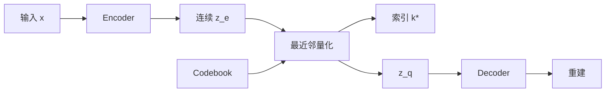
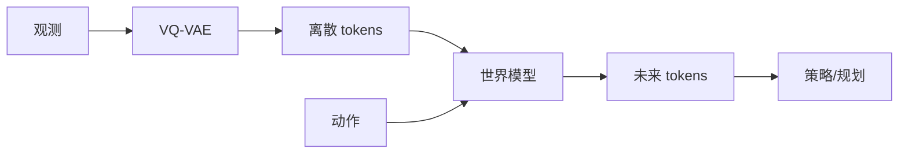

# Vector-Quantized Variational Autoencoder（VQ-VAE）

> 主卡。VQ-VAE 沿用 [VAE](./VAE.md) 的编码—解码结构，但把连续随机 latent 换成有限 codebook 中的离散向量。

## L0：一分钟理解

### 一句话定义

VQ-VAE 先让 Encoder 产生连续向量，再把它替换为 codebook 中最近的条目，使高维观测变成可学习的离散 token。

### 它解决什么问题

VAE 用连续分布和 KL 约束 latent，强 Decoder 下可能忽略 latent。VQ-VAE 强制信息通过有限词典，同时解决最近邻不可导、codebook 学习和 Encoder 输出漂移三个训练问题。

### 在 VLA/WAM 中有什么用

- 将图像、深度或触觉观测压成 token，供 Transformer 或世界模型预测；
- 将动作片段或技能编码成有限词表，形成高层规划符号；
- 在 latent dynamics 中预测 code index，而不是回归像素。

这是从离散表示性质推得的用途，并不表示所有 VLA/WAM 都使用原始 VQ-VAE。

### 记住这三点

1. 量化是选择最近 code，不是高斯采样。
2. Straight-through estimator 让前向使用离散向量、反向近似传递梯度。
3. 重建、codebook、commitment 三项的梯度对象不同。

## L1：直觉与结构

### 1. 从旧方法的局限出发

普通 AE 的连续 latent 不一定规整；VAE 的 latent 又可能被强 Decoder 忽略。VQ-VAE 使用有限词典：

```math
\mathcal{E}=\{e_1,\ldots,e_K\},\qquad e_k\in\mathbb{R}^{D}
```

### 2. 核心思想

```math
k^*(x)=\arg\min_k\|z_e(x)-e_k\|_2^2,\qquad z_q(x)=e_{k^*(x)}
```

Encoder 给出连续描述，量化器从词典中选择最接近的“词”，Decoder 只能看到该词。

### 3. 结构或数据流



文字说明：Encoder 输出连续向量，量化器选择最近 code，Decoder 根据对应 embedding 重建输入。

### 4. 输入、输出与张量形状

| 对象 | 形状 | 含义 |
|---|---|---|
| $z_e$ | `[B,D,H,W]` | Encoder 输出 |
| 展平 $z_e$ | `[BHW,D]` | 每个位置独立量化 |
| codebook | `[K,D]` | $K$ 个 code |
| indices | `[B,H,W]` | 离散 token |
| $z_q$ | `[B,D,H,W]` | 量化 latent |

### 5. 在具身智能系统中的位置



文字说明：VQ-VAE 离散化观测，时序模型预测未来 token，策略或规划器使用预测。

### 6. 与相近方法的区别

| 方法 | latent | 训练约束 | 风险 |
|---|---|---|---|
| AutoEncoder | 连续确定值 | 重建 | 空洞 latent |
| VAE | 连续分布 | likelihood + KL | posterior collapse |
| VQ-VAE | 离散 code | 重建 + codebook + commitment | codebook collapse |

原始 VQ-VAE 通常先训练量化自编码器，再学习离散索引上的 prior；量化器本身不是完整生成模型。

## L2：数学与实现

### 1. 符号表

| 符号 | 含义 |
|---|---|
| $z_e(x)$ | Encoder 连续输出 |
| $e_k$ | 第 $k$ 个 code |
| $k^*$ | 最近 code 索引 |
| $z_q(x)$ | 量化向量 |
| $\operatorname{sg}$ | stop-gradient：前向恒等，反向梯度为 0 |
| $\beta$ | commitment 权重 |

### 2. 核心公式

```math
\mathcal{J}
=
-\log p_\theta(x\mid z_q)
+\|\operatorname{sg}[z_e]-e_{k^*}\|_2^2
+\beta\|z_e-\operatorname{sg}[e_{k^*}]\|_2^2
```

第一项训练重建；第二项只把 codebook 拉向 Encoder 输出；第三项只把 Encoder 拉向选中的 code。

### 3. 公式的逐步解释或推导

#### 3.1 最近邻为何需要替代梯度

$\arg\min$ 输出离散整数，输入小幅变化时索引不变，跨越边界时突然跳变，因此没有稳定的普通梯度。VQ-VAE 构造：

```math
z_{\mathrm{st}}=z_e+\operatorname{sg}[z_q-z_e]
```

前向时 $\operatorname{sg}$ 不改数值，所以 $z_{\mathrm{st}}=z_q$；反向时括号项梯度为 0，所以 $\partial z_{\mathrm{st}}/\partial z_e=I$。这不是量化的真实导数，而是有偏的 straight-through surrogate。

#### 3.2 两个距离项为何不能合并

Codebook loss 冻结 $z_e$，只更新 $e_{k^*}$；commitment loss 冻结 $e_{k^*}$，只更新 Encoder。两者数值相似，但 `detach` 位置相反，梯度流向不同。

#### 3.3 重建公式为何会变成 MSE

若 Decoder 使用固定方差 Gaussian likelihood：

```math
p_\theta(x\mid z_q)=\mathcal{N}(x;\mu_\theta(z_q),\sigma_x^2I)
```

则：

```math
-\log p_\theta(x\mid z_q)
=
\frac{1}{2\sigma_x^2}\|x-\mu_\theta(z_q)\|_2^2+C
```

固定 $\sigma_x^2$ 时，忽略常数与固定比例后，NLL 与平方误差具有相同最优点。因此重建 MSE 是特定 likelihood 下的成比例目标；Bernoulli likelihood 应对应 BCE。

### 4. 最小数值例子

若 $z_e=1.6$，codebook 为 $0,1,3$，平方距离为 $2.56,0.36,1.96$，故 $k^*=2$、$z_q=1$。当 $\beta=0.25$ 时，codebook loss 为 $0.36$，commitment loss 为 $0.09$。

### 5. 训练与推理

| 阶段 | 操作 |
|---|---|
| 训练 | 编码、量化、重建并更新 Encoder、Decoder、codebook |
| 表征 | 输出 indices 或 embeddings |
| 重建 | 输入经 Encoder、量化器和 Decoder |
| 生成 | 从另行学习的离散 prior 生成 indices，再查表解码 |

随机均匀抽 code 通常不能生成合理样本，因为 token 之间存在空间或时间依赖。

### 6. 伪代码

1. Encoder 得到 $z_e$；
2. 计算到全部 codes 的平方距离；
3. `argmin` 取索引并查表得到 $z_q$；
4. 构造 straight-through latent；
5. 计算重建、codebook 与 commitment loss；
6. 按明确 reduction 聚合并反向传播。

### 7. 最小 PyTorch 实现

```python
import torch
from torch import nn
from torch.nn import functional as F


class VectorQuantizer(nn.Module):
    def __init__(self, num_codes, code_dim, beta=0.25):
        super().__init__()
        self.codebook = nn.Embedding(num_codes, code_dim)
        self.beta = beta

    def forward(self, z_e):
        # [B,D,H,W] -> [BHW,D]
        flat = z_e.permute(0, 2, 3, 1).contiguous()
        flat = flat.view(-1, z_e.shape[1])

        # 平方距离 [BHW,K]；argmin 是不可导的离散选择。
        e = self.codebook.weight
        distances = (
            flat.square().sum(1, keepdim=True)
            - 2 * flat @ e.t()
            + e.square().sum(1).unsqueeze(0)
        )
        indices = distances.argmin(1)
        z_q = self.codebook(indices)

        # detach 位置决定梯度流向；两项均为全元素平均 scalar。
        codebook_loss = F.mse_loss(z_q, flat.detach())
        commitment_loss = self.beta * F.mse_loss(
            flat, z_q.detach()
        )

        # 前向等于 z_q；反向对 flat 使用恒等 surrogate。
        z_st = flat + (z_q - flat).detach()
        z_st = z_st.view(
            z_e.shape[0], z_e.shape[2], z_e.shape[3], z_e.shape[1]
        ).permute(0, 3, 1, 2).contiguous()
        indices = indices.view(
            z_e.shape[0], z_e.shape[2], z_e.shape[3]
        )
        return z_st, indices, codebook_loss + commitment_loss


def vqvae_loss(recon, x, vq_loss):
    # 固定方差 Gaussian NLL 的成比例简化；全元素平均。
    recon_loss = F.mse_loss(recon, x)
    return recon_loss + vq_loss
```

三个 MSE 来源不同：重建 MSE 来自 Gaussian likelihood；另两项是学习 codebook 和约束 Encoder 的辅助目标。

### 8. 公式—代码对应

| 数学对象 | 代码 | 转换依据 | 形状与 reduction |
|---|---|---|---|
| $\|z_e-e_k\|^2$ | `distances` | 展开平方距离 | `[BHW,K]` |
| $k^*=\arg\min_k$ | `argmin(1)` | 精确最近邻，非可导 | `[BHW]` |
| $z_q=e_{k^*}$ | `codebook(indices)` | embedding lookup | `[BHW,D]` |
| $\|\operatorname{sg}[z_e]-e\|^2$ | `mse_loss(z_q,flat.detach())` | 冻结 Encoder | scalar，全元素平均 |
| $\beta\|z_e-\operatorname{sg}[e]\|^2$ | `mse_loss(flat,z_q.detach())` | 冻结 codebook | scalar，全元素平均 |
| $z_e+\operatorname{sg}[z_q-z_e]$ | `flat+(...).detach()` | straight-through surrogate | `[BHW,D]` |
| $-\log p_\theta(x\mid z_q)$ | `mse_loss(recon,x)` | Gaussian NLL，省略常数与固定比例 | scalar，全元素平均 |

### 9. 常见超参数

- codebook size $K$、code dimension $D$；
- commitment 权重 $\beta$；
- latent 分辨率、likelihood 与 reduction；
- 梯度或 EMA codebook 更新；
- 离散 prior 容量。

### 10. 失败模式与常见误解

1. Codebook collapse：只使用少数 codes。
2. Dead codes：部分 embedding 长期没有样本。
3. 重建好不等于 token 自动具有语义。
4. Straight-through 是 surrogate，不是精确导数。
5. VQ-VAE 不是 VAE 简单加取整。
6. 无条件生成仍需要离散 prior。

## 自测

### 基础题

1. $k^*$ 如何计算？
2. 三个 loss 分别训练什么？
3. stop-gradient 的反向行为是什么？

### 理解题

1. 为什么两个距离项不能合并？
2. 为什么 straight-through 前向等于 $z_q$？
3. 三个 MSE 的来源有何不同？

### 迁移题

1. 1024 个 codes 只使用 12 个时应检查什么？
2. 只有 Decoder 和 codebook 能否无条件生成？
3. 动作 chunk 量化可能保留或丢失什么？

<details>
<summary>参考答案</summary>

1. 取与 $z_e$ 欧氏平方距离最小的 code。
2. 重建项训练 Encoder/Decoder，codebook 项训练 embedding，commitment 项约束 Encoder。
3. 梯度为 0。
4. 两项 detach 位置相反，梯度流向不同。
5. 前向代数消去后得到 $z_q$。
6. 重建 MSE 来自 likelihood；另两项是辅助目标。
7. 检查使用率、初始化、$\beta$、输出尺度和 dead-code 策略。
8. 不能，还需要离散 prior。
9. 可能保留技能类别，丢失细粒度连续差异。

</details>

## 学习导航

### 前置卡片

- [VAE](./VAE.md)
- AutoEncoder（待创建）
- Vector Quantization（待创建）
- Stop Gradient（待创建）

### 原子子卡

- Straight-Through Estimator（待创建）
- Codebook Collapse（待创建）
- EMA Codebook Update（待创建）

### 对比卡片

- VQ-VAE vs VAE（待创建）
- VQ-VAE vs Scalar Quantization（待创建）

### 下一张推荐卡

学习 Straight-Through Estimator，再进入 VQ-VAE-2 或离散 latent world model。

## 参考资料

1. [Neural Discrete Representation Learning（NeurIPS 2017）](https://papers.nips.cc/paper_files/paper/2017/hash/7a98af17e63a0ac09ce2e96d03992fbc-Abstract.html).
2. [Neural Discrete Representation Learning（arXiv）](https://arxiv.org/abs/1711.00937).
3. [Google DeepMind Sonnet VQ-VAE implementation](https://github.com/google-deepmind/sonnet/blob/v2/sonnet/src/nets/vqvae.py).

## L3：论文与源码深入（待补充）

- 离散 ELBO 中常数 KL；
- EMA codebook update 与 k-means；
- VQ-VAE-2 层级先验；
- perplexity、dead-code 重启与机器人 tokenization 实证。
