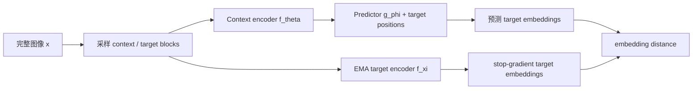
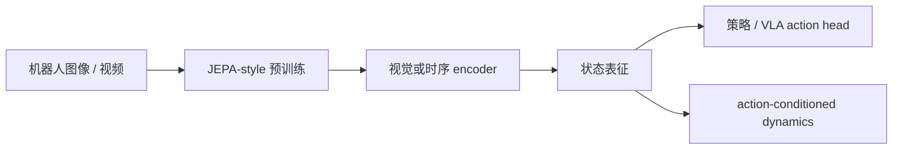

# Joint-Embedding Predictive Architecture（JEPA）

> 主卡片：解释 JEPA 的共同设计思想，并用图像版 I-JEPA 具体化训练目标和实现；JEPA 是架构族，不是某一个固定模型。

## L0：一分钟理解

### 一句话定义

联合嵌入预测架构（Joint-Embedding Predictive Architecture，JEPA）让模型根据可见上下文，预测被遮挡目标在**表征空间**中的 embedding，而不是复原目标的每一个像素。

### 它解决什么问题

像素重建会要求模型花大量能力预测纹理、噪声和精确颜色，但许多下游任务更关心“这里是机械臂末端”“物体正在移动”这类语义。JEPA 把预测目标换成另一个编码器产生的高层表征，让学习压力更多落在可预测的语义结构上。

这不是说像素细节永远无用：精密操作仍可能依赖纹理和几何。JEPA 做的是选择一种不同的信息偏好，而不是无条件优于生成模型。

### 在 VLA/WAM 中有什么用

JEPA 可作为无标签视觉或视频预训练方法，为 VLA 的视觉编码器、状态估计器或 latent dynamics 提供特征。I-JEPA 本身只做同一图像内的空间预测，不包含动作条件、奖励或闭环规划，因此不能直接等同于完整的具身世界模型；V-JEPA 才把该原则扩展到视频特征预测。

### 记住这三点

1. JEPA 预测的是目标区域的 **embedding**，不是像素。
2. context encoder 负责猜，EMA target encoder 负责产生停止梯度的学习目标。
3. 遮挡策略决定任务是否迫使模型学习语义；目标过小或上下文泄漏都会让任务变成捷径。

## L1：直觉与结构

### 1. 背景：前一方法已经解决了什么

自监督学习不依赖人工标签，而是从数据自身构造监督信号。两条常见路线已经很有效：

- 对比学习让同一对象的不同视图接近、不同样本远离；
- 掩码自编码器（MAE）根据可见 patch 重建被遮挡像素。

它们分别解决了“没有标签如何定义相似性”和“如何从图像内部制造预测任务”。

### 2. 剩余矛盾与设计目标

对比学习往往依赖精心设计的数据增强或负样本；像素重建则必须解释大量高频细节。对于识别、控制和预测，模型需要保留对任务有用的结构，却不一定要知道被遮挡区域每个像素的唯一答案。

设计目标因此变成：**只用同一个样本构造监督，在不重建像素的情况下学习可迁移、具有语义的表征。**

### 3. 设计因果链

#### 从像素预测转向表征预测

当前问题是像素空间包含大量不可预测或任务无关的细节。I-JEPA 让 target encoder 把目标区域映射为 embedding，predictor 只需从上下文 embedding 预测该目标 embedding。这降低了重建低层细节的压力，但也带来新问题：如果编码器把所有输入映射成同一个常量，预测误差同样可以很小。

#### 用非对称双编码器稳定目标

为避免两个分支一起追逐一个不断变化的目标，context encoder 用梯度更新，target encoder 不接收反向传播，而是 context encoder 参数的指数滑动平均（EMA）。停止梯度提供相对稳定的靶标；EMA 又让靶标随学习逐渐更新。它降低坍塌风险，但不构成对所有设置的数学保证，并引入动量系数与教师滞后的权衡。

#### 用大目标块和分散上下文提高任务难度

如果目标只是一个小 patch，模型可能靠相邻纹理完成局部插值；如果目标像素泄漏进 context，答案更是近乎可见。I-JEPA 采样足够大的目标块，并从不与目标重叠、空间分散的 context 预测目标。这样更需要对象级理解，但遮挡过强又会让目标从上下文中不可确定。

### 4. 完整训练与部署数据流



文字等价描述：训练时，学生从可见上下文和目标位置预测 embedding，EMA 教师从完整图像产生停止梯度的目标 embedding，两者距离训练学生和 predictor。

部署到下游任务时通常只保留预训练 encoder，再接分类、检测、策略或状态估计头；target encoder 和 predictor 并非必需。

### 5. 输入、输出与张量形状

设 batch 为 $B$，每张图切为 $N$ 个 patch，embedding 维度为 $D$，目标 patch 数为 $K$：

- 图像：$x\in\mathbb{R}^{B\times C\times H\times W}$；
- context tokens：$s_x\in\mathbb{R}^{B\times N_c\times D}$；
- 目标位置编码：$m_y\in\mathbb{R}^{B\times K\times D}$；
- 预测目标：$\hat y\in\mathbb{R}^{B\times K\times D}$；
- 教师目标：$y\in\mathbb{R}^{B\times K\times D}$。

一个 context 可同时预测多个 target blocks。实现中常把它们展平到 target-token 维度后计算损失。

### 6. 在具身智能系统中的位置



文字等价描述：JEPA-style 预训练先学习视觉或时序特征，之后这些特征可供策略或动作条件 dynamics 使用；动作预测和控制目标仍需额外模块与数据。

### 7. 与相近方法的区别

| 方法 | 预测目标 | 常见防坍塌/约束 | 主要信息偏好 |
|---|---|---|---|
| MAE | 被遮挡像素 | 重建任务本身 | 局部外观与结构 |
| 对比学习 | 样本身份/视图一致性 | 负样本、stop-grad 或其他正则 | 增强不变性 |
| I-JEPA | 目标图像区域的 embedding | EMA teacher、stop-grad、遮挡设计 | 可预测的空间语义 |
| V-JEPA | 被遮挡时空区域的 embedding | EMA teacher、stop-grad、时空遮挡 | 外观与运动表征 |
| RSSM | 下一时刻的随机/确定性 latent | 变分目标、重建/奖励等 | 动作条件的时序 belief |

JEPA 与 RSSM 都可在 latent 空间预测，但经典 I-JEPA 没有显式随机状态、观测似然或动作条件 transition，不能把两者视为同一模型。

## L2：数学与实现

### 1. 符号表

| 符号 | 含义 |
|---|---|
| $x$ | 一张训练图像 |
| $x_c$ | mask 后保留的 context patches |
| $x_t$ | target patches；只用于选择教师输出的位置 |
| $f_\theta$ | context encoder（student） |
| $f_\xi$ | target encoder（EMA teacher） |
| $g_\phi$ | predictor |
| $m_t$ | target 位置的 mask/position tokens |
| $\hat y_t$ | predictor 输出的目标 embedding |
| $y_t$ | target encoder 输出并 stop-gradient 的目标 embedding |
| $\tau$ | EMA 动量系数 |

### 2. 核心公式

学生先编码可见上下文：

```math
s_x=f_\theta(x_c)
```

predictor 根据上下文和目标位置，给出目标区域的表示预测：

```math
\hat y_t=g_\phi(s_x,m_t)
```

教师编码完整图像，再选择目标位置并停止梯度：

```math
y_t=\operatorname{sg}\!\left(\operatorname{select}_t(f_\xi(x))\right)
```

以每个 target token 的平均 L1 距离为例，最小化：

```math
\mathcal{L}_{\mathrm{JEPA}}
=\frac{1}{BKD}
\sum_{b=1}^{B}\sum_{k=1}^{K}\sum_{d=1}^{D}
\left|\hat y_{bkd}-y_{bkd}\right|
```

target encoder 不由该损失反向传播更新，而是在每一步之后使用 EMA：

```math
\xi \leftarrow \tau\xi+(1-\tau)\theta
```

### 3. 公式的逐步解释或推导

#### 第一步：监督信号来自哪里

同一张图像产生两条分支。教师看完整图像，因此能计算目标区域的表示 $y_t$；学生只能看 context，所以必须利用可见内容和目标位置 $m_t$ 猜出 $\hat y_t$。这里没有人工类别标签，教师 embedding 就是自监督标签。

#### 第二步：为什么不是像素误差

若重建 RGB，目标可写为 $x_t$，损失会直接比较 $\hat x_t$ 与 $x_t$。JEPA 先通过 $f_\xi$ 把图像变换到表征空间，比较的是 $\hat y_t$ 与 $y_t$：

```math
\underbrace{\ell(\hat x_t,x_t)}_{\text{pixel reconstruction}}
\quad\longrightarrow\quad
\underbrace{\ell\!\left(g_\phi(f_\theta(x_c),m_t),\operatorname{sg}(f_\xi(x)_t)\right)}_{\text{representation prediction}}
```

这不是两个目标的代数等价替换，而是建模目标的改变：教师编码器决定哪些差异在 embedding 中重要。因此，JEPA 不提供显式像素似然，也不能像生成式解码器那样直接输出图像。

#### 第三步：L1 代码为何是逐元素绝对值

上式将每个 batch、目标 token 和特征维度的绝对误差求和，再除以元素总数 $BKD$。PyTorch 的 `F.l1_loss(pred, target, reduction="mean")` 对形状相同的张量恰好执行这个 reduction，所以它是该有限 batch 目标的直接实现。

论文或变体也可使用 L2、归一化特征距离或额外正则；它们不是 JEPA 名称本身唯一规定的损失。使用 L2 时，`mse_loss` 对应的是 embedding 空间中的平方误差，而不是像素 MSE。

#### 第四步：stop-gradient 与 EMA 分别做什么

`detach()` 实现 $\operatorname{sg}$：数值仍参与损失，但梯度不会进入 target encoder。EMA 则在优化器更新 $\theta$ 后，逐参数执行 $\xi\leftarrow\tau\xi+(1-\tau)\theta$。前者切断一次反向传播路径，后者定义跨训练步的教师更新规则，不能混为同一个操作。

#### 第五步：为什么仍可能坍塌

若 $f_\theta$ 与 $f_\xi$ 对所有输入都输出相同常量，predictor 也输出该常量，则距离为零。这说明“只写一个 embedding distance”存在平凡解。实际效果来自架构非对称性、EMA 动态、位置条件、mask 设计和优化过程的共同作用；不应把 EMA 描述为单独且严格的防坍塌证明。

### 4. 最小数值例子

设一个目标 token 的教师 embedding 为 $y=[1,2]$，预测为 $\hat y=[0.5,3]$。该 token 的平均 L1 损失为：

```math
\mathcal{L}=\frac{|0.5-1|+|3-2|}{2}=\frac{0.5+1}{2}=0.75
```

若当前教师参数为 $\xi=2.0$，学生更新后参数为 $\theta=4.0$，且 $\tau=0.9$，则：

```math
\xi_{\mathrm{new}}=0.9\times2.0+0.1\times4.0=2.2
```

教师只向学生移动了 $0.2$，说明较大的 $\tau$ 产生更平滑但更滞后的目标。

### 5. 训练与推理

#### 预训练

1. 从图像采样大 target blocks 与分散 context；
2. context encoder 只处理可见 patches；
3. target encoder 处理完整图像，选择目标位置并停止梯度；
4. predictor 根据 context tokens 和目标位置预测 target embeddings；
5. 反向传播只更新 context encoder 与 predictor；
6. 用 context encoder 的新参数 EMA 更新 target encoder。

#### 下游推理

通常保留 context encoder，用完整图像或视频产生特征，再接任务头。此时不再随机遮挡，也不需要教师提供目标。若要进行未来预测或规划，还必须定义时间、动作和预测 horizon，不能仅凭 I-JEPA 预训练流程获得。

### 6. 伪代码

```text
initialize student theta, predictor phi
copy theta to teacher xi
for image batch x:
    context_mask, target_mask = sample_blocks(x)
    context = student(x, context_mask)
    prediction = predictor(context, target_mask.positions)
    with no_grad:
        all_targets = teacher(x)
        target = select(all_targets, target_mask)
    loss = mean(abs(prediction - target))
    update theta and phi with gradient descent
    xi = tau * xi + (1 - tau) * theta
```

### 7. 最小 PyTorch 实现

下面代码省略 ViT 和复杂 block masking，只保留 JEPA 的三条关键路径。输入已假设为 patch tokens，mask 用索引表示。

```python
import copy
import torch
import torch.nn as nn
import torch.nn.functional as F


class TinyEncoder(nn.Module):
    def __init__(self, in_dim: int, embed_dim: int):
        super().__init__()
        self.net = nn.Sequential(
            nn.Linear(in_dim, embed_dim),
            nn.GELU(),
            nn.Linear(embed_dim, embed_dim),
        )

    def forward(self, patches: torch.Tensor) -> torch.Tensor:
        # patches: [B, N, P] -> embeddings: [B, N, D]
        return self.net(patches)


class TinyPredictor(nn.Module):
    def __init__(self, embed_dim: int):
        super().__init__()
        self.net = nn.Sequential(
            nn.Linear(2 * embed_dim, embed_dim),
            nn.GELU(),
            nn.Linear(embed_dim, embed_dim),
        )

    def forward(
        self,
        context_tokens: torch.Tensor,
        target_positions: torch.Tensor,
    ) -> torch.Tensor:
        # context_tokens: [B, Nc, D]; use a pooled summary in this toy model.
        # target_positions: [B, K, D]; real I-JEPA uses positional mask tokens.
        context_summary = context_tokens.mean(dim=1, keepdim=True)  # [B, 1, D]
        context_summary = context_summary.expand_as(target_positions)  # [B, K, D]
        return self.net(torch.cat([context_summary, target_positions], dim=-1))


@torch.no_grad()
def ema_update(student: nn.Module, teacher: nn.Module, tau: float) -> None:
    # Implements xi <- tau * xi + (1 - tau) * theta parameter by parameter.
    for student_p, teacher_p in zip(student.parameters(), teacher.parameters()):
        teacher_p.mul_(tau).add_(student_p, alpha=1.0 - tau)


def jepa_step(
    patches: torch.Tensor,
    context_idx: torch.Tensor,
    target_idx: torch.Tensor,
    target_positions: torch.Tensor,
    student: nn.Module,
    teacher: nn.Module,
    predictor: nn.Module,
) -> torch.Tensor:
    # patches: [B, N, P]
    # context_idx: [Nc], target_idx: [K], target_positions: [B, K, D]
    context_patches = patches[:, context_idx]  # [B, Nc, P]
    context_tokens = student(context_patches)  # [B, Nc, D]
    pred = predictor(context_tokens, target_positions)  # [B, K, D]

    with torch.no_grad():
        # Teacher sees all patches; detach/no_grad implements stop-gradient.
        all_target_tokens = teacher(patches)  # [B, N, D]
        target = all_target_tokens[:, target_idx]  # [B, K, D]

    # Exact finite-batch implementation of (1 / B K D) * sum |pred - target|.
    return F.l1_loss(pred, target, reduction="mean")


def build_models(in_dim: int, embed_dim: int):
    student = TinyEncoder(in_dim, embed_dim)
    teacher = copy.deepcopy(student)
    teacher.requires_grad_(False)
    predictor = TinyPredictor(embed_dim)
    return student, teacher, predictor
```

训练循环必须先对 student/predictor 执行 `optimizer.step()`，再调用 `ema_update(student, teacher, tau)`；teacher 参数不能加入 optimizer。

### 8. 公式—代码对应

| 数学对象 | 代码 | 转换依据 | 形状与 reduction |
|---|---|---|---|
| $s_x=f_\theta(x_c)$ | `student(context_patches)` | 直接前向计算 | `[B,Nc,P] -> [B,Nc,D]` |
| $\hat y_t=g_\phi(s_x,m_t)$ | `predictor(context_tokens, target_positions)` | 目标位置作为预测条件 | 输出 `[B,K,D]` |
| $y_t=\operatorname{sg}(f_\xi(x)_t)$ | `with torch.no_grad(): teacher(patches)[:, target_idx]` | `no_grad` 切断教师梯度，再选择目标 tokens | `[B,N,D] -> [B,K,D]` |
| $\frac{1}{BKD}\sum|\hat y-y|$ | `F.l1_loss(..., reduction="mean")` | 对全部 $BKD$ 个元素取绝对误差均值 | 标量 |
| $\xi\leftarrow\tau\xi+(1-\tau)\theta$ | `teacher_p.mul_(tau).add_(student_p, alpha=1-tau)` | 原地逐参数 EMA；不是梯度下降 | 每个对应参数形状相同 |

这里的 toy predictor 用 context mean 简化了 token 交互，只用于暴露信息流；它不是论文中 Transformer predictor 的等价实现。

### 9. 常见超参数

- target block 的数量、面积和长宽比：决定预测是否偏向对象级语义；
- context 保留比例：太高容易泄漏，太低则信息不足；
- embedding 维度 $D$：影响表示容量和计算量；
- EMA 动量 $\tau$：越接近 1，教师越平滑也越滞后；
- predictor 深度：过弱无法完成预测，过强可能替 encoder 承担过多任务；
- 学习率、权重衰减和训练时长：共同影响稳定性与表征质量。

### 10. 失败模式与常见误解

#### 表征坍塌

所有输入得到相似 embedding 时，损失可很低但特征无用。检查特征方差、协方差谱和下游 probing，而不能只看训练损失。

#### mask 任务太容易或太难

小目标加邻近上下文鼓励纹理插值；目标太大且上下文太少会使条件预测高度不确定。应联合调整 target 尺度和 context 分布。

#### 把位置编码当作答案泄漏

位置编码告诉 predictor “预测哪里”，不告诉它“那里是什么”。若 target 的内容 token 进入 context，才是真正的内容泄漏。

#### 误以为 JEPA 能生成图像

原生目标没有训练像素 decoder。论文中的可视化若借助另训的 decoder，不代表 JEPA predictor 本身输出像素。

#### 误以为 embedding 距离就是概率似然

L1/L2 距离是表征匹配目标，并未自动定义 $p(x\mid z)$ 或归一化概率模型。不能直接从中读取生成概率或不确定性。

#### 误以为 I-JEPA 已经是机器人世界模型

I-JEPA 学的是静态图像内的空间关系。机器人世界模型通常还要求时序、动作条件、可滚动预测，以及与规划相关的状态信息。JEPA 原则可以被扩展到这些设置，但扩展后的模型才承担相应职责。

## 自测

### 基础题

1. JEPA 的预测目标位于像素空间还是 embedding 空间？
2. 训练完成后，为什么下游推理通常不需要 target encoder？

### 理解题

3. `detach()` 和 EMA 各自解决什么更新问题？
4. 为什么把 target block 设得足够大，可能比预测单个 patch 更利于学习语义？
5. `F.mse_loss(pred, target)` 若用于 JEPA，为什么不等同于 MAE 的像素 MSE？

### 迁移题

6. 若把 JEPA 用于机器人视频，并希望预测动作后的未来，你至少需要在输入和目标中新增哪些信息？
7. 一个 JEPA 训练损失持续下降，但线性 probe 结果很差，你会优先检查什么？

<details>
<summary>参考答案</summary>

1. embedding 空间。
2. target encoder 只在预训练时生成自监督目标；部署时 student encoder 已能直接产生特征。
3. `detach()` 切断当前计算图的教师梯度；EMA 规定跨训练步如何用学生参数平滑更新教师。
4. 单 patch 常可由邻近纹理插值，大块目标更可能要求理解物体组成和全局上下文；但过大会造成不可确定。
5. 两者比较的随机变量不同：JEPA 比较 learned embeddings，MAE 比较 RGB/patch pixels；同一算子不意味着同一建模目标。
6. 至少加入时间上下文、动作序列、未来 horizon 与对应未来 target embeddings；规划还可能需要奖励、价值或目标条件。
7. 检查表征方差/谱是否坍塌、mask 是否存在捷径、teacher/student 更新顺序、EMA 动量、target 是否意外参与梯度，以及 probe 协议。

</details>

## 学习导航

### 前置卡片

- Self-Supervised Learning（待创建）
- Vision Transformer（待创建）
- Exponential Moving Average（待创建）

### 原子子卡

- Stop-Gradient 与 EMA Teacher（待创建）
- Block Masking Strategy（待创建）
- Representation Collapse（待创建）

### 对比卡片

- JEPA vs Masked Autoencoder（待创建）
- JEPA vs Contrastive Learning（待创建）
- JEPA vs [RSSM](../../architectures/world-model/RSSM.md)

### 下一张推荐卡

学习 V-JEPA，重点理解如何把二维空间 block prediction 扩展到时空 tube prediction，以及视频表征与动作条件世界模型之间仍缺少什么。

## 参考资料

1. [A Path Towards Autonomous Machine Intelligence](https://openreview.net/forum?id=BZ5a1r-kVsf) — JEPA 总体构想。
2. [Self-Supervised Learning from Images with a Joint-Embedding Predictive Architecture](https://arxiv.org/abs/2301.08243) — I-JEPA 原论文。
3. [Official I-JEPA implementation](https://github.com/facebookresearch/ijepa) — 官方 PyTorch 实现。
4. [Revisiting Feature Prediction for Learning Visual Representations from Video](https://arxiv.org/abs/2404.08471) — V-JEPA 原论文。

## L3：论文与源码深入（待补充）

- I-JEPA multi-block masking 的精确采样与官方实现映射；
- EMA schedule、初始化与坍塌动力学；
- V-JEPA 时空 masking、frozen evaluation 与视频运动表征；
- action-conditioned JEPA 与 latent planning 的目标设计；
- JEPA、生成式 world model 与能量模型的理论联系。
