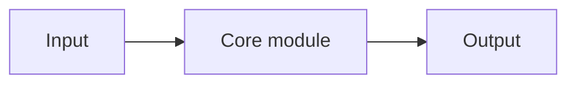

# CONCEPT_TITLE

> State whether this is a main card or an atomic child card, and link to its parent when applicable.

## L0：一分钟理解

### 一句话定义

Define the concept in plain Chinese, retaining the English term on first use.

### 它解决什么问题

Explain the previous approach, its limitation, and the new idea.

### 在 VLA/WAM 中有什么用

Name the concrete system role and avoid claiming that a descendant architecture is identical to this concept.

### 记住这三点

1. TAKEAWAY_1
2. TAKEAWAY_2
3. TAKEAWAY_3

## L1：直觉与结构

### 1. 从旧方法的局限出发

### 2. 核心思想

Use `$z$` for inline math.

### 3. 结构或数据流



Text equivalent: describe the same flow in one sentence.

### 4. 输入、输出与张量形状

### 5. 在具身智能系统中的位置

### 6. 与相近方法的区别

## L2：数学与实现

### 1. 符号表

### 2. 核心公式

Use display math exactly like this:

```math
\mathcal{L}(\theta)=\mathbb{E}_{x\sim p_{\mathrm{data}}}[\ell_\theta(x)]
```

### 3. 公式的逐步解释或推导

For every nontrivial step, state the identity, modeling assumption, approximation, or omitted constant/scale. Explain what each term makes the model do and how expectations are estimated in code.

### 4. 最小数值例子

### 5. 训练与推理

### 6. 伪代码

### 7. 最小 PyTorch 实现

```python
# Explain why each key loss or estimator implements the preceding equation.
# State tensor shapes and reduction dimensions where they affect scaling.
```

### 8. 公式—代码对应

Use columns such as `数学对象 | 代码 | 转换依据 | 形状与 reduction`. Distinguish exact implementations from proportional objectives, Monte Carlo estimates, straight-through estimators, and engineering surrogates.

### 9. 常见超参数

### 10. 失败模式与常见误解

## 自测

### 基础题

### 理解题

### 迁移题

<details>
<summary>参考答案</summary>

ANSWERS

</details>

## 学习导航

### 前置卡片

### 原子子卡

### 对比卡片

### 下一张推荐卡

## 参考资料

1. PRIMARY_SOURCE

## L3：论文与源码深入（待补充）

- PAPER_LEVEL_DERIVATION
- OFFICIAL_CODE_MAPPING
- VARIANTS_AND_OPEN_QUESTIONS
